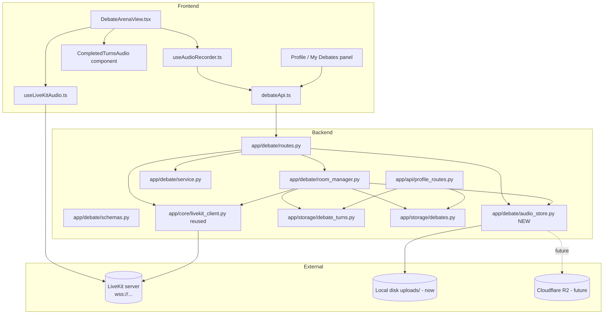
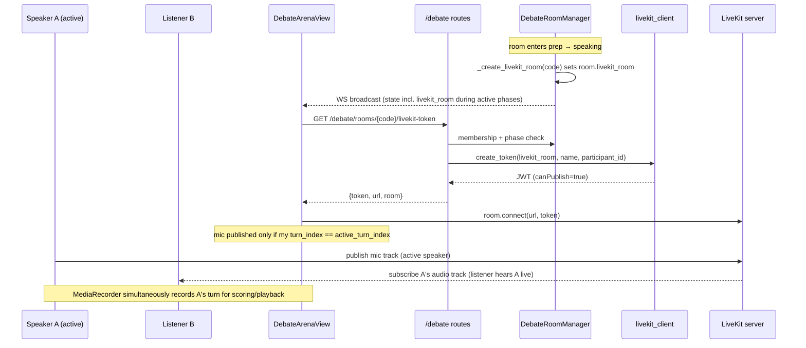
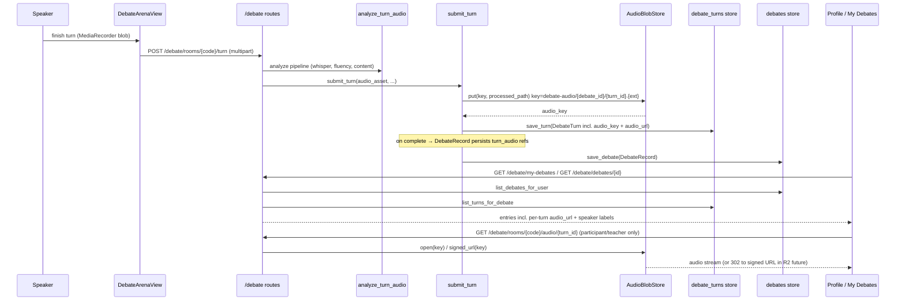

# Design Document: Debate Live Audio & Playback

## Overview

The Debate feature is turn-based: each speaker records their turn with the browser
`MediaRecorder` (`useAudioRecorder`), uploads it to `POST /debate/rooms/{code}/turn`, and
the backend scores it and persists a `DebateTurn`. What Debate lacks — and what Group
Discussion (GD) already has — is (a) **live "voice hearing"** between the two participants
while the debate is in progress, and (b) a durable, first-class **post-debate playback**
experience in the personal panel and on the results screen.

This design adds three capabilities to the existing Debate feature by mirroring the proven
GD LiveKit integration and hardening the per-turn audio storage that already exists in
Debate:

1. **Live audio between participants (LiveKit).** Set a `livekit_room` name on the debate
   room around the prep/speaking phases (mirroring GD's naming and lifecycle), expose it in
   public state **only during active phases**, add `GET /debate/rooms/{code}/livekit-token`
   (mirroring the GD endpoint's auth/membership checks and `503`/`400` error codes), and wire
   `useLiveKitAudio` into `DebateArenaView`. Because Debate is head-to-head and turn-based,
   live audio is **gated to the active speaker** (their mic is published; the listener is
   subscribe-only), with graceful degradation when LiveKit is not configured.
2. **Durable per-speaker audio storage.** Debate already copies each turn's recording to
   `uploads/{turn_id}.{ext}` and stores an `audio_url` on the `DebateTurn`. This design
   replaces that ad-hoc path with a small **storage-location abstraction** (`AudioBlobStore`)
   and a stable **key scheme** so it can move from local disk to Cloudflare R2 (S3-compatible)
   later, surfaces the reference on `DebateRecord`, fixes the access control on the serve
   route (participants **and teachers** only), and defines a signed/expiring-URL path for the
   object-storage future.
3. **Post-debate playback in the personal panel.** Extend `GET /debate/my-debates` (and add a
   debate-detail endpoint) to include per-turn audio references + speaker labels, and design
   the frontend playback UI in the profile ("My Debates") panel plus the completion/results
   screen, reusing the existing `CompletedTurnsAudio`-style component.

No new external dependency is introduced beyond what GD already uses. LiveKit reuses
`app/core/livekit_client.py` and the existing `LIVEKIT_API_KEY` / `LIVEKIT_API_SECRET` /
`LIVEKIT_URL` environment variables. The object-storage future (R2) is designed as an
optional, additive backend behind the storage abstraction and is out of scope for the initial
implementation (local disk remains the default).

### What already exists (do not rebuild — extend)

| Concern | Current state | Change in this design |
|---|---|---|
| Per-turn recording | `useAudioRecorder` (MediaRecorder webm) in `DebateArenaView` | Keep. Coexists with LiveKit mic. |
| Turn upload + scoring | `POST /debate/rooms/{code}/turn` → `analyze_turn_audio` | Unchanged pipeline; persistence path refactored. |
| Turn audio file | `submit_turn` copies to `uploads/{turn_id}.{ext}`; sets `audio_url` | Route through `AudioBlobStore` + key scheme. |
| Turn audio serve | `GET /debate/rooms/{code}/audio/{turn_id}` | Fix completed-debate lookup + add teacher access. |
| In-room playback | `CompletedTurnsAudio` + `completed_turns` cache | Keep; reuse component for post-debate. |
| Live audio | **absent for Debate** | Add `livekit_room`, token route, hook wiring. |
| Post-debate playback | **absent** (my-debates has no audio) | Add audio refs + detail endpoint + UI. |

---

## Architecture

### Component map



### Live-audio path (gated to active speaker)



### Storage + post-debate playback path



---

## Components and Interfaces

### 1. `app/core/livekit_client.py` (reused, not modified)

Called as-is. Relevant surface:

```python
livekit.is_available            # bool: True when API key/secret/url are configured
livekit.url                     # str: wss URL
livekit.create_token(           # -> Optional[str] JWT
    room_name: str,
    participant_name: str,
    participant_identity: str,
    ttl_seconds: int = 3600,
) -> Optional[str]
```

The token grant already includes `canPublish=True` and `canSubscribe=True`. Publish gating for
the listener is enforced **client-side** (only the active speaker calls
`setMicrophoneEnabled(true)`), matching how GD manages mic state. Server-side grant remains
identical to GD to avoid changing `livekit_client.py` (a shared module).

### 2. `app/debate/schemas.py` (additive fields only)

New/changed fields (see Data Models for full pydantic snippets):

- `DebateRoom.livekit_room: Optional[str]` — internal, set around prep/speaking.
- `PublicDebateRoom.livekit_room: Optional[str]` — exposed **only** while
  `state in ("prep", "speaking")`; `to_public` gates it.
- `DebateTurn.audio_key: Optional[str]` — storage-abstraction key (new source of truth).
- `DebateTurn.audio_content_type: Optional[str]` — e.g. `"audio/webm"` for correct serving.
- `DebateRecord.turn_audio: list[DebateTurnAudioRef]` — self-contained audio index for the
  completed debate (so playback survives room eviction and turn-store scans).
- New model `DebateTurnAudioRef` and new `CompletedTurnPublic` already exists (unchanged).

### 3. `app/debate/room_manager.py`

Changes:

- `_create_livekit_room(code)` — **new**, mirrors GD. Sets `room.livekit_room =
  f"debate-{code.lower()}-{debate_id[:8]}"` when `livekit.is_available`, then broadcasts.
  Fired (via `asyncio.create_task`) at the transition into `prep` (from `_run_prep_timer`'s
  predecessors — i.e. when the room enters `prep` in `flip_ready` / `_delayed_auto_start`).
- `submit_turn(...)` — refactored to persist audio via `AudioBlobStore` and record `audio_key`
  + `audio_content_type` on the `DebateTurn` instead of hand-copying to `uploads/{turn_id}.ext`.
- Finalize path (transition to `complete`) — populate `DebateRecord.turn_audio` from the
  persisted turns so `my-debates`/detail can render playback without a full turn-store scan.

Interface (signatures unchanged except internal behavior):

```python
async def _create_livekit_room(self, code: str) -> None: ...
async def submit_turn(self, code, user, audio_asset, transcription,
                      pronunciation, fluency, analysis_id) -> tuple[DebateTurn, DebateRoom]: ...
```

### 4. `app/debate/audio_store.py` (NEW — storage-location abstraction)

A minimal blob-store abstraction so the audio backend can move from local disk to R2 without
touching callers. Lives inside the `app/debate` boundary.

```python
class AudioBlobStore(Protocol):
    def key_for(self, debate_id: str, turn_id: str, ext: str) -> str: ...
    def put(self, key: str, src_path: str) -> None: ...
    def open(self, key: str) -> tuple[BinaryIO, str]: ...      # (stream, content_type)
    def exists(self, key: str) -> bool: ...
    def signed_url(self, key: str, ttl_seconds: int = 3600) -> Optional[str]: ...
    def delete(self, key: str) -> None: ...

class LocalDiskAudioStore:  # default (now)
    root = Path("uploads/debate-audio")
    # key => uploads/debate-audio/{debate_id}/{turn_id}.{ext}
    # signed_url returns None (serve via the app route instead)

class R2AudioStore:  # future, additive; behind DEBATE_AUDIO_BACKEND=r2
    # put => boto3 upload_fileobj; signed_url => presigned GET URL
    ...

def get_audio_store() -> AudioBlobStore:  # picks backend from env, defaults local
```

**Key scheme:** `debate-audio/{debate_id}/{turn_id}.{ext}` — debate-scoped prefix enables
per-debate lifecycle (retention/deletion) and clean R2 object listing.

### 5. `app/debate/routes.py`

- **New** `GET /debate/rooms/{code}/livekit-token` — mirrors GD exactly (membership check,
  `503 livekit_not_configured`, `400 audio_not_ready`, `500 token_generation_failed`).
- **Changed** `GET /debate/rooms/{code}/audio/{turn_id}` — fix completed-debate lookup and add
  **teacher** access; route bytes through `AudioBlobStore` (local stream now; `302` to signed
  URL when an R2 backend is active).
- **New** `GET /debate/debates/{debate_id}` — detail endpoint returning per-turn audio refs +
  speaker labels for the results/profile playback list.
- **Changed** `GET /debate/my-debates` — `MyDebateEntry` gains `turn_audio` (list of
  `{turn_index, participant_id, display_name, audio_url, is_forfeit}`).

Signatures:

```python
@router.get("/rooms/{code}/livekit-token")
async def get_livekit_token(code: str, current_user: User = Depends(require_user)) -> dict: ...

@router.get("/rooms/{code}/audio/{turn_id}")
async def get_turn_audio(code: str, turn_id: str,
                         current_user: User = Depends(require_user)): ...  # FileResponse | RedirectResponse

@router.get("/debates/{debate_id}", response_model=DebateDetailResponse)
async def get_debate_detail(debate_id: str,
                            current_user: User = Depends(require_user)) -> DebateDetailResponse: ...
```

### 6. `app/storage/debate_turns.py`

- Fix `list_turns_for_debate_by_code` (currently returns `[]`) so the audio-serve route can
  resolve turns for completed/evicted rooms. Preferred approach: resolve `debate_id` from the
  `debates` store by `code`, then reuse `list_turns_for_debate(debate_id)`. This avoids adding
  `room_code` to every turn row.

### 7. Frontend: `useLiveKitAudio.ts` (reused as-is)

No change to the hook. It already: connects, attaches remote audio tracks, and calls
`setMicrophoneEnabled(true)` on join. Debate needs mic **gating** (only active speaker
publishes), which is done from `DebateArenaView` via the hook's `toggleMute` / by only enabling
the hook for the active speaker. See Low-Level Design for the gating wiring.

### 8. Frontend: `DebateArenaView.tsx`

- Fetch a LiveKit token when `state.livekit_room` is set and `state.state ∈ {prep, speaking}`
  (mirror `GDArenaView`).
- Wire `useLiveKitAudio({ serverUrl, token, enabled })`.
- **Mic gating:** enable publish only when `myTurnIndex === state.active_turn_index` and
  `state.state === "speaking"`; otherwise mute. The existing `MediaRecorder` recording for the
  active speaker's turn continues independently (see coexistence note).
- Show a small "live audio" indicator + graceful "audio unavailable" state when LiveKit is not
  configured (token fetch returns `503`).

### 9. Frontend: `CompletedTurnsAudio` + Profile panel

- Reuse the existing `CompletedTurnsAudio` component (already renders a per-speaker `<audio>`
  list from `completed_turns`).
- Results/completion screen: render `CompletedTurnsAudio` from `state.completed_turns`
  (already present) and, after completion, from the detail endpoint.
- Profile "My Debates": render a compact per-speaker audio player list from
  `MyDebateEntry.turn_audio` / detail response.

### Frontend TypeScript signatures (`debateApi.ts`)

```typescript
export interface CompletedTurnPublic {
  turn_index: number;
  participant_id: string;
  display_name: string;
  audio_url: string | null;
  ai_score: number;
  is_forfeit: boolean;
}

export interface LiveKitTokenResponse { token: string; url: string; room: string; }

export interface DebateTurnAudioRef {
  turn_index: number;
  participant_id: string;
  display_name: string;
  audio_url: string | null;
  is_forfeit: boolean;
}

export interface MyDebateEntry {
  debate_id: string;
  code: string;
  motion: Motion;
  completed_at: number;
  ai_score: number | null;
  teacher_override_score: number | null;
  teacher_comment: string | null;
  winner_participant_id: string | null;
  turn_audio: DebateTurnAudioRef[];          // NEW
}

export interface DebateDetailResponse {
  debate_id: string;
  code: string;
  motion: Motion;
  completed_at: number;
  winner_participant_id: string | null;
  turn_audio: DebateTurnAudioRef[];
}

// PublicDebateRoom gains:
//   livekit_room: string | null;            // NEW (present only during prep/speaking)

export async function getDebateLiveKitToken(code: string): Promise<LiveKitTokenResponse>;
export async function getDebateDetail(debateId: string): Promise<DebateDetailResponse>;
```

---

## Data Models

### `DebateRoom` (internal) — additive field

```python
class DebateRoom(BaseModel):
    # ... existing fields ...
    livekit_room: Optional[str] = None  # LiveKit room name; set around prep/speaking
```

### `PublicDebateRoom` (broadcast) — additive field, phase-gated

```python
class PublicDebateRoom(BaseModel):
    # ... existing fields ...
    # Present ONLY while the debate is in an active audio phase.
    livekit_room: Optional[str] = None
```

`to_public` gates the field (mirrors GD's `room.livekit_room if room.state in (...) else None`):

```python
def to_public(room: DebateRoom) -> PublicDebateRoom:
    return PublicDebateRoom(
        # ... existing projection ...
        livekit_room=room.livekit_room if room.state in ("prep", "speaking") else None,
    )
```

### `DebateTurn` (persisted) — additive fields

```python
class DebateTurn(BaseModel):
    # ... existing fields (turn_id, debate_id, participant_id, turn_index,
    #     analysis_id, audio_url, ai_score, scoring_unavailable,
    #     teacher_override_score, teacher_comment, content_*, submitted_at,
    #     forfeit_reason) ...

    # Storage-abstraction key (new source of truth for locating the blob).
    # Format: debate-audio/{debate_id}/{turn_id}.{ext}
    audio_key: Optional[str] = None
    # MIME type so the serve route sets the correct Content-Type.
    audio_content_type: Optional[str] = None
```

Invariant additions (enforced by the room manager, not the schema):
- Every **non-forfeit** completed turn has a retrievable audio reference: `audio_key` is set
  and `AudioBlobStore.exists(audio_key)` is `True` (Property 3).
- Forfeit turns (`forfeit_reason is not None`) have `audio_key is None` and `audio_url is None`.

### `DebateTurnAudioRef` (NEW) — playback index element

```python
class DebateTurnAudioRef(BaseModel):
    """Self-contained per-turn audio reference for post-debate playback.

    Carries a display label (speaker name) so the personal panel and results
    screen can render a per-speaker player list without re-joining participant
    data. Broadcast/response-safe: no email / uid.
    """
    turn_index: int
    participant_id: str
    display_name: str
    audio_url: Optional[str] = None   # app route URL (or None for forfeit)
    is_forfeit: bool = False
```

### `DebateRecord` (persisted) — additive field

```python
class DebateRecord(BaseModel):
    # ... existing fields ...
    # Ordered by turn_index; empty entries allowed for forfeits.
    turn_audio: list[DebateTurnAudioRef] = Field(default_factory=list)
```

### `MyDebateEntry` (response, local to routes) — additive field

```python
class MyDebateEntry(BaseModel):
    # ... existing fields ...
    turn_audio: list[DebateTurnAudioRef] = []   # per-turn audio + speaker labels
```

### `DebateDetailResponse` (NEW response model)

```python
class DebateDetailResponse(BaseModel):
    debate_id: str
    code: str
    motion: Motion
    completed_at: float
    winner_participant_id: Optional[str] = None
    turn_audio: list[DebateTurnAudioRef] = []
```

### LiveKit token response (unchanged shape, mirrors GD)

```python
{ "token": "<jwt>", "url": "wss://...", "room": "debate-abc123-1a2b3c4d" }
```

---

## Low-Level Design

Actual Python / TypeScript is used throughout (the codebase is Python backend + TypeScript
frontend). Each key function lists preconditions, postconditions, and (where relevant) loop
invariants.

### LiveKit token handler (mirrors GD)

```python
@router.get("/rooms/{code}/livekit-token")
async def get_livekit_token(
    code: str,
    current_user: User = Depends(require_user),
) -> dict:
    normalized = code.strip().upper()
    room = debate_room_manager.get_state(normalized)
    if room is None:
        raise HTTPException(status_code=404, detail="room_not_found")

    participant = next(
        (p for p in room.participants if p.user_id == current_user.uid),
        None,
    )
    if participant is None:
        raise HTTPException(status_code=403, detail="not_a_participant")

    if not livekit.is_available:
        raise HTTPException(status_code=503, detail="livekit_not_configured")

    if not room.livekit_room:
        raise HTTPException(status_code=400, detail="audio_not_ready")

    token = livekit.create_token(
        room_name=room.livekit_room,
        participant_name=participant.display_name,
        participant_identity=participant.participant_id,
        ttl_seconds=3600,
    )
    if not token:
        raise HTTPException(status_code=500, detail="token_generation_failed")

    return {"token": token, "url": livekit.url, "room": room.livekit_room}
```

**Preconditions:** caller authenticated; `code` refers to a known room.
**Postconditions:** returns a valid JWT + connection info **iff** caller is a participant,
LiveKit is configured, and `room.livekit_room` is set; otherwise raises the specific status
code above. No room state mutated.

### LiveKit room lifecycle (room_manager, mirrors GD `_create_livekit_room`)

```python
async def _create_livekit_room(self, code: str) -> None:
    """Set the LiveKit room name for live debate audio. Idempotent + best-effort."""
    try:
        room = self._rooms.get(code)
        if room is None:
            return
        room_name = f"debate-{code.lower()}-{room.debate_id[:8]}"
        if livekit.is_available:
            async with self._lock_for(code):
                room = self._rooms.get(code)
                if room and not room.livekit_room:      # idempotent
                    room.livekit_room = room_name
                    logger.info("livekit_room set for debate %s: %s", code, room_name)
            await self.broadcast(code)
        else:
            logger.warning("LiveKit not configured for debate %s (live audio disabled)", code)
    except Exception as exc:                             # never break the debate
        logger.error("livekit_room setup error for %s: %s", code, type(exc).__name__)
```

Fired when the room enters `prep`. In `flip_ready` and `_delayed_auto_start`, immediately after
setting `room.state = "prep"` and spawning the prep timer:

```python
# after: room.state = "prep"; self._spawn_timer(code, "prep", self._run_prep_timer(code))
asyncio.create_task(self._create_livekit_room(code))
```

**Preconditions:** room exists; called at/after entry into `prep`.
**Postconditions:** if LiveKit configured, `room.livekit_room` is a stable non-empty name and a
broadcast is emitted; if not configured, no field is set and the debate proceeds unchanged.
**Idempotency invariant:** repeated calls never overwrite an existing `livekit_room`.

### Turn-audio persistence path (room_manager `submit_turn`, refactored)

```python
# inside submit_turn, replacing the ad-hoc shutil.copy2 to uploads/{turn_id}.ext
store = get_audio_store()
ext = "webm"
content_type = "audio/webm"
if audio_asset and audio_asset.processed_path:
    src = audio_asset.processed_path
    ext = src.rsplit(".", 1)[-1] if "." in src else "webm"
    content_type = _content_type_for_ext(ext)      # e.g. audio/webm, audio/wav
    audio_key = store.key_for(room.debate_id, turn_id, ext)
    try:
        store.put(audio_key, src)
    except Exception as exc:
        logger.warning("audio_persist_failed turn=%s err=%s", turn_id, type(exc).__name__)
        audio_key = None

audio_url = f"/debate/rooms/{code}/audio/{turn_id}" if audio_key else None

turn = DebateTurn(
    turn_id=turn_id,
    debate_id=room.debate_id,
    participant_id=participant.participant_id,
    turn_index=room.active_turn_index,
    analysis_id=analysis_id,
    audio_url=audio_url,
    audio_key=audio_key,
    audio_content_type=content_type if audio_key else None,
    ai_score=float(ai_score),
    scoring_unavailable=bool(scoring_unavailable),
    submitted_at=time.time(),
    forfeit_reason=None,
    content_score=content_score,
    content_feedback=content_feedback,
    score_breakdown=score_breakdown,
)
debate_turns_store.save_turn(turn)
room.completed_turns_cache.append(CompletedTurnPublic(
    turn_index=turn.turn_index,
    participant_id=turn.participant_id,
    display_name=participant.display_name,
    audio_url=turn.audio_url,
    ai_score=turn.ai_score,
    is_forfeit=False,
))
```

**Preconditions:** caller is the active-turn participant; room in `speaking`, not paused.
**Postconditions:** turn persisted with a durable `audio_key` when the blob was stored;
`audio_url` is non-null **iff** `audio_key` is set; forfeit turns keep both null.
**Failure mode:** a storage failure logs a warning and persists the turn with null audio rather
than failing the whole turn (scoring is not lost).

### Forfeit path (unchanged shape, explicit null audio)

Forfeit turns are constructed with `audio_key=None`, `audio_url=None`,
`audio_content_type=None`, `forfeit_reason ∈ {"timeout","reconnect_timeout"}`. This preserves
Property 3 (only **non-forfeit** turns require audio) and Property 6 (forfeit ⇒ `ai_score == 0`).

### Finalize: populate `DebateRecord.turn_audio`

```python
# at transition into "complete", when building DebateRecord:
persisted = debate_turns_store.list_turns_for_debate(room.debate_id)   # ordered by turn_index
name_by_pid = {p.participant_id: p.display_name for p in room.participants}
turn_audio = [
    DebateTurnAudioRef(
        turn_index=t.turn_index,
        participant_id=t.participant_id,
        display_name=name_by_pid.get(t.participant_id, "Speaker"),
        audio_url=t.audio_url,
        is_forfeit=t.forfeit_reason is not None,
    )
    for t in persisted
]
record = DebateRecord(..., turn_audio=turn_audio)
debates_store.save_debate(record)
```

**Loop invariant:** after processing the first `k` persisted turns, `turn_audio` holds exactly
`k` refs in `turn_index` order, each labelled from the room's participant snapshot.

### Audio-serve handler with access control (routes, hardened)

```python
@router.get("/rooms/{code}/audio/{turn_id}")
async def get_turn_audio(
    code: str,
    turn_id: str,
    current_user: User = Depends(require_user),
):
    normalized = code.strip().upper()

    # 1) Resolve the turn (works for live, completed, and evicted rooms).
    turn = debate_turns_store.load_turn(turn_id)
    if turn is None or not turn.audio_key:
        raise HTTPException(status_code=404, detail="audio_not_available")

    # 2) Access control: participant of THIS debate OR a teacher/admin.
    if not _may_access_debate_audio(current_user, code=normalized, turn=turn):
        raise HTTPException(status_code=403, detail="not_authorized")

    # 3) Serve via the storage abstraction.
    store = get_audio_store()
    if not store.exists(turn.audio_key):
        raise HTTPException(status_code=404, detail="audio_file_not_found")

    signed = store.signed_url(turn.audio_key, ttl_seconds=300)
    if signed:                                   # R2 future: redirect to expiring URL
        return RedirectResponse(url=signed, status_code=302)

    stream, content_type = store.open(turn.audio_key)   # local now
    return StreamingResponse(
        stream,
        media_type=turn.audio_content_type or content_type or "audio/webm",
        headers={"Content-Disposition": f'inline; filename="turn_{turn.turn_index + 1}.webm"'},
    )


def _may_access_debate_audio(user: User, *, code: str, turn: DebateTurn) -> bool:
    # Teachers/admins may review any student audio.
    if getattr(user, "is_teacher", False) or getattr(user, "role", "") in ("teacher", "admin"):
        return True
    # Live room: must be a current participant.
    room = debate_room_manager.get_state(code)
    if room is not None:
        return any(p.user_id == user.uid for p in room.participants)
    # Completed/evicted room: must appear in the persisted participant snapshot.
    record = debates_store.get_debate(turn.debate_id)
    if record is not None:
        return any(
            isinstance(p, dict) and p.get("user_id") == user.uid
            for p in record.participants
        )
    return False
```

**Preconditions:** caller authenticated.
**Postconditions:** returns audio bytes (or a `302` to a short-lived signed URL) **iff** the
turn exists, has stored audio, and the caller is a participant of that debate or a
teacher/admin; otherwise raises `404`/`403`. No mutation.
**Security note:** access is checked against the *turn's* `debate_id`, not just the URL `code`,
so a caller cannot fetch another debate's audio by swapping the path `code`.

### Frontend mic gating in `DebateArenaView.tsx`

```typescript
// Token fetch (mirror GDArenaView): only while livekit_room is set and phase is active.
useEffect(() => {
  if (!roomCode || !state?.livekit_room) return;
  if (state.state !== "prep" && state.state !== "speaking") return;
  if (liveKitToken) return;
  getDebateLiveKitToken(roomCode)
    .then(setLiveKitToken)
    .catch((err) => {
      // 503 => LiveKit not configured: degrade gracefully, feature simply unavailable.
      setLiveKitError(err?.detail === "livekit_not_configured" ? null : String(err));
    });
}, [roomCode, state?.livekit_room, state?.state, liveKitToken]);

const myTurnIndex = state?.participants.find(p => p.participant_id === participantId)?.turn_index;
const isMyTurn = state?.state === "speaking" && myTurnIndex === state?.active_turn_index;

const liveKitAudio = useLiveKitAudio({
  serverUrl: liveKitToken?.url ?? null,
  token: liveKitToken?.token ?? null,
  // Everyone joins to HEAR; only the active speaker publishes.
  enabled: (state?.state === "prep" || state?.state === "speaking") && !!liveKitToken,
});

// Publish gating: mute unless it's my turn to speak.
useEffect(() => {
  if (!liveKitAudio.isJoined) return;
  const shouldPublish = isMyTurn;
  if (liveKitAudio.isMuted === shouldPublish) {
    void liveKitAudio.toggleMute();   // flip to match desired publish state
  }
}, [liveKitAudio.isJoined, isMyTurn]);
```

**Live audio gating decision (open-to-all vs active-speaker).** Recommended: **gate to the
active speaker**. Rationale for a two-person, strictly turn-based debate:
- **Pro (chosen):** prevents cross-talk and accidental interruption during a timed turn;
  matches the turn semantics (`active_turn_index`); reduces echo/feedback; keeps the listener's
  mic off so their own environment noise never bleeds into the speaker's scored recording.
- **Con:** listener cannot interject (acceptable — debate format is monologue-per-turn, not
  free discussion like GD, which intentionally allows overlap).
Everyone still **subscribes** (hears) the whole time; only **publish** is gated. Prep phase may
optionally allow both mics (social warm-up) — default keeps prep listen-only for simplicity.

### MediaRecorder ↔ LiveKit mic coexistence

Both the existing `useAudioRecorder` (MediaRecorder) and `useLiveKitAudio` acquire the
microphone via `getUserMedia`. They coexist as follows:

- **Roles are separate:** `MediaRecorder` produces the **authoritative recording** used for
  scoring (`POST /turn`) and for durable playback. LiveKit handles **live transport only**; its
  audio is not persisted.
- **Only the active speaker runs both at once.** The listener publishes nothing (mic muted), so
  only one device has two consumers, and only during that speaker's turn.
- **No device conflict:** modern browsers permit multiple independent `getUserMedia` consumers
  of the same input device, so an independent MediaRecorder stream + LiveKit publish track is
  supported. To be robust, the implementation must **not** call `stop()` on one library's
  `MediaStreamTrack` (which would end the shared device); each library manages its own stream.
- **Optional optimization (documented, not required):** feed LiveKit the same
  `MediaStreamTrack` that MediaRecorder uses (single capture) to avoid opening the device twice.
  Default keeps them independent for minimal change and lowest risk.

---

## Correctness Properties

Universal statements the implementation must uphold (candidates for property-based / example
tests):

### Property 1: Live audio phase-gating

For all rooms `r`: `to_public(r).livekit_room is not None` **implies** `r.state ∈ {"prep",
"speaking"}`. In any other state the public projection hides the room name.
(∀ r: livekit_room exposed ⟹ active phase.)

**Validates: Requirements 1.1** (forward reference — Requirement 1 = live audio; to be
formalized in the requirements phase)

### Property 2: Token requires membership + configuration

`GET /debate/rooms/{code}/livekit-token` returns `200` **iff** the caller is a participant
**and** `livekit.is_available` **and** `room.livekit_room` is set; otherwise it returns exactly
one of `404`/`403`/`503`/`400`/`500` with the mirrored GD detail code. Non-participants never
receive a token.

**Validates: Requirements 1.2** (forward reference — live audio token access control)

### Property 3: Every non-forfeit completed turn has retrievable audio

For all persisted turns `t` with `t.forfeit_reason is None`: `t.audio_key is not None`,
`t.audio_url is not None`, and `AudioBlobStore.exists(t.audio_key)` is `True` (unless the
underlying store write failed, in which case both `audio_key` and `audio_url` are consistently
`None` — never one without the other).

**Validates: Requirements 2.2** (forward reference — every completed turn is retrievable for
playback)

### Property 4: Audio-URL consistency

For all turns `t`: `t.audio_url is not None ⟺ t.audio_key is not None`. (No dangling URL without
a key, and no key without a servable URL.)

**Validates: Requirements 2.1** (forward reference — durable per-speaker audio storage)

### Property 5: Access restricted to participants/teachers

For all authenticated callers `u` and turns `t`: `get_turn_audio` returns audio to `u` **iff**
`u` is a participant of `t.debate_id` **or** `u` is a teacher/admin. Swapping the path `code` to
another debate never grants access to `t` (access is evaluated against `t.debate_id`).

**Validates: Requirements 2.3** (forward reference — access control on sensitive student audio)

### Property 6: Graceful degradation

When `livekit.is_available` is `False`: the debate reaches `complete` normally, no
`livekit_room` is ever set, the token route returns `503`, and the frontend shows "live audio
unavailable" without blocking recording, upload, scoring, or playback.

**Validates: Requirements 1.3** (forward reference — graceful degradation when LiveKit is
unconfigured)

### Property 7: Idempotent room naming

Repeated `_create_livekit_room(code)` calls leave `room.livekit_room` unchanged after the first
successful set.

**Validates: Requirements 1.1** (forward reference — live audio room lifecycle)

### Property 8: PII never leaks

`PublicDebateRoom`, `DebateTurnAudioRef`, `MyDebateEntry`, `DebateDetailResponse`, and the token
response carry no `user_email` / `user_id` / WS-bookkeeping fields.

**Validates: Requirements 3.1** (forward reference — Requirement 3 = post-debate playback,
PII-safe projections)

---

## Error Handling

| Scenario | Condition | Response / behavior |
|---|---|---|
| LiveKit not configured | `livekit.is_available == False` | Token route `503 livekit_not_configured`; no `livekit_room` set; UI hides live-audio controls. Debate fully functional. |
| Room not ready for audio | `room.livekit_room is None` (e.g. still `waiting`) | Token route `400 audio_not_ready`; FE waits for next broadcast. |
| Non-participant token request | caller not in `room.participants` | `403 not_a_participant`; no token issued. |
| Unknown room | `get_state(code) is None` and no record | Token route `404 room_not_found`. |
| Token signing failure | `create_token` returns `None` | `500 token_generation_failed`; FE surfaces retry. |
| Audio blob write fails | `store.put` raises | Warn + persist turn with `audio_key=None`/`audio_url=None`; scoring preserved; playback shows "audio unavailable" for that turn. |
| Audio missing on serve | `store.exists(key) == False` | `404 audio_file_not_found`. |
| Turn has no audio | forfeit or write-failed turn | `404 audio_not_available`. |
| Unauthorized audio fetch | not participant/teacher of `t.debate_id` | `403 not_authorized`. |
| LiveKit connect fails (client) | `room.connect` throws | Hook sets `error`; UI shows non-blocking banner; recording/scoring unaffected. |
| Mic permission denied | `getUserMedia` rejected | Existing recorder error path; LiveKit publish simply stays off; listener audio still plays. |

Design principle: **live audio is strictly additive** — every failure mode degrades to "no live
audio" while the recording/scoring/playback pipeline continues to function.

---

## Testing Strategy

### Unit tests

- `to_public` phase-gating: `livekit_room` present only in `prep`/`speaking`; `None` in
  `waiting`/`scoring`/`complete`/`abandoned` (Property 1).
- `AudioBlobStore` (local): `key_for` format `debate-audio/{debate_id}/{turn_id}.{ext}`;
  `put`/`exists`/`open` round-trip; `signed_url` returns `None` for local backend.
- `_may_access_debate_audio`: participant-yes, non-participant-no, teacher-yes, cross-debate-no
  (Property 5), for both live and completed rooms.
- `_create_livekit_room` idempotency (Property 7) and no-op when `livekit.is_available` is
  `False` (Property 6).
- `submit_turn` persistence: non-forfeit ⇒ `audio_key` + `audio_url` both set; forfeit ⇒ both
  `None` (Properties 3, 4).

### Property-based tests

**Library:** `hypothesis` (already present in the repo — see `.hypothesis/`).

- **Audio-URL consistency (Property 4):** for randomly generated `DebateTurn`s (varying
  forfeit_reason and store-write success), assert `audio_url is not None ⟺ audio_key is not
  None`.
- **Phase-gating (Property 1):** for a random `DebateState` and random `livekit_room`,
  `to_public` exposes the name **iff** the state is active.
- **Access control (Property 5):** for random (caller, turn, room-membership, role) tuples,
  `_may_access_debate_audio` matches the boolean spec exactly.

### Integration tests

- Token endpoint mirrors GD status-code matrix (`200/404/403/503/400/500`).
- Audio-serve happy path for a completed debate (participant), teacher access, and cross-debate
  `403`.
- `my-debates` / detail endpoints include `turn_audio` with correct speaker labels and ordering.
- End-to-end (mocked LiveKit + real MediaRecorder blob): two-participant debate → both turns
  persisted with retrievable audio → playback list renders.

### Frontend tests

- `DebateArenaView` fetches token only during `prep`/`speaking` with `livekit_room` set.
- Mic gating: publish enabled only when `isMyTurn`; muted otherwise.
- Graceful degradation: `503` from token route hides live-audio UI without errors.

---

## Performance Considerations

- **Token issuance** is a stateless JWT sign (microseconds); no LiveKit server round-trip. Same
  cost profile as GD.
- **Live transport** is peer-to-SFU via LiveKit; server (FastAPI) is not in the media path.
- **Audio serving (local):** `StreamingResponse` streams from disk; no full-file buffering.
  For R2, the `302`-to-signed-URL path offloads bytes entirely to object storage/CDN.
- **`my-debates` fan-out:** the existing endpoint already scans the turns store per record.
  Populating `DebateRecord.turn_audio` at finalize time means the common list view can read
  audio refs directly from the record, avoiding a per-request turn-store scan (bounded by 2
  turns per debate regardless).
- Turn recordings are short (≤ ~2 min webm); storage footprint per debate is small.

---

## Security Considerations

- **Sensitive data:** turn audio is **student voice** — treat as PII. Access is restricted to
  the debate's participants and teachers/admins (Property 5); checks are keyed to the turn's
  `debate_id`, not the request path.
- **Signed/expiring URLs:** the R2 future uses short-lived (default 300s) presigned GET URLs so
  audio links are not durably shareable; the local backend serves through the authenticated app
  route (no direct static exposure of the debate-audio prefix).
- **Retention:** the `debate-audio/{debate_id}/...` key prefix enables per-debate retention and
  deletion. Recommended policy (to be finalized in requirements): retain for the academic
  term/course lifetime, then purge; provide an admin/teacher-triggered delete that removes all
  blobs under a debate's prefix. Local static mount for avatars is unaffected.
- **LiveKit tokens** are per-participant, 1-hour TTL, scoped to the specific `livekit_room`;
  identity is the opaque `participant_id` (not email/uid).
- **No new secrets:** reuses existing LiveKit env vars. R2 credentials, if/when enabled, are
  read from env (`R2_*`) and never logged.
- **Untrusted input:** `code` and `turn_id` are treated as opaque; file serving resolves only
  through the store key derived from the persisted turn, never from client-supplied paths.

---

## Dependencies

- **Reused (no new deps):** `app/core/livekit_client.py`, `livekit-client` (frontend, already
  used by GD), `PyJWT` (already used by `livekit_client`), FastAPI `StreamingResponse` /
  `RedirectResponse` / `FileResponse`.
- **Environment (already used by GD):** `LIVEKIT_API_KEY`, `LIVEKIT_API_SECRET`, `LIVEKIT_URL`.
  When unset, live audio is simply unavailable (graceful degradation).
- **Future (optional, additive, not in initial scope):** `boto3` (or `aioboto3`) for the
  `R2AudioStore` backend and `R2_ENDPOINT` / `R2_ACCESS_KEY_ID` / `R2_SECRET_ACCESS_KEY` /
  `R2_BUCKET` env vars, selected via `DEBATE_AUDIO_BACKEND=r2`. Default backend is local disk;
  no new dependency is required for the initial implementation.

---

## Non-Modification / Boundaries

Consistent with the `.kiro/specs/group-debate/` spec, the following are **out of bounds** and
MUST NOT be modified by this feature (they may be *called/read* but not changed):

- `app/pronunciation`, `app/battles`, `app/asr`, `app/audio`, `app/attempts`, `app/auth`,
  `app/interview`, `app/fluency`, `ss3`, and `app/api/analysis_routes.py`.
- `app/core/livekit_client.py` is **reused as-is** (called, not modified) — the token grant
  stays identical to GD; publish gating is enforced client-side.

**In-scope files to add/modify:**

- Modify: `app/debate/schemas.py` (additive fields + `to_public` gating),
  `app/debate/room_manager.py` (`_create_livekit_room`, `submit_turn` persistence, finalize
  `turn_audio`), `app/debate/routes.py` (token route, hardened audio serve, detail endpoint,
  `my-debates` audio refs), `app/storage/debate_turns.py` (fix `list_turns_for_debate_by_code`).
- Add: `app/debate/audio_store.py` (storage abstraction).
- Frontend modify: `frontend/src/components/DebateArenaView.tsx` (LiveKit wiring + mic gating,
  reuse `CompletedTurnsAudio`), `frontend/src/debateApi.ts` (new types + API calls), profile /
  "My Debates" panel (playback list). Reuse `frontend/src/hooks/useLiveKitAudio.ts` unchanged.
- `app/api/profile_routes.py` may be extended additively to surface debate audio in the profile
  summary if desired (its `recent_debates` currently reads `outputs/debates.jsonl`); this is
  optional and additive, not a modification of an out-of-bounds module.

**Config/env:** no new required env vars; LiveKit keys are shared with GD. R2 support is
additive and disabled by default.
