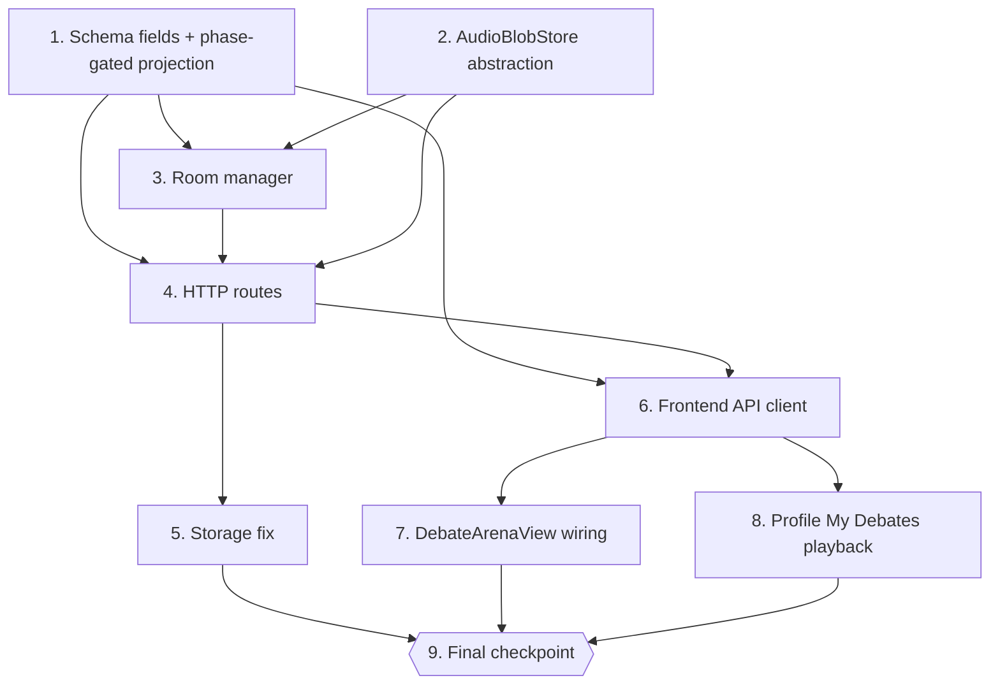

# Implementation Plan: debate-live-audio-playback

## Overview

Convert the `debate-live-audio-playback` design into a sequence of code-generation prompts.
Each task is incremental and lands code that compiles + keeps the existing debate test suite
green. The feature is **strictly additive**: every failure mode of live audio degrades to "no
live audio" while the existing recording → upload → scoring → playback pipeline keeps working.

Order intent (each step keeps the tree green):

- **Pure data + storage abstraction first** (Tasks 1–2): additive Pydantic fields + the
  phase-gated `to_public` projection, and the new `AudioBlobStore` abstraction. These are
  testable in isolation without HTTP, WebSocket, or React.
- **Room manager next** (Task 3): the LiveKit room lifecycle (`_create_livekit_room`),
  `submit_turn` persistence through `AudioBlobStore`, and finalize-time population of
  `DebateRecord.turn_audio`. Consumes the pure layer.
- **HTTP surface** (Task 4): the LiveKit token endpoint, the hardened audio-serve route with
  access control, the debate-detail endpoint, and `my-debates` audio refs.
- **Storage correctness fix** (Task 5): make `list_turns_for_debate_by_code` resolve turns for
  completed/evicted rooms.
- **Frontend surface** (Tasks 6–8): `debateApi.ts` types + calls, `DebateArenaView` LiveKit
  wiring + active-speaker mic gating + playback reuse, and the profile "My Debates" playback
  list.
- **Final verification checkpoint** (Task 9).

Implementation language: **Python 3.11+** for backend (codebase standard) and
**TypeScript + React** for the frontend (matching `frontend/src/`). The design uses real code,
not pseudocode, so the tasks map directly to file edits.

`app/core/livekit_client.py` is **reused unmodified**. `useLiveKitAudio.ts` is **reused
unchanged**. Backend changes are confined to `app/debate/schemas.py`, `app/debate/room_manager.py`,
`app/debate/routes.py`, `app/storage/debate_turns.py`, and the new `app/debate/audio_store.py`;
any change to `app/api/profile_routes.py` is additive only. The out-of-bounds modules from
Requirement 6.1 are never edited.

Test sub-tasks marked with `*` are optional. Property tests use `hypothesis` (already present in
the repo) with a minimum of 100 examples, and cite their design Property number and the
requirements clause they validate.

## Tasks

- [x] 1. Additive schema fields + phase-gated public projection
  - [x] 1.1 Add additive fields and the new response models in `app/debate/schemas.py`
    - Add `livekit_room: Optional[str] = None` to internal `DebateRoom`.
    - Add `livekit_room: Optional[str] = None` to `PublicDebateRoom` (broadcast projection).
    - Add `audio_key: Optional[str] = None` and `audio_content_type: Optional[str] = None` to `DebateTurn`.
    - Add the new model `DebateTurnAudioRef` (fields: `turn_index: int`, `participant_id: str`, `display_name: str`, `audio_url: Optional[str] = None`, `is_forfeit: bool = False`) — response/broadcast-safe, no email/uid.
    - Add `turn_audio: list[DebateTurnAudioRef] = Field(default_factory=list)` to `DebateRecord`.
    - Add the new response model `DebateDetailResponse` (fields: `debate_id: str`, `code: str`, `motion: Motion`, `completed_at: float`, `winner_participant_id: Optional[str] = None`, `turn_audio: list[DebateTurnAudioRef] = []`).
    - Update `to_public(room)` to project `livekit_room = room.livekit_room if room.state in ("prep", "speaking") else None`; all other fields unchanged.
    - All fields are additive with defaults so existing serialization/round-trips keep working.
    - _Requirements: 1.1, 2.1, 3.1, 3.4_

  - [x]* 1.2 Write unit test for `to_public` phase-gating
    - Add `tests/test_debate_audio_schemas.py`. Example-based test: for a `DebateRoom` with `livekit_room` set, assert `to_public(room).livekit_room` is non-null when `room.state in {"prep","speaking"}` and `None` for each of `{"waiting","scoring","complete","abandoned"}`.
    - **Property 1: Live audio phase-gating**
    - **Validates: Requirements 1.1**

  - [x]* 1.3 Write property test for `to_public` phase-gating
    - In `tests/test_debate_audio_schemas.py`, `hypothesis` test (min 100 examples) over a random `room.state` (drawn from all 6 states) and a random non-empty `livekit_room` string. Assert `to_public(room).livekit_room is not None` **iff** `room.state in {"prep","speaking"}`.
    - **Property 1: Live audio phase-gating**
    - **Validates: Requirements 1.1**

  - [x]* 1.4 Write property test for PII-safety of audio projections
    - In `tests/test_debate_audio_schemas.py`, `hypothesis` test (min 100 examples) that constructs random `PublicDebateRoom`, `DebateTurnAudioRef`, and `DebateDetailResponse` instances (with adversarial values) and asserts `model_dump_json()` never contains the substrings `user_email`, `user_id`, `ws_connected_since`, `disconnected_at`, or `_pause_started_at`.
    - **Property 8: PII never leaks**
    - **Validates: Requirements 3.1, 4.4**

- [x] 2. AudioBlobStore storage abstraction
  - [x] 2.1 Create `app/debate/audio_store.py`
    - Define the `AudioBlobStore` `Protocol` with `key_for(debate_id, turn_id, ext) -> str`, `put(key, src_path) -> None`, `open(key) -> tuple[BinaryIO, str]`, `exists(key) -> bool`, `signed_url(key, ttl_seconds=3600) -> Optional[str]`, and `delete(key) -> None`.
    - Implement `LocalDiskAudioStore` (default): `root = Path("uploads/debate-audio")`; `key_for` returns `debate-audio/{debate_id}/{turn_id}.{ext}`; `put` copies the source file to `root/{debate_id}/{turn_id}.{ext}` (creating parents); `open` returns `(binary stream, content_type)`; `exists` checks the resolved path; `signed_url` returns `None` (serve via the app route); `delete` removes the blob.
    - Add a module-level `_content_type_for_ext(ext) -> str` helper (`webm→audio/webm`, `wav→audio/wav`, `mp3→audio/mpeg`, `ogg→audio/ogg`, default `application/octet-stream`).
    - Implement `get_audio_store() -> AudioBlobStore` selecting the backend from `DEBATE_AUDIO_BACKEND` env (default local disk). Do NOT implement the R2 backend now — leave a documented stub/branch only (out of scope per Req 5.3).
    - File resolution MUST derive only from the store key, never from client-supplied paths.
    - _Requirements: 2.1, 4.2, 5.2, 5.3_

  - [x]* 2.2 Write unit test for `LocalDiskAudioStore` round-trip
    - Add `tests/test_debate_audio_store.py`. Using `tmp_path` to override `root`: assert `key_for(debate_id, turn_id, ext)` equals `debate-audio/{debate_id}/{turn_id}.{ext}`; write a temp source file, `put` it, assert `exists(key)` is `True`, `open(key)` yields identical bytes and the expected content type, and `signed_url(key)` returns `None` for the local backend.
    - _Requirements: 2.1, 2.10, 5.2_

- [x] 3. Room manager: LiveKit lifecycle, turn persistence, finalize refs
  - [x] 3.1 Implement `_create_livekit_room` and fire it on prep entry in `app/debate/room_manager.py`
    - Add `async def _create_livekit_room(self, code: str) -> None` mirroring GD: compute `room_name = f"debate-{code.lower()}-{room.debate_id[:8]}"`, and only when `livekit.is_available`, set `room.livekit_room` under the room lock **iff it is not already set** (idempotent), then `await self.broadcast(code)`. When LiveKit is unavailable, log a warning and set nothing. Wrap the body so any exception is caught and logged and never breaks the debate.
    - Fire `asyncio.create_task(self._create_livekit_room(code))` immediately after the room enters `prep` (in `flip_ready` and `_delayed_auto_start`, right after `room.state = "prep"` and spawning the prep timer).
    - _Requirements: 1.1, 1.3, 1.11_

  - [x] 3.2 Refactor `submit_turn` to persist audio via `AudioBlobStore`
    - Replace the ad-hoc `uploads/{turn_id}.{ext}` copy with `store = get_audio_store()`: derive `ext`/`content_type` from `audio_asset.processed_path` via `_content_type_for_ext`, compute `audio_key = store.key_for(room.debate_id, turn_id, ext)`, and `store.put(audio_key, src)` inside a `try/except` that on failure logs a WARNING and sets `audio_key = None`.
    - Set `audio_url = f"/debate/rooms/{code}/audio/{turn_id}"` **iff** `audio_key` is set, else `None`. Build the `DebateTurn` with `audio_key`, `audio_url`, and `audio_content_type` (the last only when `audio_key` is set). Keep the existing `completed_turns_cache` append using `turn.audio_url`.
    - Ensure the forfeit-turn construction path sets `audio_key=None`, `audio_url=None`, `audio_content_type=None`.
    - _Requirements: 2.1, 2.2, 2.4, 2.5, 2.6_

  - [x] 3.3 Populate `DebateRecord.turn_audio` at finalize
    - At the transition into `complete`, when building the `DebateRecord`, read `debate_turns_store.list_turns_for_debate(room.debate_id)` (ordered by `turn_index`), build a `name_by_pid` map from `room.participants`, and construct an ordered `turn_audio` list of `DebateTurnAudioRef` (each with `is_forfeit = t.forfeit_reason is not None` and `display_name` from the map, defaulting to `"Speaker"`). Pass `turn_audio=...` into `DebateRecord` before `debates_store.save_debate(record)`.
    - _Requirements: 3.1, 3.5_

  - [x]* 3.4 Write unit tests for `_create_livekit_room` idempotency and graceful no-op
    - Add `tests/test_debate_livekit_lifecycle.py`. With `livekit.is_available` patched `True`: call `_create_livekit_room` twice and assert `room.livekit_room` is a stable non-empty `debate-{code}-{id8}` name unchanged after the second call. With `livekit.is_available` patched `False`: assert `room.livekit_room` stays `None` and no broadcast side effects raise.
    - **Property 7: Idempotent room naming** and **Property 6: Graceful degradation**
    - **Validates: Requirements 1.11, 1.3**

  - [x]* 3.5 Write unit test for `submit_turn` audio persistence
    - Add `tests/test_debate_submit_turn_audio.py`. Patch `get_audio_store` with a fake store and drive a non-forfeit `submit_turn`: assert the resulting `DebateTurn` has non-null `audio_key`, non-null `audio_url`, `audio_content_type` set, and the fake store received a `put(key, src)` with key matching `debate-audio/{debate_id}/{turn_id}.{ext}`. Then simulate a store `put` raising and assert the turn persists with `audio_key is None` and `audio_url is None` (scoring intact). Assert a forfeit turn has all three audio fields `None`.
    - **Property 3: Every non-forfeit completed turn has retrievable audio**
    - **Validates: Requirements 2.2, 2.4, 2.5**

  - [x]* 3.6 Write property test for audio_url ⟺ audio_key consistency
    - In `tests/test_debate_submit_turn_audio.py`, `hypothesis` test (min 100 examples) generating random `DebateTurn`s produced through the `submit_turn` construction logic (varying `forfeit_reason` and store-write success/failure). Assert for every generated turn `t`: `t.audio_url is not None` **iff** `t.audio_key is not None` (never one without the other).
    - **Property 4: Audio-URL consistency**
    - **Validates: Requirements 2.1**

- [x] 4. HTTP routes: token, hardened audio serve, detail, my-debates
  - [x] 4.1 Add `GET /debate/rooms/{code}/livekit-token` in `app/debate/routes.py`
    - Implement `get_livekit_token(code, current_user=Depends(require_user))` mirroring GD exactly: normalize code; `404 room_not_found` if unknown; `403 not_a_participant` if caller not in `room.participants`; `503 livekit_not_configured` when `not livekit.is_available`; `400 audio_not_ready` when `not room.livekit_room`; call `livekit.create_token(room_name=room.livekit_room, participant_name=..., participant_identity=participant.participant_id, ttl_seconds=3600)`; `500 token_generation_failed` when it returns falsy. Return `{"token", "url": livekit.url, "room": room.livekit_room}` — identity is the opaque `participant_id`, no email/uid.
    - _Requirements: 1.2, 1.4, 1.5, 1.6, 1.7, 4.4_

  - [x] 4.2 Harden `GET /debate/rooms/{code}/audio/{turn_id}` with access control
    - Rewrite `get_turn_audio` per the design: resolve the turn via `debate_turns_store.load_turn(turn_id)`; `404 audio_not_available` when the turn is missing or has no `audio_key`; call `_may_access_debate_audio(current_user, code=normalized, turn=turn)` and raise `403 not_authorized` on failure; `404 audio_file_not_found` when `store.exists(turn.audio_key)` is `False`; if `store.signed_url(...)` returns a URL, `RedirectResponse(url, status_code=302)`; otherwise `StreamingResponse(stream, media_type=turn.audio_content_type or content_type or "audio/webm", ...)`.
    - Add `_may_access_debate_audio(user, *, code, turn)`: `True` for teacher/admin (`is_teacher` or `role in {"teacher","admin"}`); for a live room, `True` iff `user.uid` is a current participant; for a completed/evicted room, resolve `debates_store.get_debate(turn.debate_id)` and check the persisted participant snapshot. Access MUST be evaluated against `turn.debate_id`, not the path `code`.
    - _Requirements: 2.3, 2.7, 2.8, 2.9, 2.10, 4.1, 4.3_

  - [x] 4.3 Add `GET /debate/debates/{debate_id}` detail endpoint
    - Implement `get_debate_detail(debate_id, current_user=Depends(require_user))` returning `DebateDetailResponse`: load the record via `debates_store`; `404` when missing; enforce that the caller is a participant (from the persisted snapshot) or a teacher/admin; project `debate_id`, `code`, `motion`, `completed_at`, `winner_participant_id`, and the record's ordered `turn_audio`.
    - _Requirements: 3.1, 3.4, 3.5_

  - [x] 4.4 Add per-turn audio refs to `GET /debate/my-debates`
    - Extend the local `MyDebateEntry` model with `turn_audio: list[DebateTurnAudioRef] = []` and populate it from each `DebateRecord.turn_audio` (falling back to a `debate_turns_store.list_turns_for_debate` projection for older records without the field). Keep entries PII-safe (no email/uid) and ordered by ascending `turn_index`.
    - _Requirements: 3.1, 3.5_

  - [x]* 4.5 Write unit test for `_may_access_debate_audio`
    - Add `tests/test_debate_audio_access.py`. Cover, for both a live room and a completed/evicted room: participant → `True`, non-participant → `False`, teacher/admin → `True`, and a cross-debate turn (caller is a participant of a *different* `debate_id`) → `False`.
    - **Property 5: Access restricted to participants/teachers**
    - **Validates: Requirements 2.3, 4.1**

  - [x]* 4.6 Write property test for audio access control
    - In `tests/test_debate_audio_access.py`, `hypothesis` test (min 100 examples) over random `(caller, turn, room-membership, role)` tuples. Assert `_may_access_debate_audio` returns `True` **iff** the caller is a participant of `turn.debate_id` **or** is a teacher/admin, and that swapping the path `code` to another debate never grants access.
    - **Property 5: Access restricted to participants/teachers**
    - **Validates: Requirements 2.3, 4.1**

  - [x]* 4.7 Write integration test for the token endpoint status-code matrix
    - Add `tests/test_debate_livekit_routes.py`. With `TestClient`, exercise `GET /debate/rooms/{code}/livekit-token` across the full matrix: `200` (participant + configured + room set), `404 room_not_found`, `403 not_a_participant`, `503 livekit_not_configured`, `400 audio_not_ready`, and `500 token_generation_failed` (patch `create_token` to return `None`). Assert the `200` body carries `token`/`url`/`room` and no email/uid.
    - **Property 2: Token requires membership + configuration**
    - **Validates: Requirements 1.2, 1.4, 1.5, 1.6, 1.7**

  - [x]* 4.8 Write integration test for audio-serve access
    - In `tests/test_debate_livekit_routes.py`, seed a completed debate with a stored turn blob. Assert: a participant gets `200` with the recorded content type; a teacher gets `200`; a caller who is only a participant of a *different* debate gets `403 not_authorized` even when using the other debate's path `code`; a missing turn gives `404 audio_not_available`; a turn whose blob is absent gives `404 audio_file_not_found`.
    - **Property 5: Access restricted to participants/teachers**
    - **Validates: Requirements 2.3, 2.7, 2.8, 2.9, 2.10**

  - [x]* 4.9 Write integration test for my-debates / detail audio refs
    - In `tests/test_debate_livekit_routes.py`, complete a two-participant debate (mock analysis so both turns persist retrievable audio) and assert `GET /debate/my-debates` and `GET /debate/debates/{debate_id}` both return `turn_audio` ordered by ascending `turn_index`, with correct `display_name` labels, `is_forfeit` flags, and no `user_email`/`user_id` fields.
    - _Requirements: 3.1, 3.4, 3.5_

- [x] 5. Storage correctness fix
  - [x] 5.1 Fix `list_turns_for_debate_by_code` in `app/storage/debate_turns.py`
    - Replace the current `[]` stub so it resolves `debate_id` from the `debates` store by `code`, then reuses `list_turns_for_debate(debate_id)`. This lets the audio-serve path resolve turns for completed/evicted rooms without adding `room_code` to every turn row. Change is confined to this file.
    - _Requirements: 2.3, 3.1_

  - [x]* 5.2 Write unit test for `list_turns_for_debate_by_code`
    - Add `tests/test_debate_turns_by_code.py`. Using `monkeypatch` to point the stores at `tmp_path`: seed a `DebateRecord` (with a `code`) and its turns, then assert `list_turns_for_debate_by_code(code)` returns exactly those turns ordered by `turn_index`, and returns `[]` for an unknown code.
    - _Requirements: 2.3, 3.5_

- [x] 6. Frontend types and API client (`frontend/src/debateApi.ts`)
  - [x] 6.1 Add live-audio + playback types and calls
    - Add interfaces `LiveKitTokenResponse` (`token`, `url`, `room`), `DebateTurnAudioRef` (`turn_index`, `participant_id`, `display_name`, `audio_url: string | null`, `is_forfeit`), and `DebateDetailResponse` (`debate_id`, `code`, `motion`, `completed_at`, `winner_participant_id: string | null`, `turn_audio: DebateTurnAudioRef[]`).
    - Add `livekit_room: string | null` to `PublicDebateRoom` and `turn_audio: DebateTurnAudioRef[]` to `MyDebateEntry`.
    - Implement `getDebateLiveKitToken(code): Promise<LiveKitTokenResponse>` (GET `/debate/rooms/{code}/livekit-token`) and `getDebateDetail(debateId): Promise<DebateDetailResponse>` (GET `/debate/debates/{debateId}`), mirroring the existing fetch/error/auth-header helpers in the file.
    - _Requirements: 1.2, 3.1, 3.4_

  - [x]* 6.2 TypeScript sanity via `npx tsc --noEmit`
    - From `frontend/`, run `npx tsc --noEmit` and confirm the new types and calls type-check with zero errors.
    - _Requirements: 1.2, 3.4_

- [x] 7. DebateArenaView: LiveKit wiring, mic gating, playback reuse
  - [x] 7.1 Wire the LiveKit token fetch and `useLiveKitAudio` in `frontend/src/components/DebateArenaView.tsx`
    - Fetch a token via `getDebateLiveKitToken(roomCode)` only when `state.livekit_room` is set and `state.state ∈ {"prep","speaking"}` (mirror `GDArenaView`). On a `503 livekit_not_configured`, degrade silently (no error banner); on other errors surface a non-blocking message.
    - Instantiate `useLiveKitAudio({ serverUrl: token?.url ?? null, token: token?.token ?? null, enabled: (state.state === "prep" || state.state === "speaking") && !!token })` so every participant joins to **hear**. `useLiveKitAudio.ts` is reused unchanged.
    - _Requirements: 1.2, 1.9, 5.1_

  - [x] 7.2 Implement active-speaker microphone gating
    - Compute `myTurnIndex` from `state.participants` and `isMyTurn = state.state === "speaking" && myTurnIndex === state.active_turn_index`. Publish the mic only when `isMyTurn`; keep it muted otherwise (including all of `prep`). Drive this via the hook's mute toggle, matching the design's gating effect. The existing `useAudioRecorder` recording path is left independent and unchanged (MediaRecorder remains the authoritative scored/persisted audio; do not `stop()` a shared `MediaStreamTrack`).
    - _Requirements: 1.8, 1.9, 1.10, 2.6, 6.2_

  - [x] 7.3 Render post-debate playback and the live/degraded indicator
    - On the results/completion screen, reuse the existing `CompletedTurnsAudio` component to render a per-speaker `<audio>` list from `state.completed_turns` and, after completion, from `getDebateDetail(...).turn_audio`. Render no playback control for forfeit turns (`is_forfeit`/null `audio_url`).
    - Show a small "live audio" indicator while joined, and an unobtrusive "live audio unavailable" state when the token fetch returned `503` — without blocking recording, upload, scoring, or playback.
    - _Requirements: 1.3, 3.2, 3.3_

  - [x]* 7.4 TypeScript sanity via `npx tsc --noEmit`
    - From `frontend/`, run `npx tsc --noEmit` and confirm `DebateArenaView.tsx` and its new usages type-check with zero errors.
    - _Requirements: 3.2_

- [x] 8. Profile "My Debates" playback list
  - [x] 8.1 Render per-speaker playback in `frontend/src/components/ProfileView.tsx`
    - In the "My Debates" panel, render a compact per-speaker audio player list for each completed debate from `MyDebateEntry.turn_audio` (or a `getDebateDetail` fetch on expand). To keep playback consistent with the arena without editing `DebateArenaView.tsx` in the same wave as Task 7, extract the `CompletedTurnsAudio`-style rendering into a new shared component (e.g. `frontend/src/components/DebateTurnsAudio.tsx`) and import it from `ProfileView.tsx` (Task 7.3 may consume the same shared component). Skip forfeit turns and order players by ascending `turn_index`. Any backend touch for this stays additive in `app/api/profile_routes.py` only.
    - _Requirements: 3.1, 3.2, 3.3, 3.5, 6.3_

  - [x]* 8.2 TypeScript sanity via `npx tsc --noEmit`
    - From `frontend/`, run `npx tsc --noEmit` and confirm `ProfileView.tsx` and any shared playback component type-check with zero errors.
    - _Requirements: 3.2_

- [x] 9. Final verification checkpoint
  - [x] 9.1 Run backend tests, import sanity, and frontend type-check
    - Run `python -m pytest tests/ -k debate -q` from the repo root and assert all debate tests pass (including any starred tests that were implemented).
    - Run `python -c "import app.main"` and assert it imports cleanly (registers the new/changed `/debate` endpoints without error).
    - Run `npx tsc --noEmit` from `frontend/` and assert zero errors.
    - Ensure all tests pass; ask the user if questions arise.
    - _Requirements: 5.1, 5.2, 6.1, 6.2, 6.3_

## Notes

- Sub-tasks marked with `*` are optional (unit, property, and integration tests). Core
  implementation sub-tasks are never marked optional.
- Property tests use `hypothesis` with a minimum of 100 examples and cite their design Property
  number plus the requirements clause they validate.
- The plan keeps the tree green at every step: additive schema fields + storage abstraction
  (Tasks 1–2) → room manager (Task 3) → HTTP routes (Task 4) → storage fix (Task 5) → frontend
  (Tasks 6–8) → final checkpoint (Task 9).
- Non-modification boundaries (Req 6.1) are respected: `app/pronunciation`, `app/battles`,
  `app/asr`, `app/audio`, `app/attempts`, `app/auth`, `app/interview`, `app/fluency`, `ss3`, and
  `app/api/analysis_routes.py` are never edited. `app/core/livekit_client.py` and
  `useLiveKitAudio.ts` are reused unmodified. Backend writes are confined to
  `app/debate/schemas.py`, `app/debate/room_manager.py`, `app/debate/routes.py`,
  `app/storage/debate_turns.py`, and the new `app/debate/audio_store.py`; `app/api/profile_routes.py`
  is only touched additively.
- Live audio is strictly additive — every LiveKit failure mode degrades to "no live audio"
  while recording/upload/scoring/playback continue (Property 6).

## Task Dependency Graph



**Critical path**: 1 → 3 → 4 → 6 → 7 → 9. Tasks 2, 5, 8 hang off this spine and can be
developed in parallel once their predecessors are satisfied.

**Stage gates**:

- Tasks 1 and 2 (pure layer) gate the room manager; their unit/property tests (1.2–1.4, 2.2)
  should be green before Task 3 starts.
- Task 4 (routes) depends on the room manager persisting `audio_key`/`audio_url` and on the
  schema models; its status-code and access-control tests gate the frontend.
- Task 9 (final checkpoint) gates the spec being marked complete: every core sub-task in
  Tasks 1–8 must be implemented and every non-starred test must pass here.

**File-conflict isolation** (tasks writing the same file are never in the same wave):
`schemas.py` (T1), `audio_store.py` (T2), `room_manager.py` (T3), `routes.py` (T4),
`debate_turns.py` (T5), `debateApi.ts` (T6), `DebateArenaView.tsx` (T7), `ProfileView.tsx` (T8)
are each isolated to a single wave.

```json
{
  "waves": [
    { "id": 0, "tasks": ["1.1", "2.1"] },
    { "id": 1, "tasks": ["1.2", "1.3", "1.4", "2.2"] },
    { "id": 2, "tasks": ["3.1", "3.2", "3.3"] },
    { "id": 3, "tasks": ["3.4", "3.5", "3.6"] },
    { "id": 4, "tasks": ["4.1", "4.2", "4.3", "4.4"] },
    { "id": 5, "tasks": ["4.5", "4.6", "4.7", "4.8", "4.9", "5.1"] },
    { "id": 6, "tasks": ["5.2", "6.1"] },
    { "id": 7, "tasks": ["6.2", "7.1", "8.1"] },
    { "id": 8, "tasks": ["7.2", "7.3", "8.2"] },
    { "id": 9, "tasks": ["7.4", "9.1"] }
  ]
}
```
