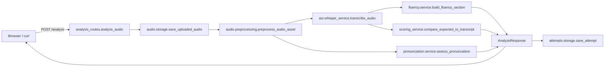

# Design Document

## Overview

This design implements Phase 0 cleanup and Phase 1 foundation for the soft-skills speech platform. The work spans the full `/analyze` request flow — from upload through preprocessing, ASR, pronunciation assessment, fluency stub, persistence, and frontend rendering — without introducing new runtime dependencies and without breaking the working `hf_phoneme` provider or the recently-updated frontend.

The design is organized around four core ideas:

1. **One canonical response shape.** The `AnalyzeResponse` becomes `{analysis_id, audio, transcription, pronunciation, fluency, communication, debug}`. The legacy flat fields (`word_scores`, `mfa_available`, `mfa_error`, `expected_phonemes`, `phoneme_timeline`, `mistakes`, `pronunciation_score`, `clarity_score`, `pace_wpm`, `transcript`, `expected_text`, `language`, `processed_audio_path`, `words`) are removed in a sequence that updates the frontend first, then trims the backend.
2. **Module boundaries match responsibility.** `audio/`, `asr/`, `pronunciation/`, `attempts/` already exist. A new `fluency/` package owns the fluency contract. Cross-module imports flow downstream only: `api → fluency, pronunciation, asr, audio, attempts → core, utils, schemas`.
3. **Cleanup is bounded by Phase 0.** Misleading scoring helpers are deleted from `scoring_service.py`. The `pronunciation/whisper_service.py` re-export shim is removed. `mfa_service.py` either moves out of the request flow entirely or is deleted; this design chooses deletion because nothing imports it on the happy path. Hardcoded developer-machine paths in `mfa_service.py` go away with the file.
4. **Phase 1 contracts are honest.** Where a metric is not implemented yet (silence_ratio, filler_word_count, repetition_count, communication rubric), the field is present in the response but populated with deterministic stub values (`null` for ratios, `0` for counts, `available: false` for the communication section). This keeps the frontend stable across phases.

The end state is verifiable by running `pytest` from the repo root.

## Architecture

### Module map

```text
app/
  api/
    routes.py                 # top-level APIRouter aggregator
    health_routes.py          # GET /
    prompt_routes.py          # GET /battle/prompts
    analysis_routes.py        # POST /analyze            (thin orchestrator)
    attempts_routes.py        # GET /attempts
  audio/
    schemas.py                # AudioAsset
    storage.py                # save_uploaded_audio
    preprocessing.py          # preprocess_audio_asset (ffmpeg)
  asr/
    schemas.py                # TranscribedWord, TranscriptionResult
    whisper_service.py        # transcribe_audio
  fluency/                    # NEW
    __init__.py
    schemas.py                # FluencyResult
    service.py                # build_fluency_section (stub-aware)
  pronunciation/
    service.py                # get_pronunciation_provider, assess_pronunciation
    scoring_service.py        # SLIMMED: clarity, pace, transcript-vs-expected ONLY
    transcript_cleaner.py     # normalize_transcript
    phoneme_normalize.py      # used by hf_phoneme
    phoneme_service.py        # CMU dict lookups (used by hf_phoneme, local, mock)
    providers/
      base.py                 # PronunciationProvider protocol
      unavailable.py
      mock.py
      local.py
      local_acoustic.py
      hf_phoneme.py
    acoustic/                 # GOPT stub (unchanged)
  attempts/
    schemas.py                # AttemptSummary, AttemptListResponse, build_attempt_summary
    storage.py                # save_attempt, load_recent_attempts, count_attempts
  schemas/
    pronunciation_schema.py   # SLIMMED: AnalyzeResponse + Pronunciation* records ONLY
                              # (legacy WordPronunciationScore, ExpectedWordPhonemes,
                              #  PhonemeTiming removed)
  core/
    config.py                 # settings
    logger.py                 # logger
    exceptions.py
  utils/
    ffmpeg_utils.py
    file_utils.py
  frontend/
    app.js                    # UPDATED: reads sectioned response
    index.html
    styles.css
  main.py                     # FastAPI app + /ui mount
```

### Files deleted in this spec

- `app/pronunciation/whisper_service.py` (re-export shim; consumers move to `app.asr.whisper_service`).
- `app/pronunciation/mfa_service.py` (hardcoded developer paths, `print` debugging, nothing in the request flow imports it).
- The `app/mfa_models/` directory is left in place (it contains `cmudict.dict` which is still used indirectly via the `cmudict` package; deletion is out of scope for this spec).

### Files added

- `app/fluency/__init__.py`
- `app/fluency/schemas.py`
- `app/fluency/service.py`
- `tests/fixtures/short_sample.wav` (≤2s, 16kHz mono, ≤200KB, generated and checked in)
- `tests/test_fluency_service.py`
- `tests/test_attempts_storage.py`
- `tests/test_provider_dispatch.py`
- `tests/test_transcript_cleaner.py`
- `tests/test_audio_fixture.py` (real ffmpeg call, marked with `@pytest.mark.audio` so it can be skipped if ffmpeg is absent)
- `tests/conftest.py` (helpers for temporary attempts paths and sample audio access)

### Request flow



The Analyze_API orchestrates but does no scoring of its own. Every box logs one record with `analysis_id` as the correlation id (Requirement 11).

### Response shape transition strategy

The legacy `AnalyzeResponse` carries 18 top-level fields. We cannot delete legacy fields and update the frontend in the same commit because the frontend reads several of them today (`result.transcript`, `result.clarity_score`, `result.pace_wpm`, `result.word_scores`, `result.words`, `result.mistakes`, `result.language`). Two staged commits keep the system green:

1. **Stage A — additive backend, defensive frontend.** Backend keeps emitting both old and new fields. Frontend is updated to prefer sectioned fields (`pronunciation.overall_score`, `fluency.clarity_score`, `fluency.words_per_minute`, `pronunciation.words[*]`, `debug.transcript_mistakes`) and to ignore legacy fields. Frontend is verified manually with one upload.
2. **Stage B — backend trim.** Once the frontend is on the sectioned shape, the `AnalyzeResponse` pydantic model is rewritten to expose only the seven sectioned keys. Legacy field builders in `analysis_routes.py` are deleted. Existing tests in `tests/test_analysis_contracts.py` are updated to assert the new key set exactly.

This is encoded as separate tasks (see `tasks.md` 4.x → 5.x ordering) so each commit leaves the app working.

### Provider dispatch (preserved)

`get_pronunciation_provider()` in `app/pronunciation/service.py` keeps its current behavior: a case-insensitive match on `settings.PRONUNCIATION_PROVIDER` selects one of `local`, `local_acoustic`, `hf_phoneme`, or `mock`; any other value (including the empty string and `unavailable`) falls back to `UnavailablePronunciationProvider`. The `hf_phoneme` provider is still imported lazily inside the dispatcher to keep `transformers`/`torch` out of the import graph for users on the `local` or `mock` path.

### Logging strategy

`app/core/logger.py` already configures a single named logger. For Phase 1, we keep the same logger but standardize on a one-line "key=value" extra-data format so future ingestion (Phase 6 observability) does not require a rewrite. Each stage emits a single structured `INFO` line. Helpers live in a small new module `app/core/logging_helpers.py` (no new dependency):

```python
def stage_log(stage: str, analysis_id: str, **fields) -> str:
    parts = [f"stage={stage}", f"analysis_id={analysis_id}"]
    parts.extend(f"{k}={v}" for k, v in fields.items())
    return " ".join(parts)
```

Stages: `analyze_received`, `audio_saved`, `audio_preprocessed`, `asr_done`, `pronunciation_done`, `fluency_done`, `attempt_saved`. Errors call `logger.error(stage_log("...error", analysis_id, exc=type(e).__name__))` before re-raising.

Note: `analysis_id` is created at the top of `analyze_audio` before any work, so it is available to every stage. `audio_id` is created inside `save_uploaded_audio`; we plumb it forward via the `AudioAsset`.

### Module boundaries (no cross-leakage)

After cleanup, the import directions are:

- `api/*` imports from `audio`, `asr`, `pronunciation`, `fluency`, `attempts`, `schemas`, `core`. It does not import providers directly except through `pronunciation.service`.
- `audio/*` imports from `core`, `utils`, `schemas` (audio schemas).
- `asr/*` imports from `core`, `utils`, `schemas` (asr schemas), and `pronunciation.transcript_cleaner` for `normalize_transcript`. We accept the cleaner sitting under `pronunciation/` for this spec (moving it to `core/text.py` is a small follow-up; out of scope).
- `pronunciation/*` imports from `core`, `asr.schemas` (for `TranscriptionResult` parameter type), and `schemas.pronunciation_schema`.
- `fluency/*` imports from `core`, `asr.schemas`, `audio.schemas`, and `pronunciation.scoring_service` (for `calculate_clarity_score` only).
- `attempts/*` imports from `core` and `schemas`. It reads sectioned fields out of a `dict` to avoid pulling in `AnalyzeResponse` and creating a cycle.

There is no import from a downstream layer back to `api/`. The Analyze_API is the only place that wires everything together.

## Components and Interfaces

### `app/api/analysis_routes.py` — Analyze_API

Becomes a thin orchestrator (~60 lines). Pseudocode:

```python
@router.post("/analyze", response_model=AnalyzeResponse)
async def analyze_audio(
    file: UploadFile = File(...),
    expected_text: str | None = Form(None),
):
    analysis_id = str(uuid4())
    logger.info(stage_log("analyze_received", analysis_id,
                          content_type=file.content_type,
                          size_hint=file.size))

    audio_asset = await save_uploaded_audio(file)
    logger.info(stage_log("audio_saved", analysis_id,
                          audio_id=audio_asset.audio_id,
                          size_bytes=audio_asset.size_bytes))

    audio_asset = preprocess_audio_asset(audio_asset)
    logger.info(stage_log("audio_preprocessed", analysis_id,
                          audio_id=audio_asset.audio_id,
                          processed_path=audio_asset.processed_path,
                          duration=audio_asset.duration_seconds,
                          sample_rate=audio_asset.sample_rate,
                          channels=audio_asset.channels))

    transcription = transcribe_audio(audio_asset.processed_path)
    logger.info(stage_log("asr_done", analysis_id,
                          provider=transcription.provider,
                          model=transcription.model,
                          word_count=len(transcription.words)))

    pronunciation = assess_pronunciation(
        audio_path=audio_asset.processed_path,
        expected_text=expected_text,
        transcription=transcription,
    )
    logger.info(stage_log("pronunciation_done", analysis_id,
                          provider=pronunciation.provider,
                          available=pronunciation.available,
                          overall_score=pronunciation.overall_score))

    fluency = build_fluency_section(
        transcription=transcription,
        audio_asset=audio_asset,
    )
    logger.info(stage_log("fluency_done", analysis_id,
                          wpm=fluency.words_per_minute,
                          clarity=fluency.clarity_score))

    debug = build_debug_section(
        expected_text=expected_text,
        transcription=transcription,
    )

    response = AnalyzeResponse(
        analysis_id=analysis_id,
        audio=audio_asset,
        transcription=transcription,
        pronunciation=pronunciation,
        fluency=fluency,
        communication=unavailable_communication_section(),
        debug=debug,
    )

    try:
        save_attempt(
            build_attempt_summary(
                analysis_id=analysis_id,
                response_data=response.model_dump(),
            )
        )
    except Exception as exc:
        logger.warning(
            stage_log("attempt_persist_failed", analysis_id,
                      exc=type(exc).__name__)
        )

    return response
```

Helpers `build_debug_section` and `unavailable_communication_section` live in the same module:

```python
def build_debug_section(expected_text, transcription):
    if not expected_text:
        return {
            "expected_text_provided": False,
            "expected_text": None,
            "transcript_match_score": None,
            "transcript_mistakes": [],
        }
    score, mistakes = compare_expected_to_transcript(
        expected_text, transcription.normalized_text
    )
    return {
        "expected_text_provided": True,
        "expected_text": expected_text,
        "transcript_match_score": score,
        "transcript_mistakes": mistakes,  # [{expected_word, heard_word, feedback}]
    }


def unavailable_communication_section():
    return {
        "available": False,
        "provider": None,
        "overall_score": None,
        "rubric_version": None,
        "message": "Communication rubric scoring is not configured yet.",
    }
```

### `app/fluency/service.py` — Fluency_Service (new)

```python
def build_fluency_section(
    transcription: TranscriptionResult,
    audio_asset: AudioAsset,
) -> FluencyResult:
    words = transcription.words
    if words:
        start = min(w.start for w in words)
        end = max(w.end for w in words)
        speech_duration = round(end - start, 3)
        minutes = (end - start) / 60.0
        wpm = round(len(words) / minutes, 2) if minutes > 0 else 0
    else:
        speech_duration = 0
        wpm = 0

    return FluencyResult(
        words_per_minute=wpm,
        speech_duration_seconds=speech_duration,
        total_duration_seconds=audio_asset.duration_seconds or 0,
        silence_ratio=None,
        long_pause_count=0,
        filler_word_count=0,
        repetition_count=0,
        clarity_score=calculate_clarity_score(words),
    )
```

`calculate_clarity_score` is imported from the slimmed `pronunciation/scoring_service.py` and continues to read `word.confidence` from `TranscribedWord`. (It was previously calling `word.probability` on a now-removed legacy type; the rewrite reads `confidence` directly.)

### `app/pronunciation/scoring_service.py` — slimmed

After cleanup, this file exports exactly these symbols:

- `normalize_transcript` (re-exported from `transcript_cleaner` for backward import compatibility — optional; can be inlined).
- `calculate_clarity_score(words: List[TranscribedWord]) -> float`
- `calculate_pace_wpm(words: List[TranscribedWord]) -> float`  (kept for any callers, though Fluency_Service does its own WPM computation)
- `compare_expected_to_transcript(expected_text: str, transcript: str) -> (Optional[float], List[Mistake])`
- `build_feedback(expected_word: str, heard_word: str | None) -> str`
- `SPECIAL_FEEDBACK` constant (silent-letter feedback)

Symbols removed:

- `calculate_phoneme_score`
- `find_short_phonemes`
- `apply_phoneme_timing_penalty`
- `build_word_scores`
- `get_heard_word_for_expected`
- `find_word_probability`
- `calculate_pronunciation_score`
- `MIN_PHONEME_DURATION_SECONDS`, `SHORT_DURATION_PHONEME_PENALTY`, `PHONEME_TIMING_SCORE_CAP`, `VOWEL_PHONEMES`

The `compare_expected_to_transcript` return type changes: it now returns a list of plain dicts `{expected_word, heard_word, feedback}` (no `PronunciationMistake` model). The Analyze_API places them directly under `debug.transcript_mistakes`. This removes the need for `PronunciationMistake` from the schema module.

### `app/pronunciation/service.py` — Pronunciation_Service (preserved)

No behavior change. We add one safety net to satisfy Requirement 2.3: wrap the provider call in a try/except inside `assess_pronunciation` so a provider exception becomes a `PronunciationResult(available=False, message=...)` rather than a 500.

```python
def assess_pronunciation(audio_path, expected_text, transcription=None):
    provider = get_pronunciation_provider()
    try:
        return provider.assess(
            audio_path=audio_path,
            expected_text=expected_text,
            transcription=transcription,
        )
    except Exception as exc:
        logger.exception("pronunciation provider %s failed", provider.provider_name)
        return PronunciationResult(
            available=False,
            provider=getattr(provider, "provider_name", None),
            overall_score=None,
            words=[],
            phoneme_errors=[],
            message=f"Pronunciation provider failed: {type(exc).__name__}",
        )
```

### `app/attempts/schemas.py` — AttemptSummary (preserved, retargeted)

`build_attempt_summary` already reads `response_data["pronunciation"]` and `response_data["fluency"]` first, falling back to top-level legacy fields. After Stage B (legacy fields removed), the fallbacks become unreachable and are deleted in the same task.

### `app/api/attempts_routes.py` — Attempts_API (preserved)

`GET /attempts` already accepts `limit` with `ge=1, le=50` and default `20`. Out-of-range values produce HTTP `422` automatically via FastAPI's validation. No changes required.

### `app/frontend/app.js` — Frontend (updated)

`renderResult` is rewritten to read from sectioned fields. Specifically:

- `pronunciationScore` ← `pronunciation.overall_score` (only when `pronunciation.available`).
- `clarityScore` ← `fluency.clarity_score`.
- `paceScore` ← `fluency.words_per_minute`.
- `transcriptText` ← `transcription.text` (preferred) with fallback to `transcription.normalized_text`.
- `mistakesList` ← `debug.transcript_mistakes` plus a synthesized line per `pronunciation.phoneme_errors[*]`.
- `wordsList` ← `pronunciation.words` when `pronunciation.available`, otherwise `transcription.words` rendered with timing only.
- `providerInfo` rows read from `pronunciation`, `transcription`, `fluency.clarity_score`, `audio` — same as today but without the `result.language` fallback (use `transcription.language`).
- `loadAttempts` renders from `AttemptSummary` fields, which are unchanged.

`index.html` and `styles.css` are not touched.

## Data Models

### AudioAsset (`app/audio/schemas.py`) — unchanged shape

| Field | Type | Notes |
|---|---|---|
| audio_id | str | UUID; distinct from `analysis_id` |
| original_path | str | path under `uploads/` |
| processed_path | Optional[str] | path under `temp/` after ffmpeg |
| duration_seconds | Optional[float] | rounded to 3 decimals |
| sample_rate | Optional[int] | 16000 after preprocess |
| channels | Optional[int] | 1 after preprocess |
| format | Optional[str] | "WAV" after preprocess |
| content_type | Optional[str] | source MIME |
| original_filename | Optional[str] |  |
| size_bytes | Optional[int] | total bytes received |

### TranscriptionResult (`app/asr/schemas.py`) — unchanged shape

| Field | Type | Notes |
|---|---|---|
| text | str | Whisper raw text |
| normalized_text | str | lowercase, `[a-z0-9 ]` only |
| language | str | default `"en"` |
| provider | str | `"whisper"` |
| model | str | `"small"` or whatever is active |
| words | List[TranscribedWord] | `word`, `start`, `end`, `confidence` |
| segments | List[dict] | raw Whisper segments |

### FluencyResult (`app/fluency/schemas.py`) — new

```python
class FluencyResult(BaseModel):
    words_per_minute: float = 0
    speech_duration_seconds: float = 0
    total_duration_seconds: float = 0
    silence_ratio: Optional[float] = None
    long_pause_count: int = 0
    filler_word_count: int = 0
    repetition_count: int = 0
    clarity_score: float = 0
```

`clarity_score` is included because the Frontend already reads it from this section. When clarity moves to its own engine in a later phase, the field stays in the same place.

### PronunciationResult (`app/schemas/pronunciation_schema.py`) — unchanged shape

After cleanup the module exposes exactly:

- `PhonemeError` (`type`, `word`, `expected`, `observed`, `message`)
- `WordPronunciationResult` (`word`, `score`, `expected_phonemes`, `observed_phonemes`, `errors`, `feedback`)
- `PronunciationResult` (`available`, `provider`, `overall_score`, `words`, `phoneme_errors`, `message`, `raw`)
- `AnalyzeResponse` (`analysis_id`, `audio`, `transcription`, `pronunciation`, `fluency`, `communication`, `debug`)

Removed: `WordTimestamp`, `WordPronunciationScore`, `PhonemeTiming`, `ExpectedWordPhonemes`, `PronunciationMistake`, and the eleven legacy top-level fields on `AnalyzeResponse`.

### AnalyzeResponse — new shape

```python
class AnalyzeResponse(BaseModel):
    analysis_id: str
    audio: AudioAsset
    transcription: TranscriptionResult
    pronunciation: PronunciationResult
    fluency: FluencyResult
    communication: dict        # {available, provider, overall_score, rubric_version, message}
    debug: dict                # {expected_text_provided, expected_text,
                               #  transcript_match_score, transcript_mistakes}
```

`communication` and `debug` stay as `dict` for now because their shape will evolve in Phase 3 (communication) and Phase 2 (debug enrichment). The shape is documented here and asserted in tests.

### AttemptSummary (`app/attempts/schemas.py`) — unchanged shape

```python
class AttemptSummary(BaseModel):
    analysis_id: str
    created_at: str
    expected_text: Optional[str]
    transcript: str
    language: str
    duration_seconds: Optional[float]
    pronunciation_provider: Optional[str]
    pronunciation_available: bool
    pronunciation_score: Optional[float]
    clarity_score: Optional[float]
    pace_wpm: Optional[float]
    mistakes_count: int
```

`build_attempt_summary` reads:

- `analysis_id`, `created_at` from arguments / `datetime.utcnow()`.
- `expected_text` from `response_data["debug"]["expected_text"]`.
- `transcript` from `response_data["transcription"]["text"]` (or `normalized_text` if `text` is absent).
- `language` from `response_data["transcription"]["language"]`.
- `duration_seconds` from `response_data["audio"]["duration_seconds"]`.
- `pronunciation_*` from `response_data["pronunciation"]`.
- `clarity_score`, `pace_wpm` from `response_data["fluency"]`.
- `mistakes_count` from `len(response_data["debug"]["transcript_mistakes"])`.

## Correctness Properties

*A property is a characteristic or behavior that should hold true across all valid executions of a system — essentially, a formal statement about what the system should do. Properties serve as the bridge between human-readable specifications and machine-verifiable correctness guarantees.*

The properties below were derived from the prework analysis of every acceptance criterion. Redundant or subsumed properties were combined during the property-reflection step. Each property names the requirements it validates. Properties marked "fixture-backed" run against the audio fixture under `tests/fixtures/`; all other properties run with mocked I/O.

### Property 1: Sectioned response shape and section types

*For any* successful `/analyze` invocation, the response body has exactly the top-level keys `{analysis_id, audio, transcription, pronunciation, fluency, communication, debug}`, and the values under `audio`, `transcription`, `pronunciation`, and `fluency` parse as `AudioAsset`, `TranscriptionResult`, `PronunciationResult`, and `FluencyResult` respectively.

**Validates: Requirements 1.1, 1.3**

### Property 2: Analysis and audio identifiers are fresh UUIDs

*For any* successful `/analyze` invocation, `response.analysis_id` and `response.audio.audio_id` both parse as RFC-4122 UUID strings and are distinct from each other; and across any sequence of N independent invocations, the N `analysis_id` values are pairwise distinct.

**Validates: Requirements 1.2, 5.6**

### Property 3: Debug section reflects expected_text presence

*For any* `(expected_text, transcript)` pair, the `debug` section satisfies: when `expected_text` is `None` or empty, `debug.expected_text_provided` is `False`, `debug.transcript_match_score` is `None`, and `debug.transcript_mistakes` is `[]`; otherwise `debug.expected_text_provided` is `True` and `debug.transcript_match_score` is a number in `[0, 100]`.

**Validates: Requirements 1.5, 1.6**

### Property 4: Provider dispatch is total and case-insensitive

*For any* string value `v`, `get_pronunciation_provider()` (with `settings.PRONUNCIATION_PROVIDER = v`) returns: `LocalPronunciationProvider` when `v.lower() == "local"`; `LocalAcousticPronunciationProvider` when `v.lower() == "local_acoustic"`; `HFPhonemePronunciationProvider` when `v.lower() == "hf_phoneme"`; `MockPronunciationProvider` when `v.lower() == "mock"`; and `UnavailablePronunciationProvider` for any other value (including the empty string).

**Validates: Requirements 2.1, 3.2**

### Property 5: Pronunciation availability invariants

*For any* `PronunciationResult` produced by `assess_pronunciation`, the result satisfies all of: `result.available in {True, False}`; `available=True ⇒ result.provider` is a non-empty string and every entry of `result.words` exposes `word`, `score`, `expected_phonemes`, `observed_phonemes`, `errors`, and `feedback`; `available=False ⇒ result.overall_score is None ∧ result.words == [] ∧ result.phoneme_errors == []`; and the `Unavailable` and `Mock` providers always yield `overall_score is None` even when the supplied transcript exactly equals the expected text.

**Validates: Requirements 2.4, 8.1, 8.2, 8.3**

### Property 6: Provider exceptions become graceful PronunciationResult

*For any* provider exception (any exception class, any message), `assess_pronunciation` returns a `PronunciationResult` with `available=False`, `overall_score=None`, `words=[]`, `phoneme_errors=[]`, and a `message` containing the exception class name.

**Validates: Requirements 2.3**

### Property 7: phoneme_errors entries are well-formed

*For any* `PronunciationResult` whose `phoneme_errors` list is non-empty, every entry has a non-empty `type` string and a non-empty `message` string; and when the entry's `type` is `"substitution"`, both `expected` and `observed` are non-empty strings.

**Validates: Requirements 8.4**

### Property 8: AudioAsset carries the contract fields after upload

*For any* successful `save_uploaded_audio` followed by `preprocess_audio_asset`, the resulting `AudioAsset` exposes non-null `audio_id`, `original_path`, `processed_path`, `duration_seconds`, `sample_rate`, `channels`, and `format`.

**Validates: Requirements 5.1**

### Property 9: Processed audio is 16 kHz mono WAV (fixture-backed)

*For any* uploaded audio file accepted by `save_uploaded_audio`, the `AudioAsset.processed_path` returned by `preprocess_audio_asset` is a WAV file whose probed sample rate is `16000` and whose channel count is `1`.

**Validates: Requirements 5.2**

### Property 10: Unsupported content types are rejected

*For any* string `c` not in `SUPPORTED_AUDIO_TYPES`, calling `save_uploaded_audio` with an `UploadFile` whose `content_type == c` raises `HTTPException(status_code=415)`.

**Validates: Requirements 5.3**

### Property 11: normalize_transcript invariants

*For any* input string `s`, `normalize_transcript(s)` returns a string `t` satisfying all of: `t == t.lower()`; every character of `t` is in `[a-z0-9 ]`; `t` contains no consecutive spaces; and `t` has no leading or trailing whitespace.

**Validates: Requirements 6.4**

### Property 12: FluencyResult contract shape

*For any* `(TranscriptionResult, AudioAsset)` pair, `build_fluency_section` returns a `FluencyResult` whose JSON dump contains exactly the keys `words_per_minute`, `speech_duration_seconds`, `total_duration_seconds`, `silence_ratio`, `long_pause_count`, `filler_word_count`, `repetition_count`, and `clarity_score`.

**Validates: Requirements 7.1**

### Property 13: WPM formula

*For any* `TranscriptionResult` with words `w_1..w_n` and `AudioAsset` with any `duration_seconds`, `build_fluency_section` produces `words_per_minute` equal to `round(n / ((max(w_i.end) - min(w_i.start)) / 60.0), 2)` when `n >= 1` and the span is positive, and equal to `0` when `n == 0` or the span is `0`.

**Validates: Requirements 7.2, 7.3**

### Property 14: total_duration_seconds passes through audio duration

*For any* `AudioAsset.duration_seconds` value `d` (including `None`, `0`, and any positive float), `build_fluency_section` returns a `FluencyResult` with `total_duration_seconds == d` when `d is not None`, and `0` when `d is None`.

**Validates: Requirements 7.4**

### Property 15: clarity_score formula

*For any* list of `TranscribedWord` instances with confidences in `[0, 1]`, `calculate_clarity_score(words)` returns `round(mean(w.confidence for w in words) * 100, 2)` when the list is non-empty, and `0` when the list is empty.

**Validates: Requirements 7.6**

### Property 16: save_attempt round-trips through JSONL

*For any* valid `AttemptSummary` instance `a`, calling `save_attempt(a)` on a fresh `outputs/attempts.jsonl` file appends exactly one line and, after parsing that line back with `json.loads` and constructing an `AttemptSummary`, the resulting record equals `a` field-for-field.

**Validates: Requirements 9.1**

### Property 17: AttemptSummary is built from the correct sectioned sources

*For any* `AnalyzeResponse` dict whose `transcription`, `pronunciation`, `fluency`, and `debug` sections contain valid records, `build_attempt_summary(analysis_id, response_data)` returns an `AttemptSummary` whose twelve fields satisfy: `pronunciation_provider`, `pronunciation_available`, and `pronunciation_score` come from `response_data["pronunciation"]`; `clarity_score` and `pace_wpm` come from `response_data["fluency"]`; `transcript` and `language` come from `response_data["transcription"]`; `duration_seconds` comes from `response_data["audio"]`; `expected_text` and `mistakes_count` come from `response_data["debug"]`.

**Validates: Requirements 9.2, 9.3**

### Property 18: Attempts history ordering and count

*For any* sequence of `N` `AttemptSummary` instances saved in insertion order `a_1, a_2, ..., a_N` and *for any* `limit n` in `[1, 50]`, `load_recent_attempts(limit=n)` returns the list `[a_N, a_{N-1}, ..., a_{max(1, N-n+1)}]` (newest first, length `min(n, N)`).

**Validates: Requirements 9.4**

### Property 19: Persistence failure does not break analysis

*For any* exception raised inside `save_attempt`, the `/analyze` endpoint still returns HTTP `200` with a valid `AnalyzeResponse`, and the failure is recorded in the log.

**Validates: Requirements 9.7**

### Property 20: Pipeline logging emits analysis_id-tagged records

*For any* `/analyze` invocation (success or exception), captured log records contain at least one record per pipeline stage (`analyze_received`, `audio_saved`, `audio_preprocessed`, `asr_done`, `pronunciation_done`, `fluency_done`, `attempt_saved`); every such record contains the substring `analysis_id=<id>` where `<id>` is the analysis_id of the request; and when a stage raises, the captured records include one `ERROR`-level record for that stage containing both `analysis_id=<id>` and `exc=<ExceptionClassName>`.

**Validates: Requirements 11.1, 11.2, 11.3, 11.4, 11.5, 11.6**

## Error Handling

The pipeline distinguishes four error classes. Each has a defined HTTP behavior and a defined log signature.

### Input validation errors (HTTP 4xx)

- **Unsupported content type → 415.** `save_uploaded_audio` raises `HTTPException(415, "Unsupported audio format: ...")`. No log; FastAPI emits the access log line.
- **Upload exceeds `MAX_UPLOAD_BYTES` → 413.** `save_uploaded_audio` raises `HTTPException(413, "Audio file is too large")`. Logged at `WARNING` with `analysis_id` and `size_bytes`.
- **Processed duration exceeds `MAX_DURATION_SECONDS` → 413.** `preprocess_audio_asset` raises `HTTPException(413, "Audio duration is too long")`. Logged at `WARNING` with `analysis_id` and `duration_seconds`.
- **`/attempts?limit` out of range → 422.** FastAPI built-in validation. No app-level handling.

### Pipeline failures (HTTP 500 or graceful)

- **ffmpeg missing.** `preprocess_audio_asset` catches `FileNotFoundError` and raises `AudioProcessingException` (already wired to HTTP 500 via the existing exception). Logged at `ERROR` with `analysis_id` and `exc=FileNotFoundError`.
- **ffmpeg failure.** `subprocess.CalledProcessError` → `AudioProcessingException`. Logged at `ERROR` with `analysis_id`, `exc=CalledProcessError`, and the stderr tail (truncated to 500 chars).
- **Metadata read failure.** `RuntimeError` from `soundfile.info` → `AudioProcessingException("Unable to read processed audio metadata")`.
- **Whisper failure.** Propagates as an unhandled exception (HTTP 500). Logged at `ERROR` with `analysis_id` and `exc`.

### Provider failures (graceful, never HTTP 500)

- **Provider raises any exception.** Caught by the new try/except inside `assess_pronunciation` (Requirement 2.3). The endpoint returns HTTP `200` with `pronunciation.available=False` and `message` containing the exception class name. Logged at `ERROR` with `analysis_id`, `provider`, and `exc`.
- **HF model load failure.** `HFPhonemePronunciationProvider.assess` already returns a `PronunciationResult(available=False, message=...)` on import errors and inference failures. Behavior unchanged.

### Persistence failures (graceful, never HTTP 500)

- **`save_attempt` raises.** Caught by the try/except in `analyze_audio` (Requirement 9.7). The endpoint returns HTTP `200`; the failure is logged at `WARNING` with `analysis_id` and `exc`. No retry in this phase.

### Logging discipline

All log messages produced by Phase 0 + Phase 1 code paths go through `app.core.logger.logger`. The built-in `print` is not used in any module under `app/api/` or `app/pronunciation/` (Requirement 4.3). When a stage logs, it uses the `stage_log` helper described in the Architecture section.

## Testing Strategy

The Test_Suite is `pytest` driven (already configured) and lives under `tests/`. Tests cover both example-based cases (for one-shot checks) and property-based cases (for universal invariants).

### Property-based testing

PBT applies to most of the Phase 1 contract surface (audio shape, ASR shape, fluency math, pronunciation availability, attempts round-trip, normalize_transcript, provider dispatch). PBT does not apply to one-shot configuration checks (file existence, presence/absence of code symbols, frontend rendering); those use SMOKE or EXAMPLE tests.

**Library choice.** `hypothesis` is the standard Python PBT library. It is not currently in `requirements.txt`. Since the user constraint is "no new runtime dependencies beyond what is in `requirements.txt`," PBT for this spec is implemented as **deterministic randomized tests using `random` and Python's `secrets`/`uuid` modules with seeded loops of N = 100 iterations**. Each randomized test seeds `random.Random(seed)` from a per-test constant so failures reproduce. This satisfies the "100 iterations minimum" rule without adding a dependency. If the team later approves adding `hypothesis`, the same property definitions translate one-to-one.

**Configuration.**

- Minimum 100 iterations per property test.
- Each property test names the design property it validates in a docstring of the form: `"""Feature: phase-0-1-cleanup-foundation, Property {N}: {title}."""`.
- Property tests place the generator(s) at the top of the test function for visibility.

### Unit testing

Unit tests cover specific examples and edge cases not subsumed by property tests:

- `unavailable_communication_section()` returns the documented shape (1.4).
- Each known `PRONUNCIATION_PROVIDER` value yields the correct provider class (3.1, 3.4).
- `cmudict` lookup falls back to `FALLBACK_PHONEMES` for known silent-letter words.
- `/attempts?limit=0` and `/attempts?limit=100` return HTTP 422 (9.6).

### Integration testing (real subsystems)

- `tests/test_audio_fixture.py` runs the real ffmpeg subprocess against `tests/fixtures/short_sample.wav` and asserts the 16 kHz mono WAV invariant (Property 9). Marked with `@pytest.mark.audio` so CI environments without ffmpeg can skip via `-m "not audio"`.
- Whisper is **not** invoked in tests (heavy model). The ASR contract is tested by patching `whisper.load_model` and asserting `transcribe_audio` shape against canned segments.
- HF phoneme model is **not** invoked in tests. The hf_phoneme provider is tested by patching `_load_model` and `_transcribe_phonemes` to return canned outputs.

### Cleanup tests (SMOKE)

A single `tests/test_cleanup_smoke.py` file asserts the post-cleanup state of the repository:

- `app/pronunciation/whisper_service.py` does not exist (Requirement 4.6).
- `app/pronunciation/mfa_service.py` does not exist (Requirement 4.5 → deletion path).
- `app/pronunciation/scoring_service.py` exports a closed set of public symbols matching the design (Requirements 4.1, 4.2).
- No source file under `app/api/` or `app/pronunciation/` contains a line matching `^\s*print\(` (Requirement 4.3).
- No source file under `app/` contains the substrings `C:\\Users\\` or `/home/avira/` (Requirement 4.4).

### Test fixtures

`tests/fixtures/short_sample.wav` is a 1–2 second mono 16 kHz WAV file generated by a one-time `scripts/generate_sample_audio.py` script (a 440 Hz sine wave). The file is checked into the repository (≤200 KB). The generator script is documented in `tests/fixtures/README.md` so the fixture can be regenerated.

### Logging tests

The logging property (Property 20) uses pytest's `caplog` fixture to capture log records. The test calls `analyze_audio` with mocked stages, then asserts that the captured records contain one entry per stage, each tagged with `analysis_id=<id>`.

### Frontend testing

The repository has no JS test runner today, and the user constraint excludes new dependencies. Frontend changes are verified by:

- The cleanup smoke test confirming the backend response shape (Property 1) — the JS must read from that shape.
- A manual integration step documented in the task list: run the server, record one clip, confirm Expected/Heard phonemes still render and the Recent Attempts list still renders.

Adding a JS test runner (`vitest`, `jest`) is deferred to a later phase.
