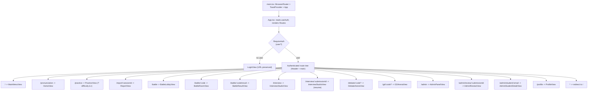
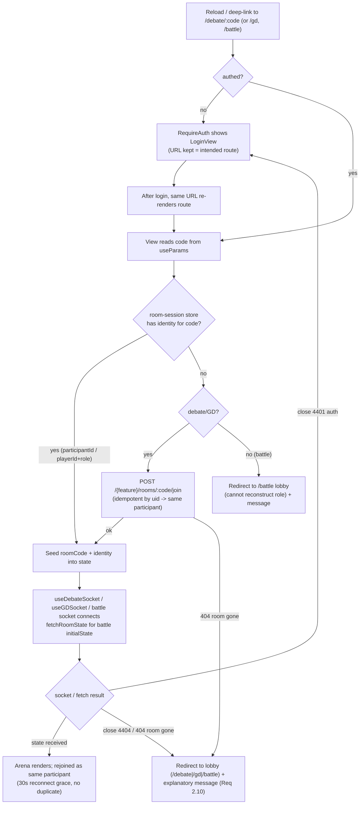

# SPA Navigation Routing Bugfix Design

## Overview

The React SPA in `frontend/` holds all navigation in in-memory state: a single
`view` variable in `App.tsx` selects the screen, and each activity keeps its own
identifiers in component-local state (`battleSession`, `activeSubmissionId`,
`activeStudentEmail`, `report`, `sentenceIdx`, `difficulty` in `App.tsx`;
`roomCode`/`participantId` inside `DebateArenaView`/`GDArenaView`;
`stage`/`submissionIdRef` inside `InterviewStudioView`). Because none of this is
reflected in the URL, a **reload** resets `view` to `main-menu` and loses every
identifier, and **browser Back** exits the app entirely because no in-app history
entries are ever pushed.

The fix introduces **URL-based routing** so every view maps to a URL path. Each
`setView(...)` call becomes a `navigate(path)` call, so history entries are
pushed (Back works) and reloads re-resolve the same route (view + context are
preserved). Live-room activities (debate, GD, battle) carry their room `code` in
the URL; on reload the arena rehydrates from the route and recovers the
non-URL `participantId`/`playerId` from a small per-room client-side store, then
rejoins the existing server room over the existing socket/reconnect flow. The
backend's debate/GD `join_room` is already **idempotent by user uid** (it returns
the existing participant rather than creating a duplicate) and grants a **30s
reconnect grace**, so rejoin resumes as the same participant with no duplicate
and no backend changes.

This is a **frontend-only** change — `App.tsx`, `main.tsx`, the view components,
a new client-side room-session store, and a route guard. It relies entirely on
existing endpoints and reconnect behavior (Req 3.7).

## Glossary

- **Bug_Condition (C)**: A reload or an in-app Back while the user is in a view
  other than the default empty `main-menu` (see `isBugCondition`).
- **Property (P)**: After the fix, a reload re-resolves the same route (same view
  + restorable context, or a graceful degrade), and Back navigates within the app.
- **Preservation**: In-app navigation via tiles/start/back/leave buttons (no
  reload, no browser Back), auth gating, and each activity's normal run/leave flow
  must behave exactly as today.
- **Router**: `react-router-dom` `BrowserRouter`, wrapping the app at the entry.
- **Route**: A URL path (+ params/query) that uniquely identifies a view and its
  restorable context.
- **Rehydrate**: Reconstruct a view's context from the route (+ client store)
  after a reload.
- **Live-room activity**: Debate, GD, or Battle — backed by a realtime socket and
  a server room identified by a room `code`.
- **Rejoin**: After reload, reconnect a live participant to their existing server
  room using the URL `code` + recovered participant identity.
- **Room-session store**: A per-room client-side store (`sessionStorage`) keyed by
  room code that holds the non-URL identity (`participantId` for debate/GD,
  `playerId` + `role` for battle).
- **Route guard**: `RequireAuth` — gates activity routes behind authentication and
  round-trips back to the intended route after login.
- **F**: The original app (state-only navigation). **F'**: The fixed app
  (URL-based routing).

## Bug Details

### Bug Condition

The bug manifests whenever the browser is reloaded, or the browser Back button is
pressed, while the user is anywhere other than the default empty `main-menu`. In
F, navigation lives only in React state (`view` + per-view identifiers), so a
reload discards it (resetting to `main-menu`) and Back leaves the app because no
in-app history entries were pushed.

**Formal Specification:**
```
FUNCTION isBugCondition(X)
  INPUT: X of type NavigationEvent
    X.event     IN { "reload", "back" }
    X.view      IN View union
    X.context   = identifiers the view depends on (room code, participantId,
                  submissionId, studentEmail, sessionId, sentenceIdx, difficulty,
                  interview stage, ...)
    X.authed    IN { true, false }
    X.roomAlive IN { true, false, n/a }   // live-room views only
  OUTPUT: boolean

  RETURN (X.event = "reload" AND X.view <> "main-menu")
      OR (X.event = "reload" AND context_is_nonempty(X.context))
      OR (X.event = "back"   AND user_navigated_within_app_before(X))
END FUNCTION
```

### Examples

- **Debate reload (bug):** User in `debate-arena` room `ABC234` presses refresh →
  F lands on `main-menu`, room + participant lost. F' reloads `/debate/ABC234`,
  recovers `participantId` from the store, and rejoins as the same participant.
- **Back exits app (bug):** User navigates `main-menu → battle-lobby` then presses
  Back → F leaves the SPA. F' returns to `/` (main-menu) within the app.
- **Report reload (bug):** User viewing a `report` presses refresh → F loses the
  report and returns to `main-menu`. F' reloads `/report/:sessionId` and
  re-derives the report.
- **Stale room deep-link (graceful edge):** User opens `/debate/GONE99` for a room
  that no longer exists → F' redirects to the debate lobby with an explanatory
  message rather than crashing (Req 2.10).
- **In-app tile click (not a bug):** Authenticated user clicks the Battle tile →
  identical target view in F and F' (Req 3.1).

## Expected Behavior

### Preservation Requirements

**Unchanged behaviors (must stay identical to F for non-bug inputs):**
- In-app navigation via main-menu tiles, activity start buttons, back buttons, and
  leave/exit actions (no reload, no browser Back) SHALL show the same target view
  as today (Req 3.1).
- Unauthenticated open SHALL still show login and gate all activity views
  (Req 3.2).
- Main-menu tiles (including the Admin tile for teachers) SHALL still render and
  launch each activity (Req 3.3).
- Normal start/play/leave of debate, GD, battle, interview, practice — live audio,
  ready/forfeit, PTT, scoring, results — SHALL run unchanged (Req 3.4).
- Transient-disconnect reconnect + forfeit grace SHALL be honored with no
  double-join / no duplicate participant (Req 3.5).
- A refreshed live participant that rejoins via recovered code + identity SHALL
  rejoin as the same participant, honoring the reconnect grace and NOT creating a
  second participant (Req 3.6).
- The fix SHALL remain frontend-only with no backend API changes (Req 3.7).

**Scope:** Any input that is not a reload/Back away from empty `main-menu` should
be completely unaffected by this fix. The rendered view for a given in-app action,
the auth gate, and each activity's internal behavior are all preserved.

## Hypothesized Root Cause

Based on the bug description and the code:

1. **Navigation state is not reflected in the URL.** `App.tsx` uses
   `const [view, setView] = useState<View>("main-menu")` plus per-view state.
   Nothing writes to `window.history`, so reloads reset all of it and Back has no
   in-app entries to pop.

2. **Per-view identifiers live only in component memory.** `DebateArenaView` /
   `GDArenaView` seed `roomCode`/`participantId` to `null` and only populate them
   from create/join handlers; `battleSession`, `activeSubmissionId`,
   `activeStudentEmail`, `report`, `sentenceIdx`/`difficulty`, and the interview
   `stage`/`submissionIdRef` are all local. A remount after reload starts empty.

3. **`participantId`/`playerId` are server-issued and not derivable from the code
   alone.** They must be persisted client-side (keyed by room code) so a refreshed
   participant can rejoin as the same participant. For debate/GD this is a
   convenience — `join_room` is idempotent by uid, so re-calling join also
   recovers the same `participantId` — but the store avoids an extra round trip and
   covers battle (whose join is not idempotent by uid).

4. **No SPA history fallback assumption.** Client-side routing requires the host to
   serve `index.html` for unknown deep-link paths; the Vite dev server already does
   this, but production hosting must be configured accordingly (deployment note).

## Correctness Properties

Property 1: Bug Condition — Reload preserves view + context (or degrades gracefully)

_For any_ input where the bug condition holds and `X.event = "reload"`, the fixed
app SHALL re-resolve the same route and render the same view with its restorable
context. Specifically: if the user is unauthenticated, it SHALL show login and,
after successful login, redirect to the originally intended route; else if the
view is a live-room whose server room no longer exists, it SHALL redirect to that
activity's lobby with an explanatory message (no crash); otherwise it SHALL render
`X.view` with context ⊇ the restorable subset of `X.context` (live rooms rejoin as
the same participant via the recovered code + stored identity).

**Validates: Requirements 2.1, 2.2, 2.3, 2.4, 2.5, 2.6, 2.7, 2.9, 2.10**

Property 2: Bug Condition — Browser Back navigates within the app

_For any_ input where the bug condition holds and `X.event = "back"`, the fixed app
SHALL stay within the application and render the previous in-app view rather than
leaving the SPA.

**Validates: Requirements 2.8**

Property 3: Preservation — No duplicate participant on rejoin

_For any_ live-room reload/rejoin, the fixed app SHALL rejoin as the same
participant, honoring the existing reconnect grace and NOT creating a second
participant entry for the same person/room (relies on the backend's
idempotent-by-uid join and 30s reconnect grace).

**Validates: Requirements 3.5, 3.6**

Property 4: Preservation — Non-bug inputs behave identically

_For any_ input where the bug condition does NOT hold (in-app navigation without
reload/Back, auth gating, normal activity run/leave), the fixed app SHALL produce
the same behavior as the original app: the same target view for each in-app
action, the same auth gate, and unchanged activity internals, with no backend API
changes.

**Validates: Requirements 3.1, 3.2, 3.3, 3.4, 3.7**

## Architecture

### Routing approach & library decision

**Decision: use `react-router-dom` v6** (the standard router for Vite + React 18;
`react` is `^18.3.1`, compatible with router v6). `package.json` currently has no
router dependency, and nothing in the codebase argues against the standard choice.

Rationale / tradeoffs:
- **Chosen — `react-router-dom` v6**: batteries-included history management,
  nested routes, `useParams`/`useSearchParams`/`useNavigate`, and a well-understood
  guard pattern. Cost: one dependency (~small), and a modest refactor of `App.tsx`
  from a `view` switch into a `<Routes>` tree.
- **Rejected — hand-rolled `history`/`popstate` router**: fewer dependencies but we
  would reimplement param parsing, history stacking, and guards by hand — more
  surface for bugs and no real benefit here. Not justified.
- **Rejected — hash routing (`HashRouter`)**: avoids the server SPA-fallback
  requirement, but produces `/#/debate/ABC234` URLs and complicates the existing
  Vite WebSocket/API proxying story. We instead accept the one-line deployment
  note (serve `index.html` for unknown paths) that `BrowserRouter` needs.

The router wraps the app at the entry (`main.tsx`) so `App` and all views can use
router hooks.

### Router + route tree



### Live-room rehydrate & rejoin flow



## Route Map

| Path | View (`View` union) | Params / query | Notes |
|------|---------------------|----------------|-------|
| `/` | `main-menu` | — | Default landing. `handleBackToMenu` → `navigate("/")`. |
| `/pronunciation` | `home` | — | `handleSelectPronunciation` → `navigate("/pronunciation")`. |
| `/practice` | `practice` | `?difficulty=easy\|medium\|hard&i=<sentenceIdx>` | `handleStart` → `navigate("/practice?difficulty="+difficulty+"&i=0")`. Difficulty + index restore from query (Req 2.7). |
| `/processing` | `processing` | — | Transient. Not linkable; on reload here, redirect to `/practice` (in-flight scoring cannot be restored). |
| `/report/:sessionId` | `report` | `sessionId` | `handleViewSession(id)`/`handleSubmitRecording` → `navigate("/report/"+sessionId)`. Report re-derived from cache or re-fetched (Req 2.5). |
| `/battle` | `battle-lobby` | — | `handleSelectBattle` → `navigate("/battle")`. |
| `/battle/:code` | `battle-room` | `code` | `handleBattleCreated`/`handleBattleJoined` → `navigate("/battle/"+room_code)`; store `{playerId, role}` (Req 2.3). |
| `/battle/:code/result` | `battle-result` | `code` | `handleBattleComplete` → `navigate("/battle/"+code+"/result")`. |
| `/interview` | `interview` | — | `handleSelectInterview` → `navigate("/interview")`. Entry / pick stage. |
| `/interview/:submissionId` | `interview` (resume) | `submissionId` | Resume a `submitted`/`complete` submission by id (Req 2.4). Mid-capture stages are NOT linkable → land on `/interview`. |
| `/debate/:code?` | `debate-arena` | optional `code` | `/debate` = lobby; `/debate/:code` = in-room. `handleCreateRoom`/`handleJoinRoom` → `navigate("/debate/"+room_code)` (Req 2.2). |
| `/gd/:code?` | `gd-arena` | optional `code` | `/gd` = lobby; `/gd/:code` = in-room. Same pattern as debate (Req 2.2). |
| `/admin` | `admin-panel` | — | `handleSelectAdmin` → `navigate("/admin")`. Teacher-only tile unchanged. |
| `/admin/review/:submissionId` | `admin-review` | `submissionId` | `handleOpenReview(id)` → `navigate("/admin/review/"+id)` (Req 2.6). |
| `/admin/student/:email` | `admin-student` | `email` (URL-encoded) | `handleOpenStudent(email)` → `navigate("/admin/student/"+encodeURIComponent(email))` (Req 2.6). |
| `/profile` | `profile` | — | `handleSelectProfile` → `navigate("/profile")`. |
| `*` | — | — | Unknown path → redirect to `/`. |

### How `setView(...)` handlers map to `navigate(path)`

Every existing handler in `App.tsx` keeps its name and call sites but swaps its
`setView(...)` body for a `navigate(...)`. The `view` state variable is removed;
the current view is derived from the URL by the `<Routes>` tree. Examples:

- `handleBackToMenu`: `setBattleSession(null); setView("main-menu")` →
  `navigate("/")` (battle identity now lives in the store / route, cleared on leave).
- `handleSelectBattle`: `setView("battle-lobby")` → `navigate("/battle")`.
- `handleBattleCreated/Joined(res)`: `setView("battle-room")` →
  `saveRoomSession("battle", res.room_code, { playerId: res.player_id, role: res.role }); navigate("/battle/"+res.room_code)`.
- `handleBattleComplete`: `setView("battle-result")` →
  `navigate("/battle/"+code+"/result")`.
- `handleOpenReview(id)`: `setView("admin-review")` →
  `navigate("/admin/review/"+id)`.
- `handleStart`: `setSentenceIdx(0); setView("practice")` →
  `navigate("/practice?difficulty="+difficulty+"&i=0")`.

Because each handler now pushes a history entry, browser Back pops to the previous
route (Req 2.8), and the previously in-memory identifiers travel in the URL and/or
room-session store instead of `useState`.

## Fix Implementation

### Changes Required

Assuming the root-cause analysis holds, the fix adds `react-router-dom`, wraps the
app in `BrowserRouter`, converts `App.tsx`'s `view` switch into a `<Routes>` tree
with `navigate(...)` handlers, adds a `RequireAuth` guard and a `roomSession`
store, and teaches each live-room / context-bearing view to rehydrate from its
route param(s). Per-file changes:

### `frontend/main.tsx`
Wrap the tree in `BrowserRouter` (outermost, above `ToastProvider`) so the whole
app has router context:
```
<BrowserRouter>
  <ToastProvider>
    <App />
  </ToastProvider>
</BrowserRouter>
```

### `frontend/src/App.tsx`
- Remove the `view` state and the `View`-switch render block. Keep `useAuth`, the
  data-loading effects, and all shared/derived state (`sentences`, `sessions`,
  `report` cache, `difficulty`, etc.).
- Replace the render block with a `<Routes>` tree matching the Route Map. Shared
  chrome (`BackgroundOrbs`, `Header`, `<main>`, footer) becomes a layout element
  wrapping the authenticated routes.
- Convert each `handle*` navigation handler from `setView(...)` to `useNavigate()`
  calls (see mapping above). Handlers that took ids (`handleOpenReview`,
  `handleOpenStudent`, `handleViewSession`) navigate to the parametrized path.
- `report`/battle context that must survive a click-through stays in App state as
  today for the in-app path; the durable identity for reload lives in the URL
  (`:sessionId`, `:code`) and, for battle, the room-session store.
- Auth gate: keep the existing `authLoading` and `!user` branches, but render them
  through the `RequireAuth` guard so the URL is preserved during the login gate.
- A thin `ReportRoute` wrapper reads `:sessionId`, looks it up in
  `reportCacheResult`; on cache miss it derives the degraded fallback (as
  `handleViewSession` does today) or re-fetches, then renders `ReportView`
  (Req 2.5).
- A `PracticeRoute` wrapper reads `?difficulty`/`?i`, syncs them into
  `difficulty`/`sentenceIdx`, and renders `PracticeView` (Req 2.7).

### `frontend/src/main.tsx` entry vs `App` — layout component
Add an authenticated `AppLayout` (Header + `<main>` + footer + error banners) used
as the parent route element; activity routes render inside it. `main-menu`,
`home`, etc. become child routes.

### `frontend/src/routes/RequireAuth.tsx` (new — route guard)
- Consumes `useAuth`. While `authLoading`, renders the existing "Restoring your
  session…" splash.
- If `!user`, renders `LoginView` **without changing the URL** (gate-in-place), so
  the intended activity route stays in the address bar; once `user` becomes truthy
  the same URL re-renders the intended route — an automatic post-login round-trip
  (Req 2.9). (Optional variant: `navigate("/login", { state: { from: location } })`
  then redirect back using `from`; gate-in-place is simpler and needs no `/login`
  route.)
- If `user`, renders its children (the `AppLayout` + routes).

### `frontend/src/lib/roomSession.ts` (new — client-side room-session store)
A tiny module over `sessionStorage` (per-tab; survives reload, cleared on tab
close) keyed by room code and feature:

```
Key scheme:  "spa.room.<feature>.<CODE>"   feature ∈ { "debate", "gd", "battle" }
Value:       debate/gd -> { participantId: string, savedAt: number }
             battle    -> { playerId: string, role: "host"|"opponent", savedAt: number }

saveRoomSession(feature, code, value)   // written on create/join success
readRoomSession(feature, code)          // read on mount/rehydrate
clearRoomSession(feature, code)         // cleared on explicit leave/complete
```
- **Written** exactly where `setRoomCode/setParticipantId` are set today: in
  `handleCreateRoom`/`handleJoinRoom` (debate/GD) and `handleBattleCreated`/
  `handleBattleJoined` (battle).
- **Read** on mount when the view has a `code` param but no in-memory identity.
- **Cleared** in `handleLeave` (debate/GD), on battle leave/play-again, and on
  battle-match completion cleanup. `sessionStorage` (not `localStorage`) so a
  closed tab does not leave stale identities; a same-tab reload keeps them.

### `frontend/src/components/DebateArenaView.tsx`
- Accept an optional `code` prop (from `/debate/:code`) and an `onNavigateToRoom`
  (or reuse `onBack` + a new `onEnterRoom(code)`), plus `onLeave` that navigates to
  `/debate`.
- On mount, if a `code` is present: seed `roomCode` from the param and recover
  `participantId` via `readRoomSession("debate", code)`. If the store has no id,
  call `joinDebateRoom(code)` — idempotent by uid, so it returns the existing
  `participantId` for a prior participant (fresh join otherwise), then persist it.
  Once `roomCode`+`participantId` are set, the existing `useDebateSocket(roomCode,
  participantId)` connects and rejoins (Req 2.2).
- `handleCreateRoom`/`handleJoinRoom` additionally `saveRoomSession("debate",
  code, { participantId })` and `navigate("/debate/"+code)` so the URL reflects the
  room and reload works.
- `handleLeave` additionally `clearRoomSession("debate", code)` then navigates to
  `/debate` (unchanged teardown otherwise — Req 3.4).
- Stale room: `useDebateSocket` already surfaces close code `4404` as "room no
  longer exists"; on that signal, clear the store and redirect to `/debate` with a
  toast/message (Req 2.10). Close `4401` (auth) defers to `RequireAuth`.

### `frontend/src/components/GDArenaView.tsx`
Mirror the debate changes exactly, keyed `feature = "gd"`, using `joinGDRoom` and
`useGDSocket`. Same seed/recover/persist/clear lifecycle and the same
stale-room redirect to `/gd`.

### `frontend/src/components/BattleRoomView.tsx` + `BattleResultView` entry
- Battle room mounts from `/battle/:code`. It needs `{playerId, role,
  initialState}`. On reload: read `readRoomSession("battle", code)` for
  `{playerId, role}`, then call `fetchRoomState(code)` for `initialState` and let
  the battle socket reconnect (Req 2.3).
- If the store lacks `{playerId, role}` (e.g. deep-link with no prior join), battle
  cannot reconstruct the player safely (its join is not idempotent by uid) →
  redirect to `/battle` lobby with a message.
- If `fetchRoomState` returns 404 → redirect to `/battle` with a stale-room message
  (Req 2.10).
- `battle-result` route reads the same store and either reuses the completed state
  from memory or re-fetches via `fetchRoomState`.

### `frontend/src/components/InterviewStudioView.tsx`
- Accept optional `submissionId` (from `/interview/:submissionId`). On mount with a
  `submissionId`, call the existing `openMySubmission(submissionId)` to restore the
  `submitted`/`complete` stage and resume review polling (Req 2.4).
- `submitForReview`/`openMySubmission` navigate to `/interview/:submissionId` when a
  submission id is obtained, so a reload restores that submission.
- Mid-capture stages (`record`, `analyze` — in-progress camera/recording) are NOT
  encoded in the URL and cannot be technically restored; on reload the user lands
  on `/interview` (the entry / pick stage) rather than `main-menu` (Req 2.4).

### Admin views (`AdminReviewView`, `AdminStudentDetailView`)
No internal change needed — they already take `submissionId` / `email` props. App's
route wrappers read `:submissionId` / `:email` (URL-decoded) from params and pass
them in; their `onBack` navigates to `/admin` (Req 2.6).

## Data / State model — URL vs client store vs React state

| Identifier (today's home) | After fix |
|---------------------------|-----------|
| `view` (App state) | **URL path** (derived from `<Routes>`) — removed from state |
| `difficulty`, `sentenceIdx` (App state) | **URL query** on `/practice` (`?difficulty`, `?i`); still mirrored to state while mounted (Req 2.7) |
| `report` / session id (App state) | **URL param** `/report/:sessionId`; report body re-derived from `reportCacheResult` or re-fetched (Req 2.5) |
| `battleSession.roomCode` (App state) | **URL param** `/battle/:code` |
| `battleSession.playerId`, `role` (App state) | **Room-session store** `spa.room.battle.<code>` (not safe/meaningful in the URL) |
| `battleSession.initialState`/`finalState` | **Recovered** via `fetchRoomState(code)` + socket (ephemeral, not stored) |
| debate/GD `roomCode` (component state) | **URL param** `/debate/:code`, `/gd/:code` |
| debate/GD `participantId` (component state) | **Room-session store** `spa.room.<feature>.<code>`; backstop = idempotent `join` |
| `activeSubmissionId`, `activeStudentEmail` (App state) | **URL params** `/admin/review/:submissionId`, `/admin/student/:email` |
| interview `stage` + `submissionIdRef` | **URL param** `/interview/:submissionId` for resumable stages; mid-capture not restorable → `/interview` |

Principle: **stable, shareable, non-sensitive context → URL**; **server-issued
identity that must not leak into a shareable URL and cannot be re-derived from the
code alone (participantId, playerId, role) → per-room client store**; **ephemeral
live state (room snapshots, sockets, media streams) → recovered at runtime** from
existing endpoints/reconnect.

## SPA history fallback (deployment note)

`BrowserRouter` produces real paths (e.g. `/debate/ABC234`). Any deep-link, reload,
or bookmark issues a full HTTP GET for that path, so the host **must fall back to
`index.html` for unknown non-asset paths**:
- **Dev:** the Vite dev server already serves `index.html` for unknown routes — no
  change. The existing `server.proxy` entries for `/battle`, `/debate`, `/gd`,
  `/auth`, `/admin`, `/interview`, `/profile`, `/uploads`, etc. still forward those
  API/WS prefixes to FastAPI; SPA routes never collide with them because the SPA
  paths are the same words but the API calls use method/subpaths the proxy targets.
  (Note: `/battle`, `/debate`, `/gd`, `/interview`, `/profile`, `/admin` are proxied
  prefixes; the router only owns them in the browser — network requests to those
  prefixes still hit the proxy. This is unchanged behavior.)
- **Production:** the static host / reverse proxy must serve `index.html` for
  unknown paths (SPA fallback) while continuing to route the API/WS prefixes to the
  backend. This is a hosting-config note, not a code change, and introduces no
  backend API change (Req 3.7).

## Error Handling

- **Stale / nonexistent room (Req 2.10):** debate/GD sockets already close with
  `4404` → treat as "room gone": clear the room-session store entry and
  `navigate` to the activity lobby (`/debate` or `/gd`) with a toast/inline
  message. Battle: `fetchRoomState` 404 → redirect to `/battle` with a message.
- **Unauthenticated deep-link/reload (Req 2.9):** `RequireAuth` shows login with
  the intended URL preserved; after login the intended route renders automatically.
- **Missing client identity on live-room deep-link:** debate/GD attempt idempotent
  `join` (recovers/creates participant); battle cannot and redirects to the lobby
  with a message.
- **In-flight/transient states not restorable:** reload on `/processing` → redirect
  to `/practice`; reload during interview `record`/`analyze` → `/interview` entry.
  These degrade gracefully rather than crashing or dumping to `main-menu`.
- **Unknown route:** `*` → redirect to `/`.
- **Auth socket close `4401`:** surfaces through `RequireAuth`/login rather than an
  arena crash.
- No new failure modes are introduced for non-bug inputs (Property 4): in-app
  navigation, auth gating, and activity internals are untouched.

## Testing Strategy

### Validation Approach
Two phases: first surface counterexamples that reproduce the bug on the current
(unfixed) app, then verify the fix restores view + context on reload, keeps Back
in-app, and preserves all non-bug behavior — especially no duplicate participant.

### Exploratory Bug Condition Checking
**Goal:** Reproduce the bug on F before implementing F', confirming the root cause
(navigation lives only in React state).

**Test plan:** Drive the current app to each non-default view, then simulate a
reload (remount `App` fresh) and a browser Back, asserting the (buggy) outcome.

**Test cases (expected to fail-as-buggy on F):**
1. **Debate reload:** In `debate-arena` room `ABC234` → reload → F resets to
   `main-menu`, room + participant lost (will fail on unfixed code).
2. **Battle reload:** In `battle-room` with `battleSession` → reload → F resets to
   `main-menu` (will fail on unfixed code).
3. **Report reload:** Viewing a `report` → reload → F loses the report (will fail
   on unfixed code).
4. **Admin reload:** In `admin-review` with `activeSubmissionId` → reload → F loses
   the id and returns to `main-menu` (will fail on unfixed code).
5. **Back exits app:** `main-menu → battle-lobby`, press Back → F leaves the SPA
   (will fail on unfixed code).

**Expected counterexamples:** every non-default view collapses to `main-menu` on
reload; Back leaves the app — because no URL/history reflects `view` or context.

### Fix Checking
**Goal:** For all inputs where the bug condition holds, F' produces the expected
behavior.
```
FOR ALL X WHERE isBugCondition(X) DO
  result := F'(X)
  IF X.event = "reload" THEN
    IF NOT X.authed THEN
      ASSERT result.view = "login" AND result.intendedRoute = route_of(X.view, X.context)
    ELSE IF is_live_room(X.view) AND X.roomAlive = false THEN
      ASSERT result.view = lobby_of(X.view) AND result.shownMessage = true
    ELSE
      ASSERT result.view = X.view AND result.context ⊇ restorable(X.context)
    END IF
  ELSE  // back
    ASSERT result.stayedInApp = true AND result.view = previous_in_app_view(X)
  END IF
END FOR
```

### Preservation Checking
**Goal:** For all inputs where the bug condition does NOT hold, F' behaves like F.
```
FOR ALL X WHERE NOT isBugCondition(X) DO
  ASSERT F(X) = F'(X)
END FOR
```
**Approach:** Property-based testing is recommended for preservation because
navigation is a state machine over many (view, action) pairs — generators cover
far more transitions than hand-written cases and catch regressions in the
tile/start/back/leave flows and the auth gate.

**Test plan:** Observe F's behavior for in-app navigation, auth gating, and normal
activity run/leave first, then assert F' matches for the same inputs.

**Test cases:**
1. **In-app tile navigation:** each main-menu tile opens the same view in F and F'
   (Req 3.1, 3.3).
2. **Auth gate:** unauthenticated open shows login and gates activities in both
   (Req 3.2).
3. **Normal activity run/leave:** start → play → leave a debate/GD/battle/interview/
   practice without reload/Back behaves identically (Req 3.4).
4. **No duplicate participant:** simulate reload-rejoin and transient-reconnect;
   assert the participant count is unchanged and the same `participantId` is reused
   (Req 3.5, 3.6) — leveraging the idempotent-by-uid `join_room`.

### Unit Tests
- `roomSession` store: save/read/clear round-trips per feature + code; keys are
  namespaced; `sessionStorage` semantics (survives reload, gone after tab close).
- `RequireAuth`: renders splash while loading, login when `!user` (URL preserved),
  children when authed.
- Route wrappers: `PracticeRoute` maps `?difficulty`/`?i` → props; `ReportRoute`
  resolves cache hit vs degraded fallback vs re-fetch; admin wrappers decode
  `:email`.
- Handler mapping: each `handle*` navigates to the correct path.

### Property-Based Tests
- Generate random (view, context) states → build the route → assert route→view
  round-trips and context is restored (or degrades per the graceful rules).
- Generate random in-app navigation sequences → assert Back pops to the correct
  previous in-app view and never leaves the app.
- Generate random non-bug inputs → assert `F(X) = F'(X)` (preservation).

### Integration Tests
- Full reload flows per activity: deep-link/reload `/debate/:code`, `/gd/:code`,
  `/battle/:code`, `/report/:sessionId`, `/practice?...`, `/interview/:submissionId`,
  `/admin/review/:submissionId`, `/admin/student/:email` → correct view + context,
  live rooms rejoin as same participant.
- Stale-room deep-link → graceful lobby redirect + message (Req 2.10).
- Unauthenticated deep-link → login → post-login round-trip to intended route
  (Req 2.9).
- Browser Back across a multi-step in-app journey stays in-app at every step
  (Req 2.8).
