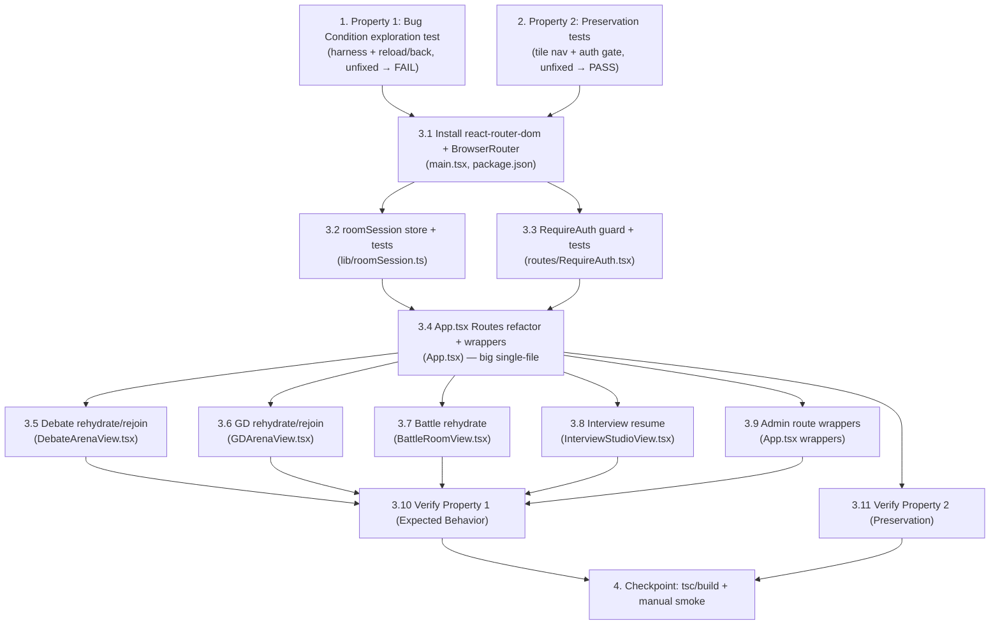

# Implementation Plan

## Overview

Frontend-only fix that introduces URL-based routing (`react-router-dom` v6) so a
reload re-resolves the same route (view + context preserved) and browser Back
navigates within the app. Tasks are ordered so the tree compiles (`npx tsc
--noEmit` from `frontend/`) and the app keeps running after every task.

## Notes

- **Frontend-only. NO backend API changes (Req 3.7).** Do not touch any module
  under `app/` (backend). Rely exclusively on the existing endpoints and the
  existing socket reconnect behavior.
- **Live-room rejoin must not create duplicate participants (Req 3.5, 3.6).**
  Debate/GD `join_room` is idempotent-by-uid and grants a 30s reconnect grace —
  rely on that; never issue a second "create participant" path on rehydrate.
- **`sessionStorage`, not `localStorage`**, for the room-session store: survives a
  same-tab reload, cleared on tab close, so no stale identities leak.
- **Entry point is `frontend/src/main.tsx`** (not `frontend/main.tsx`).
- **Testability:** `roomSession`, `RequireAuth`, the route wrappers, and the
  `handle*`→`navigate` mapping are unit-testable with Vitest + React Testing
  Library + jsdom (added in task 1). The full reload / Back / rejoin flows depend
  on real browser history, `sessionStorage` remounting, and live sockets — these
  are verified via the manual smoke checklist in the final checkpoint and (where a
  browser is available) integration tests. Tasks that are genuinely optional /
  browser-dependent are marked with `*`.
- **Green tree at each step:** run `npx tsc --noEmit` (and `npm run build` at the
  checkpoint) from `frontend/` after each task.

## Tasks

- [ ] 1. Write bug condition exploration test
  - **Property 1: Bug Condition** - Reload resets view + Back exits the app
  - **CRITICAL**: This test MUST FAIL on unfixed code - failure confirms the bug exists
  - **DO NOT attempt to fix the test or the code when it fails**
  - **NOTE**: This test encodes the expected post-fix behavior - it will validate the fix when it passes after implementation
  - **GOAL**: Surface counterexamples that demonstrate the bug (`isBugCondition(X)` = reload/Back away from empty `main-menu`)
  - **Scoped PBT Approach**: The bug is deterministic, so scope the property to concrete failing cases rather than random generation: (a) mount `App`, drive it into a non-default view (e.g. `battle-lobby` via the tile), simulate a reload by unmounting and remounting `App` fresh, and assert the app is still on that view (encodes Req 2.1); (b) after an in-app navigation, simulate browser Back and assert the app stays in-app on the previous view (encodes Req 2.8)
  - Set up the test harness first (dev-only, keeps the tree green): add `vitest`, `@testing-library/react`, `@testing-library/user-event`, `jsdom` as devDependencies; add a `test` script (`vitest --run`) and a `vitest.config.ts` with `environment: "jsdom"`; add a `src/setupTests.ts`
  - Place the test at `frontend/src/routes/__tests__/reload-back.exploration.test.tsx`
  - Run test on UNFIXED code: `npx vitest --run` from `frontend/`
  - **EXPECTED OUTCOME**: Test FAILS - reload collapses to `main-menu`, Back leaves the app (this is correct - it proves the bug exists)
  - Document counterexamples found (e.g. "in `battle-lobby`, remount → renders `main-menu` instead of `battle-lobby`"; "Back after `main-menu → battle-lobby` unloads the SPA")
  - Mark task complete when the test is written, run, and the failure is documented
  - _Requirements: 2.1, 2.8_

- [ ] 2. Write preservation property tests (BEFORE implementing fix)
  - **Property 2: Preservation** - In-app navigation + auth gating unchanged
  - **IMPORTANT**: Follow observation-first methodology - observe F (current app) first, then assert F' matches
  - Observe on UNFIXED code: clicking each main-menu tile renders its expected view; an unauthenticated `App` renders `LoginView` and never renders an activity view; the Admin tile only shows for teacher accounts
  - Write property-based tests capturing those observed patterns (Preservation Requirements in design): generate over the set of main-menu tiles → assert each opens the same target view in F; generate over `{authed, unauthed}` × activity entry points → assert the auth gate holds (Req 3.1, 3.2, 3.3)
  - Place the tests at `frontend/src/routes/__tests__/navigation.preservation.test.tsx`
  - Run tests on UNFIXED code: `npx vitest --run` from `frontend/`
  - **EXPECTED OUTCOME**: Tests PASS (this confirms the baseline behavior to preserve)
  - Mark task complete when the tests are written, run, and passing on unfixed code
  - _Requirements: 3.1, 3.2, 3.3_

- [ ] 3. Fix: URL-based routing for the SPA

  - [ ] 3.1 Install `react-router-dom` v6 and wrap the app in `BrowserRouter`
    - `npm install react-router-dom@^6` in `frontend/`
    - In `frontend/src/main.tsx`, wrap the tree with `<BrowserRouter>` as the
      outermost provider, above `<ToastProvider>` (keep `StrictMode`)
    - No routes yet - `App` still renders as today, now inside router context so
      `App` and views can use router hooks (keeps the tree green)
    - Verify `npx tsc --noEmit` passes
    - _Bug_Condition: isBugCondition(X) where X.event ∈ {reload, back} away from empty main-menu_
    - _Expected_Behavior: history entries are pushable and routes re-resolve on reload (design "Router + route tree")_
    - _Requirements: 2.1, 2.8_

  - [ ] 3.2 Add the `roomSession` client-store module (+ unit tests)
    - Create `frontend/src/lib/roomSession.ts` over `sessionStorage`, keyed
      `spa.room.<feature>.<CODE>` where `feature ∈ { "debate", "gd", "battle" }`
    - Export `saveRoomSession(feature, code, value)`, `readRoomSession(feature,
      code)`, `clearRoomSession(feature, code)`; values: debate/gd
      `{ participantId, savedAt }`, battle `{ playerId, role, savedAt }`
    - Add unit tests `frontend/src/lib/__tests__/roomSession.test.ts`:
      save/read/clear round-trips per feature+code, key namespacing, missing-key
      returns null, and JSON-corruption tolerance
    - Verify `npx vitest --run` passes for this file and `npx tsc --noEmit` passes
    - _Bug_Condition: isBugCondition(X) where X.view is a live-room and X.context holds participantId/playerId not derivable from the URL_
    - _Expected_Behavior: participant identity recovered from the per-room store on rehydrate (design "Room-session store")_
    - _Requirements: 2.2, 2.3, 3.6_

  - [ ] 3.3 Add the `RequireAuth` route guard (+ unit tests)
    - Create `frontend/src/routes/RequireAuth.tsx` consuming `useAuth`: while
      `authLoading` render the existing "Restoring your session…" splash; if
      `!user` render `LoginView` in place **without changing the URL** (so the
      intended activity route is preserved and re-renders automatically after
      login); if `user` render children (Req 2.9)
    - Add unit tests `frontend/src/routes/__tests__/RequireAuth.test.tsx`: renders
      splash while loading, renders login (URL unchanged) when unauthenticated,
      renders children when authenticated
    - Verify `npx vitest --run` and `npx tsc --noEmit` pass
    - _Bug_Condition: isBugCondition(X) where X.event = reload AND X.authed = false on an activity route_
    - _Expected_Behavior: show login with intended route preserved, round-trip back after login (design "RequireAuth")_
    - _Requirements: 2.9, 3.2_

  - [ ] 3.4 Refactor `App.tsx` into a `<Routes>` tree with `navigate` handlers
    - Remove the `view` state and the `View`-switch render block; keep `useAuth`,
      the data-loading effects, and all shared/derived state (`sentences`,
      `sessions`, `report` cache, `difficulty`, etc.)
    - Add an authenticated `AppLayout` (BackgroundOrbs + Header + `<main>` + footer
      + error banners) as the parent route element, wrapped by `RequireAuth`;
      render the route tree per the design Route Map (`/`, `/pronunciation`,
      `/practice`, `/report/:sessionId`, `/battle`, `/battle/:code`,
      `/battle/:code/result`, `/interview`, `/interview/:submissionId`,
      `/debate/:code?`, `/gd/:code?`, `/admin`, `/admin/review/:submissionId`,
      `/admin/student/:email`, `/profile`, `* → /`)
    - Convert every `handle*` navigation handler from `setView(...)` to
      `useNavigate()` per the design mapping (e.g. `handleBackToMenu → navigate("/")`,
      `handleSelectBattle → navigate("/battle")`, `handleBattleCreated/Joined →
      saveRoomSession("battle", code, {playerId, role}) + navigate("/battle/"+code)`,
      `handleOpenReview(id) → navigate("/admin/review/"+id)`,
      `handleStart → navigate("/practice?difficulty="+difficulty+"&i=0")`)
    - Add `PracticeRoute` (reads `?difficulty`/`?i`, syncs into
      `difficulty`/`sentenceIdx`, renders `PracticeView` — Req 2.7) and
      `ReportRoute` (reads `:sessionId`, resolves from `reportCacheResult`, else
      degraded fallback / re-fetch, renders `ReportView` — Req 2.5) wrapper
      components; `/processing` reload → redirect to `/practice`
    - Keep shared data-loading and state intact (Req 3.1, 3.3)
    - Add unit tests `frontend/src/routes/__tests__/routeWrappers.test.tsx`:
      `PracticeRoute` maps query→props, `ReportRoute` resolves cache-hit vs
      degraded fallback, and the `handle*`→path mapping navigates correctly
    - Verify `npx vitest --run` and `npx tsc --noEmit` pass
    - _Bug_Condition: isBugCondition(X) where X.event = reload AND X.view ≠ main-menu (report/practice/admin/etc.)_
    - _Expected_Behavior: route re-resolves the same view + restorable context; each in-app action pushes history (design "App.tsx" + Route Map)_
    - _Requirements: 2.1, 2.5, 2.7, 2.8, 3.1, 3.3_

  - [ ] 3.5 Debate view: rehydrate + rejoin from `/debate/:code`
    - In `frontend/src/components/DebateArenaView.tsx`, accept optional `code`
      (from `useParams`) and an `onLeave` that navigates to `/debate`
    - On mount with a `code`: seed `roomCode` from the param and recover
      `participantId` via `readRoomSession("debate", code)`; if the store has no
      id, call `joinDebateRoom(code)` (idempotent-by-uid → same participant, no
      duplicate) then `saveRoomSession`. Once `roomCode`+`participantId` are set,
      the existing `useDebateSocket` connects and rejoins (Req 2.2)
    - `handleCreateRoom`/`handleJoinRoom` additionally
      `saveRoomSession("debate", code, {participantId})` + `navigate("/debate/"+code)`
    - `handleLeave` additionally `clearRoomSession("debate", code)` then navigates
      to `/debate` (teardown otherwise unchanged — Req 3.4)
    - Stale room: on socket close `4404`, clear the store entry and redirect to
      `/debate` with a toast/message (Req 2.10); defer `4401` to `RequireAuth`
    - Verify `npx tsc --noEmit` passes
    - _Bug_Condition: isBugCondition(X) where X.view = debate-arena AND X.event = reload_
    - _Expected_Behavior: restore from URL code + stored participantId, rejoin as same participant; stale room → lobby + message (design "DebateArenaView")_
    - _Requirements: 2.2, 2.10, 3.4, 3.5, 3.6_

  - [ ] 3.6 GD view: mirror debate for `/gd/:code`
    - Apply the exact debate changes in
      `frontend/src/components/GDArenaView.tsx`, keyed `feature = "gd"`, using
      `joinGDRoom` and `useGDSocket`; same seed/recover/persist/clear lifecycle and
      the same stale-room redirect to `/gd`
    - Verify `npx tsc --noEmit` passes
    - _Bug_Condition: isBugCondition(X) where X.view = gd-arena AND X.event = reload_
    - _Expected_Behavior: restore from URL code + stored participantId, rejoin as same participant; stale room → /gd + message (design "GDArenaView")_
    - _Requirements: 2.2, 2.10, 3.4, 3.5, 3.6_

  - [ ] 3.7 Battle views: rehydrate `/battle/:code` and `/battle/:code/result`
    - In `frontend/src/components/BattleRoomView.tsx`, mount from `/battle/:code`:
      read `readRoomSession("battle", code)` for `{playerId, role}`, then
      `fetchRoomState(code)` for `initialState` and let the battle socket
      reconnect (Req 2.3)
    - If the store lacks `{playerId, role}` (deep-link with no prior join) → redirect
      to `/battle` with a message (battle join is NOT idempotent-by-uid, cannot
      safely reconstruct the player); if `fetchRoomState` returns 404 → redirect to
      `/battle` with a stale-room message (Req 2.10)
    - The `battle-result` route reads the same store and reuses the completed state
      from memory or re-fetches via `fetchRoomState`
    - Clear the battle store entry on leave / play-again / match-completion cleanup
    - Verify `npx tsc --noEmit` passes
    - _Bug_Condition: isBugCondition(X) where X.view ∈ {battle-room, battle-result} AND X.event = reload_
    - _Expected_Behavior: restore playerId/role from store + initialState via fetchRoomState; missing store or 404 → /battle + message (design "BattleRoomView")_
    - _Requirements: 2.3, 2.10, 3.4_

  - [ ] 3.8 Interview view: resume `/interview/:submissionId`
    - In `frontend/src/components/InterviewStudioView.tsx`, accept optional
      `submissionId` (from `useParams`); on mount with a `submissionId` call the
      existing `openMySubmission(submissionId)` to restore the
      `submitted`/`complete` stage and resume review polling (Req 2.4)
    - `submitForReview`/`openMySubmission` navigate to `/interview/:submissionId`
      when a submission id is obtained
    - Mid-capture stages (`record`/`analyze`) are not URL-encodable → on reload land
      on `/interview` (entry) rather than `main-menu` (Req 2.4)
    - Verify `npx tsc --noEmit` passes
    - _Bug_Condition: isBugCondition(X) where X.view = interview AND X.event = reload_
    - _Expected_Behavior: resume resumable submission via openMySubmission; mid-capture → /interview entry (design "InterviewStudioView")_
    - _Requirements: 2.4, 3.4_

  - [ ] 3.9 Admin route wrappers pass `:submissionId` / decoded `:email`
    - In `App.tsx`, add thin route wrappers that read `:submissionId` and
      `:email` (URL-decoded via `decodeURIComponent`) from params and pass them to
      the existing `AdminReviewView` / `AdminStudentDetailView` (no internal change
      to those components); their `onBack` navigates to `/admin` (Req 2.6)
    - `handleOpenReview(id) → navigate("/admin/review/"+id)`;
      `handleOpenStudent(email) → navigate("/admin/student/"+encodeURIComponent(email))`
    - `*` extend `routeWrappers.test.tsx` to assert admin wrappers decode `:email`
    - Verify `npx vitest --run` and `npx tsc --noEmit` pass
    - _Bug_Condition: isBugCondition(X) where X.view ∈ {admin-review, admin-student} AND X.event = reload_
    - _Expected_Behavior: restore from URL submissionId / decoded email (design "Admin views")_
    - _Requirements: 2.6_

  - [ ] 3.10 Verify bug condition exploration test now passes
    - **Property 1: Expected Behavior** - Reload preserves view + Back stays in-app
    - **IMPORTANT**: Re-run the SAME test from task 1 - do NOT write a new test
    - The test from task 1 encodes the expected behavior; when it passes it confirms
      the bug is fixed
    - Run `npx vitest --run frontend/src/routes/__tests__/reload-back.exploration.test.tsx`
    - **EXPECTED OUTCOME**: Test PASSES (confirms reload re-resolves the route and
      Back navigates in-app)
    - _Requirements: 2.1, 2.8_

  - [ ] 3.11 Verify preservation tests still pass
    - **Property 2: Preservation** - In-app navigation + auth gating unchanged
    - **IMPORTANT**: Re-run the SAME tests from task 2 - do NOT write new tests
    - Run `npx vitest --run frontend/src/routes/__tests__/navigation.preservation.test.tsx`
    - **EXPECTED OUTCOME**: Tests PASS (confirms no regressions in tile navigation
      or the auth gate)
    - _Requirements: 3.1, 3.2, 3.3_

- [ ] 4. Checkpoint - ensure all tests pass and smoke-test each activity
  - Run `npx tsc --noEmit` and `npm run build` from `frontend/` - both succeed
  - Run the full unit suite: `npx vitest --run` from `frontend/` - all green
  - **Manual smoke checklist** (browser-dependent flows not fully unit-testable):
    for each route, reload and confirm the view + context is restored, Back stays
    in-app, stale rooms redirect gracefully, and an unauth deep-link routes through
    login back to the intended route:
    - `/debate/:code` reload → rejoins same room as same participant (no duplicate)
    - `/gd/:code` reload → rejoins same room as same participant (no duplicate)
    - `/battle/:code` and `/battle/:code/result` reload → reconnects to same battle
    - `/interview/:submissionId` reload → resumes submission; mid-capture → `/interview`
    - `/report/:sessionId`, `/practice?difficulty=&i=`, `/admin/review/:submissionId`,
      `/admin/student/:email` reload → correct view + context
    - Back across a multi-step in-app journey stays in-app at every step (Req 2.8)
    - Stale/nonexistent room deep-link → lobby redirect + message (Req 2.10)
    - Unauthenticated deep-link → login → post-login round-trip to intended route (Req 2.9)
  - `*` Optional integration tests (require a browser/E2E runner): automate the
    reload/Back/rejoin flows above; only add if an E2E harness is available
  - Ensure all tests pass; ask the user if questions arise
  - _Requirements: 2.1, 2.2, 2.3, 2.4, 2.5, 2.6, 2.7, 2.8, 2.9, 2.10, 3.1, 3.2, 3.3, 3.4, 3.5, 3.6, 3.7_

---

## Task Dependency Graph



### Wave-Based Parallelization

Same-file tasks are isolated across waves. `App.tsx` is a large single-file refactor
and gets its own wave (nothing else edits `App.tsx` concurrently). `3.9` also edits
`App.tsx`, so it runs after `3.4` and is kept out of the wave that touches other view
files only where they don't overlap `App.tsx` — it is placed in the parallel view
wave because by then `3.4` owns the settled `App.tsx` structure and `3.9` only adds
isolated wrapper components; if you prefer stricter isolation, run `3.9` in its own
wave after the view wave.

```json
{
  "waves": [
    {
      "wave": 1,
      "rationale": "Pre-fix tests must run on UNFIXED code. Separate files; parallel.",
      "tasks": ["1", "2"],
      "files": [
        "frontend/vitest.config.ts",
        "frontend/src/setupTests.ts",
        "frontend/src/routes/__tests__/reload-back.exploration.test.tsx",
        "frontend/src/routes/__tests__/navigation.preservation.test.tsx",
        "frontend/package.json"
      ]
    },
    {
      "wave": 2,
      "rationale": "Foundational router install + entry wrap. Touches main.tsx + package.json; run alone.",
      "tasks": ["3.1"],
      "files": ["frontend/src/main.tsx", "frontend/package.json"]
    },
    {
      "wave": 3,
      "rationale": "Independent new modules in separate files; parallel.",
      "tasks": ["3.2", "3.3"],
      "files": [
        "frontend/src/lib/roomSession.ts",
        "frontend/src/lib/__tests__/roomSession.test.ts",
        "frontend/src/routes/RequireAuth.tsx",
        "frontend/src/routes/__tests__/RequireAuth.test.tsx"
      ]
    },
    {
      "wave": 4,
      "rationale": "Big single-file App.tsx refactor. ISOLATED — nothing else edits App.tsx in this wave.",
      "tasks": ["3.4"],
      "files": [
        "frontend/src/App.tsx",
        "frontend/src/routes/__tests__/routeWrappers.test.tsx"
      ]
    },
    {
      "wave": 5,
      "rationale": "Per-view rehydration in distinct component files; parallel. No App.tsx edits here.",
      "tasks": ["3.5", "3.6", "3.7", "3.8"],
      "files": [
        "frontend/src/components/DebateArenaView.tsx",
        "frontend/src/components/GDArenaView.tsx",
        "frontend/src/components/BattleRoomView.tsx",
        "frontend/src/components/InterviewStudioView.tsx"
      ]
    },
    {
      "wave": 6,
      "rationale": "Admin wrappers re-touch App.tsx — isolated to its own wave after the App.tsx refactor and view wave.",
      "tasks": ["3.9"],
      "files": [
        "frontend/src/App.tsx",
        "frontend/src/routes/__tests__/routeWrappers.test.tsx"
      ]
    },
    {
      "wave": 7,
      "rationale": "Re-run the SAME pre-fix tests to confirm fix + no regressions; parallel (distinct test files).",
      "tasks": ["3.10", "3.11"],
      "files": [
        "frontend/src/routes/__tests__/reload-back.exploration.test.tsx",
        "frontend/src/routes/__tests__/navigation.preservation.test.tsx"
      ]
    },
    {
      "wave": 8,
      "rationale": "Final checkpoint: tsc/build + full suite + manual smoke checklist.",
      "tasks": ["4"],
      "files": []
    }
  ]
}
```
