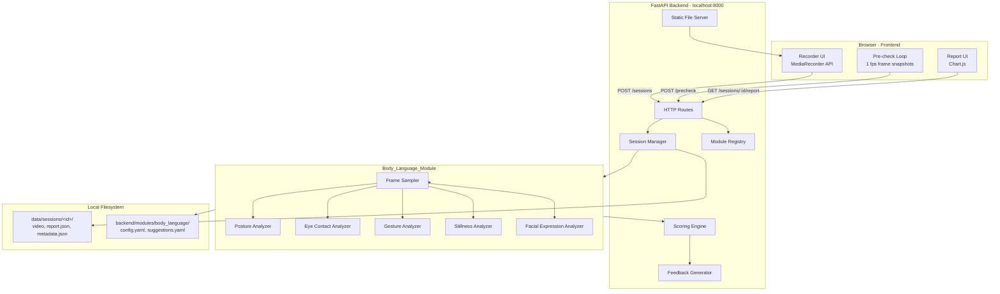
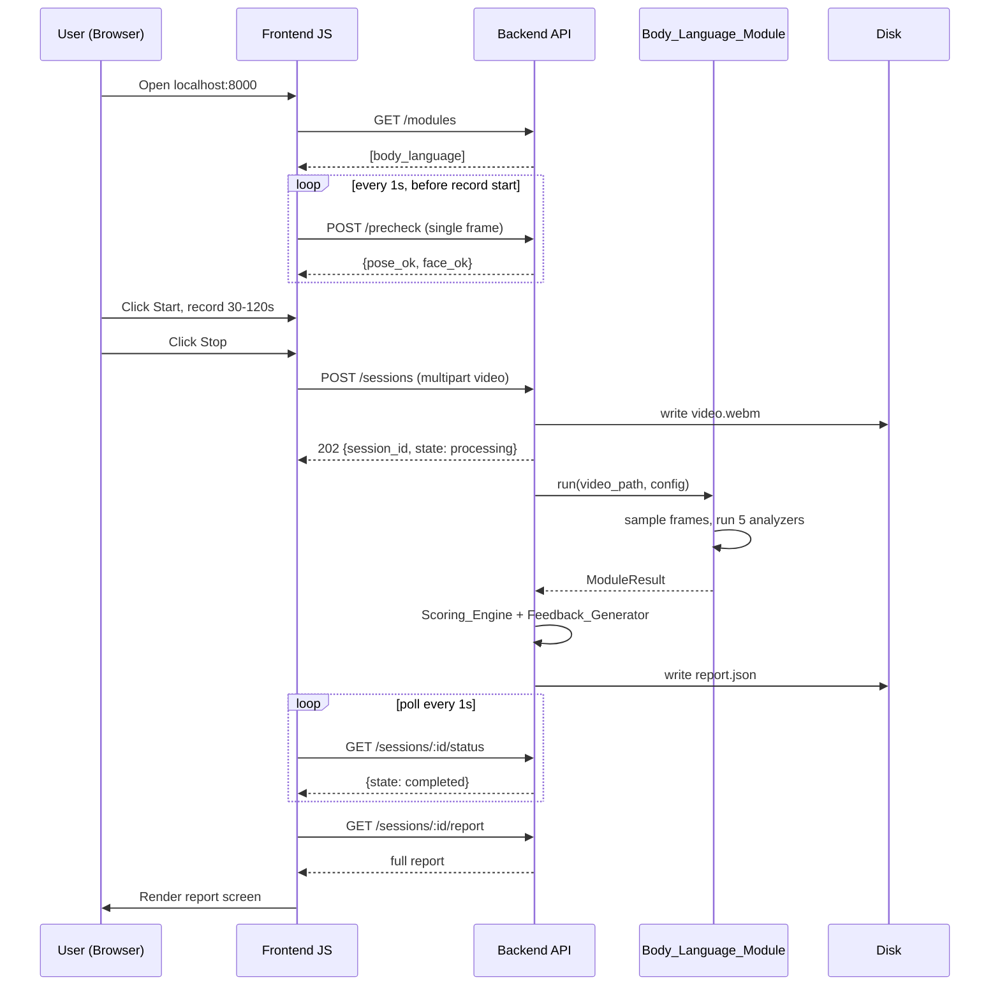

# Design Document

## Overview

The Communication Skills Analyzer (CSA) is a local single-user web application. A FastAPI backend serves a vanilla HTML/JS frontend, receives a 30–120 second webcam recording, processes it through a pluggable `Body_Language_Module`, and returns a per-metric report with an overall score, actionable feedback, and chart data.

The core architectural commitment is **modularity**: each `Analysis_Module` lives in its own folder under `backend/modules/` with a `manifest.json` and a single `run(video_path, config) -> ModuleResult` entry point. A `Module_Registry` discovers modules at startup so future modules (pronunciation, vocabulary, GD timer, interview question bank) drop in without touching existing code.

### Project Context (Phase 1 of a broader vision)

CSA is **Phase 1 of a "LeetCode for soft skills"** platform built by a 3-person team. The other two Phase 1 modules — an Interview Question Bank with teacher-graded rubrics, and a Daily Challenge / Gamification engine — are being built in parallel by teammates and ship as separate `Analysis_Module`-like folders. This design covers **only the body-language analyzer**, but is deliberate about a module interface that can host those other categories later (see Architecture → Future Module Evolution). Given a tight college deadline, every architectural choice here optimizes for "shippable in ~2 weeks" over future flexibility, except where the marginal cost of leaving the door open is essentially zero.

### Tech Stack Decisions

| Concern | Choice | Rationale |
|---|---|---|
| Backend framework | **FastAPI** + **uvicorn** | Async, automatic OpenAPI, simple file uploads, ideal for ~2 week timeline |
| Computer vision | **MediaPipe** (Pose, Face Mesh, Hands) | Required by spec; CPU-only, no GPU setup |
| Video I/O | **OpenCV (cv2)** | Required by spec; mature, handles WebM/MP4/MOV |
| Frontend | **Vanilla HTML + JS + Chart.js (CDN)** | No build step, no React tooling overhead, served as static files by FastAPI. Realistic for solo 1–2 weeks. |
| Persistence | **Local filesystem + JSON** | Single-user, no DB; spec mandates no cloud |
| Config | **YAML** files inside each module folder | Human-editable, supports nested structure |
| Python version | **3.11** | Stable MediaPipe wheels, modern typing |

### Non-Goals (Phase 1)

- No authentication, no multi-user, no cloud sync.
- No ML model training. All scoring is rule-based on landmark geometry.
- No pronunciation, vocabulary, GD timer, or interview question modules (architecture supports them but they are out of scope).
- No mobile app.

### Reference Hardware (for the 3× duration constraint in Req 2.8)

Intel Core i5 8th gen or equivalent, 8 GB RAM, integrated graphics, Windows 10/11 or Linux. Achieved by sampling at 5 FPS instead of full frame rate (see Architecture).

---

## Architecture

### High-Level Component Diagram



### Request Lifecycle (Happy Path)



### Folder Layout

```
csa/
├── backend/
│   ├── main.py                  # FastAPI app, static mount, routes
│   ├── session_manager.py       # session CRUD on filesystem
│   ├── module_registry.py       # discovers modules from manifest.json
│   ├── scoring.py               # Scoring_Engine
│   ├── feedback.py              # Feedback_Generator
│   ├── schemas.py               # Pydantic models (ModuleResult, Report, ...)
│   ├── config.py                # global backend config (port, data dir, retention)
│   └── modules/
│       └── body_language/
│           ├── manifest.json            # {id, name, version, entry}
│           ├── __init__.py              # exposes run(video_path, config)
│           ├── config.yaml              # thresholds + weights
│           ├── suggestions.yaml         # feedback text bank
│           ├── frame_sampler.py
│           ├── analyzers/
│           │   ├── posture.py
│           │   ├── eye_contact.py
│           │   ├── gesture.py
│           │   ├── stillness.py
│           │   └── facial_expression.py
│           └── tests/
├── frontend/
│   ├── index.html               # record + history + report SPA
│   ├── app.js
│   ├── styles.css
│   └── vendor/chart.min.js
├── data/
│   └── sessions/
│       └── <session_id>/
│           ├── video.webm
│           ├── metadata.json
│           └── report.json
├── tests/                       # integration tests across modules
├── pyproject.toml
└── README.md
```

### Frame Sampling Strategy

Each analyzer needs landmarks from frames, not the full video. To meet the **3× duration** budget (Req 2.8) on the reference hardware:

- The `Frame_Sampler` reads the video once and emits **5 frames per second** (configurable). 120 s × 5 fps = 600 frames.
- Each frame is run through MediaPipe Pose, Face Mesh, and Hands **once** and the resulting landmarks are cached in a `FrameLandmarks` dataclass.
- All five analyzers consume the cached `List[FrameLandmarks]`. No analyzer re-decodes the video.

This single-pass design is the key performance lever and turns the analyzers into pure functions over landmark lists, which makes them straightforward to unit and property test.

### Module Discovery (Module_Registry)

On startup, `module_registry.py` walks `backend/modules/*/manifest.json`. Each manifest has shape:

```json
{
  "id": "body_language",
  "display_name": "Body Language",
  "version": "1.0.0",
  "entry": "backend.modules.body_language:run",
  "config_files": ["config.yaml", "suggestions.yaml"]
}
```

The registry uses `importlib` to import `entry` and store a callable. Bad manifests or import failures are logged and the module is skipped (Req 11.6). If `body_language` fails to register, the backend refuses to create sessions (Req 11.7).

`GET /modules` returns the registered list (Req 11.4). A session POST may optionally pass `{"modules": ["body_language"]}`; unknown ids are rejected (Req 11.8); missing list defaults to `["body_language"]` (Req 11.5).

### Future Module Evolution (Phase 2+ awareness, not built in Phase 1)

The broader project vision is a "LeetCode for soft skills" platform with three module categories beyond Phase 1's video-analysis modules. Phase 1 builds **only** the video-analysis category (Req 11). The other categories are noted here so the Phase 1 interface does not paint us into a corner — but no Phase 1 code is written for them.

| Category | Phase 1 example | Future example | How it plugs in |
|---|---|---|---|
| **Video-analysis** | `body_language` | `pronunciation`, `vocabulary_speaking` | Today's `run(video_path, config) -> ModuleResult` signature already fits all of these. |
| **User-graded** | — | `interview_questions` (teacher grades student recordings via rubric) | Adds a new entry-point shape like `submit(answer) -> SubmissionRef` and `grade(submission, rubric) -> GradeResult`. Lives in `backend/modules/<id>/` with its own manifest. |
| **Cross-cutting / engagement** | — | `gamification` (daily challenge, streaks, XP, badges) | Subscribes to a Phase 2 `events` bus (e.g., `session.completed`, `submission.graded`) rather than running per-session. Manifest gains an optional `subscribes_to` list. |
| **Content-delivery** | — | `vocabulary_builder` (word of the day, no video) | Exposes only read endpoints (`GET /modules/<id>/today`); no `run(video_path,...)` at all. |

**Phase 1 commitment**: keep the `Analysis_Module` contract exactly as Req 11 specifies — a single `run(video_path, config) -> ModuleResult` entry point — and resist generalizing it now. When Phase 2 starts:

1. Promote the current `run` into one of several supported entry points by extending the manifest with an `entry_point_kind` field (`"video_analysis"`, `"user_graded"`, `"event_subscriber"`, `"content"`). Phase 1 manifests default to `"video_analysis"` and need no rewrite.
2. Add per-kind dispatch in `module_registry.py` (a small `match` on the kind).
3. Introduce the events bus only when the gamification module is first added.

This staged approach keeps Phase 1 simple and shippable while leaving the architectural door open. The folder convention `backend/modules/<id>/{manifest.json, ...}` already accommodates all four categories without changes.

### Session abstraction: stay body-language-specific for Phase 1

A Phase 1 `Session` today means "one recorded video → one body-language report". In Phase 2, a `Session` could equally mean "one answered interview question" or "one completed daily challenge". The pragmatic choice for this deadline is to **keep the Phase 1 `Session` body-language-specific** (video file + body-language report) and refactor to a generic `Activity` only when the second module type lands. This avoids premature abstraction that would slow Phase 1 without buying anything testable today. The `SessionMetadata` schema is small enough (~6 fields) that a future migration to a richer activity model is a one-evening job.

---

## Components and Interfaces

### HTTP API

| Method | Path | Purpose |
|---|---|---|
| GET | `/` | Serves `frontend/index.html` |
| GET | `/static/*` | Frontend assets |
| GET | `/modules` | List registered analysis modules |
| POST | `/precheck` | Body: single JPEG frame. Returns `{pose_ok: bool, face_ok: bool}` |
| POST | `/sessions` | Multipart upload of recorded video + optional `modules` field. Returns `{session_id, state}` |
| GET | `/sessions` | Returns list of past session summaries (Req 14.2) |
| GET | `/sessions/{id}/status` | Returns `{state: queued\|processing\|completed\|failed, error?}` |
| GET | `/sessions/{id}/report` | Returns full report JSON |
| DELETE | `/sessions/{id}` | Deletes session files (Req 14.5) |

Processing is launched on a background task (FastAPI `BackgroundTasks` or a simple in-process executor) so the POST returns immediately with `processing`.

### Analysis_Module Interface

Every module exposes:

```python
def run(video_path: str, config: ModuleConfig) -> ModuleResult: ...
```

Where `ModuleResult` is:

```python
@dataclass
class MetricResult:
    name: str                # e.g. "posture"
    score: int | None        # 0..100, or None when unavailable
    flag: Literal["ok", "low_confidence", "detection_failed",
                  "no_frames", "student_absent"] | None
    details: dict            # per-metric extras (e.g. gesture per-category counts)

@dataclass
class ModuleResult:
    module_id: str
    metrics: list[MetricResult]
```

The `Body_Language_Module.run` reads its `config.yaml`, drives the `Frame_Sampler`, hands `FrameLandmarks` lists to each of the five analyzers, and returns a `ModuleResult` with five `MetricResult`s.

### Analyzers (Phase 1)

All five analyzers are pure functions: `analyze(frames: list[FrameLandmarks], cfg: dict) -> MetricResult`.

**Posture_Analyzer** (Req 3)
- Inputs per frame: pose landmarks (shoulders, hips, nose).
- Computes neck-to-shoulder angle (vector from mid-shoulder to nose vs vertical) and shoulder-to-hip alignment (vector mid-shoulder→mid-hip vs vertical).
- Frame is `upright` iff both angles within configured thresholds (default 15° and 10°).
- Score = round(100 × upright_frames / sampled_frames_with_pose).
- If pose detected in ≤50% of sampled frames → score=0, flag=`low_confidence`.

**Eye_Contact_Analyzer** (Req 4)
- Inputs per frame: face mesh landmarks.
- Head pose via solvePnP on 6 canonical Face Mesh points (nose tip, chin, eye corners, mouth corners) against a generic 3D face model. Yields yaw, pitch in degrees.
- Frame is `on_camera` iff `|yaw| < 15°` and `|pitch| < 15°`.
- Score rules: 0% face → `detection_failed`, score=`None`. >0 and ≤50% face → flag=`low_confidence`, score=0. Else score = round(100 × on_camera / face_frames).

**Gesture_Analyzer** (Req 5)
- Inputs per frame: hand landmarks + pose (shoulders, wrists).
- Per-frame category (mutually exclusive, checked in order): `hand_to_face` → `crossed_arms` → `open_gesture` → `hands_at_rest` → `hands_not_visible`, matching the rules in Req 5.3–5.5.
- Score = round(100 × (open_gesture + hands_at_rest) / sampled_frames).
- Always emits per-category counts in `details`.
- 0 sampled frames → score=`None`, flag=`no_frames`.

**Stillness_Analyzer** (Req 6)
- Inputs per frame: pose landmarks (nose, left wrist, right wrist).
- For each consecutive pair, displacement = mean Euclidean distance of the three landmarks, divided by frame diagonal.
- Compute variance of the displacement series.
- Piecewise-linear map: variance ≤ 0.0005 → 100, ≥ 0.01 → 0, linear in between. Result clamped to [0,100] and rounded.
- <2 frames with pose → score=0, flag=`low_confidence`.

**Facial_Expression_Analyzer** (Req 7)
- Inputs per frame: face mesh landmarks.
- Smile metric per frame = `dist(mouth_left, mouth_right) / dist(eye_left_outer, eye_right_outer)`.
- `smiling` iff metric > 0.45.
- raw_pct = 100 × smiling / face_frames. Capped at 80. Rescaled: `score = round(raw_capped × 100 / 80)`.
- 0% face → `student_absent`, score=`None`. >0 and ≤50% face → flag=`low_confidence`, score=0.

### Scoring_Engine (Req 8)

```python
def compute_overall(metrics: list[MetricResult], weights: dict[str, float]) -> OverallScore: ...
```

- Filters out any metric whose `flag in {"low_confidence","detection_failed","no_frames","student_absent"}`.
- If all are filtered out → returns `OverallScore(value=0, session_flag="low_confidence", applied_weights={})`.
- Otherwise re-normalizes the weights of surviving metrics to sum to 1, computes weighted average, rounds to int in [0,100].
- Always records `applied_weights[metric_name]` (Req 8.6) so the report can show how the overall was assembled.

### Feedback_Generator (Req 9)

```python
def generate(metrics: list[MetricResult], bank: dict) -> list[Suggestion]: ...
```

- For each metric:
  - Determine band by score: `0–39` low, `40–69` mid, `70–100` high. Unflagged high band → exactly one positive reinforcement string.
  - Unflagged low/mid band → at least one suggestion from the bank for that metric+band.
  - Flagged metric → an extra re-record suggestion (in addition to any band suggestion that applies based on the numeric score, which is 0 by spec for flagged metrics other than `detection_failed`/`no_frames`/`student_absent` where score is `None`).

Bank YAML shape:

```yaml
posture:
  low:   ["Sit up tall. Imagine a string pulling your head up."]
  mid:   ["Good posture overall. Watch for slouching when thinking."]
  high:  ["Excellent posture throughout."]
  recheck: "Couldn't read your posture clearly. Re-record with full upper body in frame."
eye_contact: { ... }
...
```

### Frontend Screens

1. **Home** — list past sessions (timestamp, duration, overall score, delete button), button to start new recording.
2. **Recording** — live preview, readiness indicator (green/amber, updated from `/precheck`), Start button (enabled when permissions granted), elapsed timer, Stop button (disabled <30 s, auto-stop at 120 s).
3. **Processing** — spinner, polls `/sessions/:id/status` every 1 s.
4. **Report** — overall score header, per-metric bar chart, gesture category breakdown chart, suggestion list grouped by metric, low-confidence banner if applicable, "New Recording" button.

A single-page app pattern with three `<section>`s and visibility toggling keeps the JS small (<300 LOC).

---

## Data Models

### Pydantic / Dataclass Schemas

```python
# backend/schemas.py
from typing import Literal, Optional
from pydantic import BaseModel

SessionState = Literal["queued", "processing", "completed", "failed"]
MetricFlag   = Literal["ok", "low_confidence", "detection_failed",
                       "no_frames", "student_absent"]

class MetricResult(BaseModel):
    name: str
    score: Optional[int]            # 0..100 or None when unavailable
    flag: MetricFlag
    details: dict = {}

class ModuleResult(BaseModel):
    module_id: str
    metrics: list[MetricResult]

class Suggestion(BaseModel):
    metric: str
    score: Optional[int]
    band: Literal["low", "mid", "high", "unavailable"]
    text: str

class OverallScore(BaseModel):
    value: int                      # 0..100
    session_flag: Optional[Literal["low_confidence"]]
    applied_weights: dict[str, float]

class Report(BaseModel):
    session_id: str
    created_at: str                 # ISO 8601
    duration_seconds: float
    overall: OverallScore
    metrics: list[MetricResult]
    suggestions: list[Suggestion]

class SessionMetadata(BaseModel):
    session_id: str
    created_at: str
    duration_seconds: float
    state: SessionState
    error: Optional[str] = None
    overall_score: Optional[int] = None  # populated after completion
```

### On-Disk Layout

```
data/sessions/<session_id>/
├── video.webm        # raw upload
├── metadata.json     # SessionMetadata
└── report.json       # Report (only when state == completed)
```

`session_id` is a UUID4 hex string. `metadata.json` is rewritten on every state transition.

### Configuration Files

`backend/modules/body_language/config.yaml`:

```yaml
sampling:
  fps: 5
posture:
  neck_to_shoulder_max_deg: 15
  shoulder_to_hip_max_deg: 10
eye_contact:
  yaw_max_deg: 15
  pitch_max_deg: 15
gesture:
  hand_to_face_pct_diag: 0.10
stillness:
  variance_min: 0.0005
  variance_max: 0.01
facial_expression:
  smile_ratio_threshold: 0.45
  smile_cap_pct: 80
weights:
  posture:           0.20
  eye_contact:       0.25
  gesture:           0.20
  stillness:         0.15
  facial_expression: 0.20
```

`backend/config.py`:

```yaml
host: 127.0.0.1
port: 8000
data_dir: ./data
retention_limit: 20
```

---

## Correctness Properties

*A property is a characteristic or behavior that should hold true across all valid executions of a system — essentially, a formal statement about what the software is supposed to do. Properties serve as the bridge between human-readable acceptance criteria and machine-verifiable correctness guarantees, and form the basis of the property-based tests in the Testing Strategy section.*

The Phase 1 system is well-suited to property-based testing because the analyzers, scoring engine, feedback generator, and session manager are pure functions (or pure-over-filesystem) with universal rules. UI rendering, MediaPipe calls themselves, and external wiring are validated with example-based and integration tests instead.

### Property 1: Recorder state machine respects time bounds

*For any* elapsed recording time `t ≥ 0` and prior user action, the recorder state machine returns `stop_enabled == (30 ≤ t < 120)` and transitions to the `stopped` state when `t ≥ 120` or when the user clicks Stop while `stop_enabled` is true.

**Validates: Requirements 1.4, 1.5, 1.6**

### Property 2: Session identifiers are unique

*For any* sequence of N successful `POST /sessions` calls, the returned `session_id` values are pairwise distinct.

**Validates: Requirements 2.2**

### Property 3: Stored video round-trips byte-for-byte

*For any* uploaded video byte payload, reading the persisted `video.webm` from the session directory returns the exact same bytes.

**Validates: Requirements 2.2**

### Property 4: Session state stays in the allowed set and progresses monotonically

*For any* sequence of valid state-transition events applied to the `Session_Manager`, the reported state is always one of `{queued, processing, completed, failed}`, and once a session reaches `completed` or `failed` it never returns to `queued` or `processing`.

**Validates: Requirements 2.4**

### Property 5: Report serialization round-trips

*For any* valid `Report` value, `save_report` followed by `load_report` returns a `Report` equal to the original.

**Validates: Requirements 2.5**

### Property 6: Posture score formula and low-confidence flag

*For any* list of sampled frames with random pose-detection outcomes and random shoulder/hip/nose coordinates, the `Posture_Analyzer` output satisfies:
- if `detected_frames / sampled_frames ≤ 0.5`, then `score == 0` and `flag == "low_confidence"`;
- otherwise `score == round(100 × upright_frames / detected_frames)` where `upright_frames` is the count of detected frames whose neck-to-shoulder angle is within the configured threshold and shoulder-to-hip angle is within its threshold;
- `0 ≤ score ≤ 100`.

**Validates: Requirements 3.2, 3.3, 3.4, 3.5**

### Property 7: Eye contact score formula and flags

*For any* list of sampled frames with random face-detection outcomes and random simulated head yaw/pitch values, the `Eye_Contact_Analyzer` output satisfies:
- if `face_frames == 0`, then `score is None` and `flag == "detection_failed"`;
- if `0 < face_frames / sampled_frames ≤ 0.5`, then `score == 0` and `flag == "low_confidence"`;
- otherwise `score == round(100 × on_camera_frames / face_frames)` where `on_camera_frames` is the count of face frames with `|yaw| < 15°` and `|pitch| < 15°`;
- `score in [0, 100]` when not None.

**Validates: Requirements 4.2, 4.3, 4.4, 4.5, 4.6**

### Property 8: Gesture classification partitions frames and aggregates correctly

*For any* list of sampled frames with random hand and pose landmarks, the `Gesture_Analyzer` output satisfies:
- every frame is assigned to exactly one of `{hand_to_face, crossed_arms, open_gesture, hands_at_rest, hands_not_visible}`;
- the `details` per-category counts sum to the total sampled frame count;
- if `sampled_frames == 0`, then `score is None` and `flag == "no_frames"`;
- otherwise `score == round(100 × (open_gesture_count + hands_at_rest_count) / sampled_frames)`.

**Validates: Requirements 5.2, 5.3, 5.4, 5.5, 5.6, 5.7, 5.8**

### Property 9: Stillness is translation-invariant and variance-monotone

*For any* sequence of pose-landmark frames and any 2D translation vector `v`, the per-frame normalized displacement series produced by the `Stillness_Analyzer` is identical when every landmark coordinate is shifted by `v`. Additionally, for any two displacement variances `v1 ≤ v2` in the supported range, `stillness_score(v1) ≥ stillness_score(v2)`, the boundary values `0.0005 → 100` and `0.01 → 0` are exact, and `score ∈ [0,100]`. If fewer than two frames have a detected pose, `score == 0` and `flag == "low_confidence"`.

**Validates: Requirements 6.2, 6.4, 6.5**

### Property 10: Smile metric is scale-invariant; score is capped, rescaled, and flag-aware

*For any* sequence of face-mesh frames and any positive scalar `k`, the per-frame smile ratio is unchanged when all face landmark coordinates are scaled by `k`. The `Facial_Expression_Analyzer` output further satisfies:
- if `face_frames == 0`, then `score is None` and `flag == "student_absent"`;
- if `0 < face_frames / sampled_frames ≤ 0.5`, then `score == 0` and `flag == "low_confidence"`;
- otherwise let `raw_pct = 100 × smiling_frames / face_frames`; then `score == round(min(raw_pct, 80) × 100 / 80)` and `score ∈ [0, 100]`;
- `score` is non-decreasing in `smiling_frames` (holding `face_frames` fixed).

**Validates: Requirements 7.2, 7.3, 7.4, 7.5, 7.6**

### Property 11: Overall score is a flag-aware weighted average

*For any* list of `MetricResult` values with random scores in `[0,100]`, random flags, and any weight map with positive weights summing to 1, the `Scoring_Engine` output satisfies:
- let `S` be the set of metrics with `flag == "ok"`;
- if `S` is empty, `overall == 0`, `session_flag == "low_confidence"`, and `applied_weights == {}`;
- if `S` is non-empty, `sum(applied_weights[m] for m in S) == 1` (within floating-point tolerance), `applied_weights[m] == 0` for `m not in S`, the ratio `applied_weights[a] / applied_weights[b]` equals `weights[a] / weights[b]` for any `a, b in S`, and `overall == round(sum(applied_weights[m] × score[m] for m in S))`;
- `overall ∈ [0, 100]`.

**Validates: Requirements 8.1, 8.2, 8.3, 8.4, 8.5, 8.6**

### Property 12: Feedback suggestions are correct and grounded in the bank

*For any* list of metric results and any complete suggestion bank, the `Feedback_Generator` output satisfies, for every metric `m`:
- if `flag(m) == "ok"` and `score(m) < 70`, the output contains at least one suggestion `s` for `m` whose `text` is an element of `bank[m][band(score(m))]` and whose `band` field equals `band(score(m))`;
- if `flag(m) == "ok"` and `score(m) ≥ 70`, the output contains exactly one suggestion for `m`, whose `text` is an element of `bank[m]["high"]` and whose `band` is `"high"`;
- if `flag(m) != "ok"`, the output contains a suggestion for `m` whose `text == bank[m]["recheck"]`, in addition to any band-based suggestion produced for that metric;
- every emitted suggestion's `text` is a member of the corresponding bank slot (no fabricated text).

**Validates: Requirements 9.1, 9.2, 9.3, 9.4, 9.5**

### Property 13: Config overlay merges defaults with present fields and warns about missing ones

*For any* user-supplied analyzer config map that is a subset of the full default keyset, the loaded effective config equals `defaults` overlaid with the user values, and the warnings list contains exactly the set of keys present in `defaults` but missing in the user config.

**Validates: Requirements 12.4**

### Property 14: Sessions list ordering

*For any* set of stored `SessionMetadata` records with arbitrary `created_at` timestamps, the result of `GET /sessions` is the same set, sorted by `created_at` descending.

**Validates: Requirements 14.1, 14.2**

### Property 15: Delete leaves session absent

*For any* set of sessions present in the data directory and any chosen session id `s` from that set, after a successful `DELETE /sessions/s`, `GET /sessions/s/report` returns 404 and `GET /sessions` returns the original set minus `{s}`.

**Validates: Requirements 14.5**

### Property 16: Retention keeps the newest k sessions

*For any* sequence of session insertions and any configured retention limit `k ≥ 1`, after each insertion the persisted sessions equal the `min(n, k)` most recent insertions by `created_at`, where `n` is the number of insertions so far.

**Validates: Requirements 14.6**

### Property 17: Readiness indicator reflects the latest pre-check result

*For any* sequence of pre-check results, the readiness indicator state at step `k` is green iff the result at step `k` had `pose_ok == true` and `face_ok == true`, and amber otherwise.

**Validates: Requirements 15.3**

### Property 18: Guidance text triggers on five consecutive amber results

*For any* sequence of pre-check results, the guidance flag at step `k` is true iff `k ≥ 5` and the results at steps `k−4, k−3, k−2, k−1, k` are all amber.

**Validates: Requirements 15.4**

---

## Error Handling

### Frontend

| Error | Behaviour |
|---|---|
| `getUserMedia` rejected | Show explicit message naming permission; disable Start (Req 1.8). |
| Upload network failure | Show retry button; do not discard the local Blob until the upload succeeds. |
| `/sessions/:id/status` returns `failed` | Show the backend `error` string + "Try a new recording" button. |
| `/sessions/:id/report` returns 404 | Show "This session is no longer available" (Req 14.4). |

### Backend

All errors are surfaced as `{"error": "<human readable>", "code": "<machine token>"}` with appropriate HTTP status.

| Condition | Action |
|---|---|
| Unsupported video format | Set state=`failed`, code=`unsupported_format`, message includes detected MIME type. Implemented by attempting `cv2.VideoCapture` and verifying `isOpened()` plus a non-zero frame read (Req 2.6). |
| Unhandled exception during processing | Catch at the background task boundary, set state=`failed`, code=`internal_error`, log traceback, return generic message (Req 2.7). |
| `body_language` missing at startup | Refuse `POST /sessions` with 503, code=`no_modules_available` (Req 11.7). |
| Unknown module id in session request | 400, code=`unknown_module`, lists the offending id (Req 11.8). |
| Malformed manifest at startup | Log error, skip module, continue (Req 11.6). |
| Missing config file | Refuse to start, log path + parse error (Req 12.5). |
| Missing suggestion bank entries | Refuse to start, log specific metric+band missing (Req 12.6). |
| Missing threshold fields | Substitute defaults, log warning per field (Req 12.4). |
| Session not found | 404, code=`session_not_found` (Req 14.4). |

### Analyzer-Level Degradation

Each analyzer's flag mechanism is the in-protocol way to "fail soft": instead of raising, the analyzer returns a flagged `MetricResult`. The `Scoring_Engine` removes flagged metrics from the average and the `Feedback_Generator` adds a `recheck` suggestion. The user always sees a report; flagged metrics just don't count toward the overall.

If MediaPipe itself raises (e.g., model load failure), the analyzer wraps the exception and returns `score=None, flag="detection_failed"` so the rest of the pipeline can complete.

---

## Testing Strategy

### Layered Test Plan

| Layer | Tool | What it covers |
|---|---|---|
| Property tests (Python) | **Hypothesis** | Properties 2–16 above (pure / filesystem-pure logic). |
| Property tests (frontend state) | **fast-check** (or Hypothesis via a thin Python port of the recorder reducer) | Properties 1, 17, 18 — recorder time bounds, readiness indicator, guidance trigger. The recorder/precheck state is extracted into a pure reducer module to make it testable without a browser. |
| Unit tests (examples) | **pytest** | Example-classified ACs (error messages, single-frame fixture tests, schema shape checks). |
| Integration tests | **pytest + httpx.AsyncClient against the FastAPI app** | Multi-module wiring: upload → process → status polling → report fetch; module registry discovery; unknown module rejection; pre-check endpoint with a single PNG fixture. |
| Smoke tests | **pytest** | Backend boots, prints URL, listens on 127.0.0.1, refuses to start with bad config, module folder layout conformance. |
| Frontend DOM tests | **Playwright** or a single `vitest` + `jsdom` setup | Renders home/recording/report sections; permission-denied path; "no past sessions" empty state. |
| End-to-end benchmark | **pytest** marked `slow` | One 60 s sample video processes in < 180 s on the reference hardware (Req 2.8). Skipped by default. |

### Property-Based Testing Configuration

- Library: **Hypothesis** for all Python property tests.
- Each property test runs a **minimum of 100 examples** (`@settings(max_examples=100)` at minimum; analyzers use 200).
- Custom strategies live next to each module:
  - `frame_landmarks_strategy()` produces realistic `FrameLandmarks` with random detection success per modality.
  - `metric_results_strategy()` produces lists of `MetricResult` with controlled flag distributions for the Scoring_Engine property.
  - `session_event_strategy()` produces sequences of `create | start_processing | finish | fail` events for Property 4.
- Every property test carries a comment tag:
  - `# Feature: communication-skills-analyzer, Property {N}: {short title}`
- Shrinking output is preserved in CI logs to make failures actionable.

### Example-Based Unit Tests (Selected)

- Smile metric on a hand-crafted FaceMesh-like dict with known eye/mouth coordinates → expected ratio (sanity anchor for Property 10).
- Posture upright/slouching on two fixtures: a frontal upright skeleton (score 100) and an exaggerated slouch (score 0).
- Suggestion bank lookup: with a canned bank, score=50 for `posture` produces a `mid`-band suggestion text drawn from the bank.
- Recorder reducer: `t=29 → stop_enabled=False`; `t=30 → True`; `t=120 → stopped`.

### Integration Tests

- `POST /sessions` with a 2 s WebM fixture returns `processing`; polling reaches `completed`; `GET /sessions/:id/report` returns a `Report` with five metric entries.
- `POST /sessions` with a `.txt` payload reaches `failed` with code `unsupported_format`.
- `POST /sessions` listing `["unknown_module"]` returns 400 `unknown_module`.
- `GET /modules` includes `body_language` with version from the manifest.
- Backend with a stubbed missing `body_language` module refuses POST with 503.

### Test Fixtures

- `tests/fixtures/upright_2s.webm` — 2 second video of an upright person (real recording or synthetic via OpenCV writing a static frame). Used for the happy-path integration test.
- `tests/fixtures/blank.webm` — black frames, used to exercise low-confidence flags.
- `tests/fixtures/precheck_frame.jpg` — single frame for the `/precheck` integration test.

### Performance Budget

- Frame sampling at 5 fps → max 600 frames per 120 s recording.
- Mediapipe Pose + Face Mesh + Hands per frame ≈ 80–150 ms on the reference hardware → ~90 s of CPU for a 120 s video, well within the 3× budget.
- The benchmark test asserts the budget at 60 s duration as a sanity check.

### CI Strategy

A simple `pytest -q` command runs everything except `slow`-marked tests. The benchmark is run manually before tagged releases. Hypothesis examples are deterministic per seed; CI sets a fixed seed and prints any falsifying example in the failure report.
