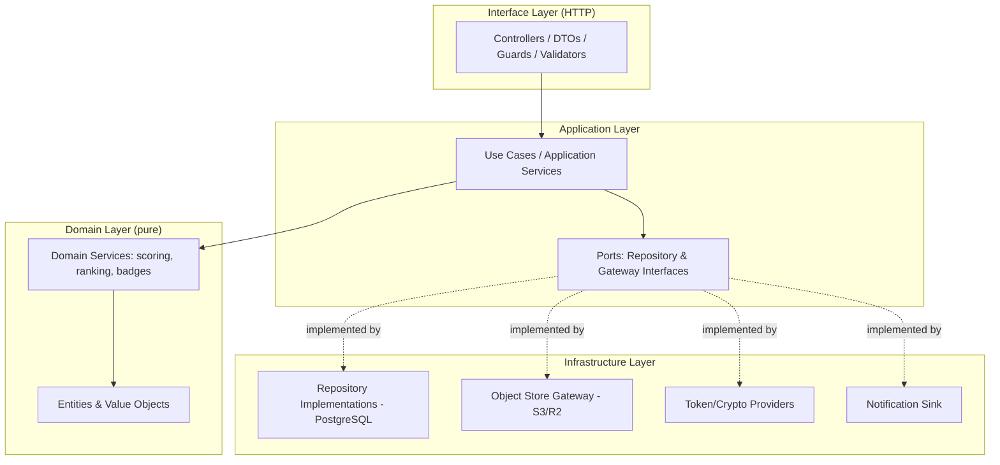
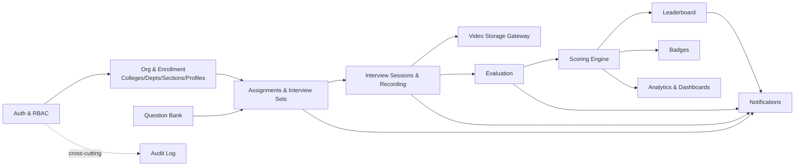
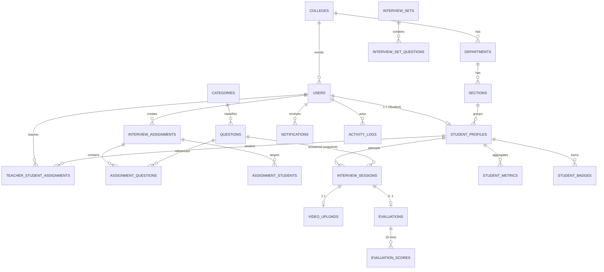

# Design Document

## Overview

The AI Interview Assessment & Teacher Evaluation Platform is delivered as a **well-architected modular monolith**: a single deployable backend organized into strongly-bounded internal modules with clean-architecture layering (domain → application → infrastructure → interface). This avoids the operational overhead of premature microservices while preserving clear seams so individual modules can later be extracted into services if scale demands it.

Key technology decisions:

- **Frontend**: React + TypeScript + Tailwind CSS (SPA).
- **Backend**: Node.js + TypeScript using **NestJS**. NestJS is chosen for first-class dependency injection, explicit module boundaries, and decorator-driven validation/guards, which map directly onto clean-architecture layering and SOLID principles. A single language across the stack reduces context switching and lets domain types be shared.
- **Database**: PostgreSQL with a normalized schema (metadata only). Accessed via a typed query layer (Prisma or Drizzle) using parameterized queries exclusively.
- **Object storage**: AWS S3 or Cloudflare R2 (S3-compatible API). Video bytes never transit the application server — clients upload and play back directly against the Object_Store using short-lived presigned URLs. The database stores only the object key/URL and metadata.
- **Auth**: JWT access tokens (≤ 60 min lifetime) plus rotating refresh tokens, with role-based access control (RBAC) for Student / Teacher / Admin.
- **Packaging/Ops**: Docker images for frontend and backend; CI/CD builds, tests, and produces artifacts before deploy; structured logging and metrics in production.

The design's central correctness concern is the **scoring pipeline** (Average Interview Score → percentage → Consistency, Improvement, Overall Interview Rating → leaderboard ranking → badge awards). These are pure, deterministic functions over a student's evaluated attempts, which makes them ideal candidates for property-based testing and the focus of the Correctness Properties section.

### Design Decisions and Rationale

| Decision | Rationale | Requirements |
|---|---|---|
| Modular monolith over microservices | Lower operational complexity at current stage; clean module seams allow later extraction | NFR scale (29), Ops (30) |
| Presigned-URL direct upload/playback | Keeps large video bytes off the app server; scales to 10k+ concurrent uploads; enforces time-limited, scoped access | 12.1–12.4, 29.2 |
| Pure scoring/ranking core (no I/O) | Deterministic, testable, reproducible; enables property-based testing and recomputation | 15, 17–21 |
| Question text snapshotting on attempts | Preserve historical fidelity when questions are edited/deleted | 8.4, 8.5, 16 |
| Soft delete with deletion flag/timestamp | Retain dependent/historical records and audit trail | 5.4, 8.5, 27.4 |
| Append-only Audit_Log (table `activity_logs`) | Traceability of security-relevant and data-changing actions | 4.4, 7.3, 27.5 |

> Terminology note: the glossary term **Audit_Log** maps to the physical table **`activity_logs`** referenced in Requirement 27.1. Both names refer to the same append-only audit store.

## Architecture

### Layered Clean Architecture

Each module follows the same four-layer structure with dependencies pointing inward only:



The **Domain Layer** (entities, value objects, and domain services for scoring/ranking/badges) is pure and free of framework or I/O dependencies. The **Application Layer** orchestrates use cases against ports (interfaces). The **Infrastructure Layer** provides concrete adapters (PostgreSQL repositories, S3/R2 gateway, JWT/crypto, notification sink). This satisfies the Dependency Inversion Principle: high-level policy never depends on low-level detail.

### Module Decomposition (Bounded Contexts)



Modules communicate **in-process** through application-service interfaces and domain events (a lightweight in-process event bus). For example, publishing an Evaluation emits an `EvaluationPublished` event that the Scoring, Leaderboard, Badge, and Notification modules subscribe to. This keeps modules decoupled and makes the publish→recompute→notify flow explicit and testable.

### Cross-Cutting Concerns

- **AuthN/AuthZ**: A global JWT guard authenticates requests; a role/ownership guard enforces RBAC and record ownership (Teacher↔Student assignment, Student↔own records).
- **Validation**: All inbound DTOs are validated against schemas at the interface boundary; failures return structured 400/422 errors.
- **Audit**: A decorator/interceptor records data-changing actions to `activity_logs`.
- **Security middleware**: HTTPS enforcement (TLS termination at the edge/ingress), security headers, CSRF safeguard for state-changing requests, per-endpoint rate limiting, parameterized DB access, output encoding.
- **Observability**: Structured JSON logs with correlation IDs and operational metrics.

### Video Upload (Presigned URL) Flow

```mermaid
sequenceDiagram
    participant C as Client (React)
    participant API as Backend API
    participant DB as PostgreSQL
    participant OS as Object_Store (S3/R2)

    C->>API: POST /interviews/{questionId}/upload-url (auth, content-type, size)
    API->>API: AuthZ + validate; compute next attempt number
    API->>OS: Create PUT presigned URL (scoped key, short TTL)
    API-->>C: { uploadUrl, objectKey, expiresAt }
    C->>OS: PUT video bytes directly (no app server transit)
    OS-->>C: 200 OK (ETag)
    C->>API: POST /interviews (objectKey, duration, questionId)
    API->>API: Verify object exists & ownership of key
    API->>DB: Create InterviewSession (status=Pending Teacher Review, attemptNumber)
    API-->>C: 201 Created (sessionId, attemptNumber)
    Note over C,OS: Playback uses a separate short-lived GET presigned URL,<br/>issued only to authorized viewers.
```

For playback, an authorized viewer requests a GET presigned URL; the backend verifies the requester may view that Attempt (owning Student, the assigned Teacher, or Admin) before issuing a short-lived read URL. Unauthorized requests receive 403.

### Scoring & Recompute Pipeline

```mermaid
sequenceDiagram
    participant T as Teacher
    participant API as Evaluation Module
    participant Bus as In-process Event Bus
    participant SC as Scoring Engine
    participant LB as Leaderboard
    participant BG as Badges
    participant NS as Notifications

    T->>API: Submit + Publish Evaluation (18 param scores 1..10 + feedback)
    API->>API: Validate scores; compute Average/percentage; persist; status=Evaluated
    API->>Bus: EvaluationPublished(studentId)
    Bus->>SC: recompute(studentId)
    SC->>SC: Average, Consistency, Improvement, Overall (Scoring_Config weights)
    Bus->>LB: recompute affected leaderboards
    Bus->>BG: re-evaluate badge rules (award/revoke)
    Bus->>NS: evaluation-completed + feedback-available notifications
```

## Components and Interfaces

All interfaces below are expressed as TypeScript port definitions in the application/domain layers. Concrete implementations live in infrastructure.

### Auth & RBAC Module

```typescript
type Role = 'Student' | 'Teacher' | 'Admin';

interface AuthService {
  register(input: RegisterInput): Promise<Result<UserId, RegistrationError>>;
  login(email: string, password: string): Promise<Result<TokenPair, AuthError>>;
  refresh(refreshToken: string): Promise<Result<TokenPair, AuthError>>;
  logout(refreshToken: string): Promise<void>; // revokes refresh token
}

interface PasswordPolicy {
  validate(password: string): PolicyResult; // identifies the unmet rule (Req 1.3)
}

interface PasswordHasher {
  hash(plain: string): Promise<string>;       // salted hash only (Req 1.6)
  verify(plain: string, hash: string): Promise<boolean>;
}

interface AccessControl {
  // 403 if role lacks permission (Req 3.2)
  assertPermitted(actor: Principal, action: Action, resource: ResourceRef): void;
  // Teacher↔Student assignment & Student-owns-record checks (Req 3.3, 3.4)
  canTeacherAccessStudent(teacherId: UserId, studentId: UserId): Promise<boolean>;
}
```

Access tokens carry `{ sub, role, collegeId }` and expire within the configured lifetime (≤ 60 min, Req 2.4). Refresh tokens are persisted (hashed) and rotated on use; logout revokes them.

### Org & Enrollment Module

```typescript
interface OrgService {
  createCollege(input: CollegeInput): Promise<College>;
  createDepartment(collegeId: Id, input: DeptInput): Promise<Department>;
  createSection(departmentId: Id, input: SectionInput): Promise<Section>;
  softDelete(entity: OrgEntityRef): Promise<void>; // retains dependents (Req 5.4)
}

interface StudentProfileService {
  upsertProfile(studentId: Id, input: ProfileInput): Promise<Result<Profile, ProfileError>>;
  // duplicate roll number within a college rejected (Req 4.2)
  // enrollment completeness gate for starting sessions (Req 4.3)
  isEnrollmentComplete(studentId: Id): Promise<boolean>;
}
```

### Question Bank Module

```typescript
type Difficulty = 'Easy' | 'Medium' | 'Hard';

interface QuestionBankService {
  createQuestion(input: QuestionInput): Promise<Result<Question, ValidationError>>;
  editQuestion(id: Id, input: Partial<QuestionInput>): Promise<Question>; // snapshot preserved on attempts (Req 8.4)
  softDeleteQuestion(id: Id): Promise<void>; // excluded from new assignments, kept for history (Req 8.5)
  createCategory(name: string): Promise<Category>;
}
```

### Assignment Module

```typescript
interface AssignmentService {
  createFixed(teacherId: Id, questionIds: Id[], studentIds: Id[]): Promise<InterviewAssignment>;
  createRandom(teacherId: Id, spec: RandomSpec, studentIds: Id[]): Promise<InterviewAssignment>; // Req 9.2
  saveInterviewSet(teacherId: Id, set: InterviewSetInput): Promise<InterviewSet>; // Req 9.3
  // assigning to non-assigned student → 403 (Req 9.4)
}
interface RandomSpec { category: string; difficulty: Difficulty; count: number; }
```

### Interview Session & Recording Module

```typescript
interface InterviewService {
  startSession(studentId: Id, questionId: Id): Promise<SessionContext>; // instructions + timers (Req 10)
  issueUploadUrl(studentId: Id, questionId: Id, meta: UploadMeta): Promise<UploadGrant>; // presigned PUT
  finalizeSubmission(studentId: Id, input: FinalizeInput): Promise<InterviewSession>; // Req 11.4, 11.5
}

interface AttemptNumbering {
  // next = max(existing for student+question) + 1 (Req 11.5)
  nextAttemptNumber(studentId: Id, questionId: Id): Promise<number>;
}
```

### Video Storage Gateway

```typescript
interface ObjectStoreGateway {
  createUploadUrl(key: string, contentType: string, ttlSeconds: number): Promise<PresignedUrl>;
  createPlaybackUrl(key: string, ttlSeconds: number): Promise<PresignedUrl>; // authorized only (Req 12.3, 12.4)
  objectExists(key: string): Promise<boolean>;
}
```

### Evaluation Module

```typescript
const EVALUATION_PARAMETERS = [
  'Confidence','Communication Skills','Fluency','Pronunciation','Grammar','Vocabulary',
  'Clarity','Answer Relevance','Logical Thinking','Technical Accuracy','Body Language',
  'Eye Contact','Facial Expressions','Hand Gestures','Posture','Voice Modulation',
  'Professionalism','Overall Impression'
] as const; // 18 parameters (Req 14.1)

interface EvaluationService {
  submit(teacherId: Id, input: EvaluationInput): Promise<Result<Evaluation, ValidationError>>;
  publish(evaluationId: Id): Promise<void>; // makes visible to student; emits EvaluationPublished
}

interface EvaluationInput {
  interviewSessionId: Id;
  parameterScores: Record<typeof EVALUATION_PARAMETERS[number], number>; // each integer 1..10
  strengths: string; weaknesses: string; suggestions: string;
  overallFeedback: string; recommendation: string;
}
```

### Scoring Engine (pure domain service)

```typescript
interface ScoringEngine {
  averageInterviewScore(parameterScores: number[]): number;     // mean of 18 (Req 15.1)
  percentage(average: number): number;                          // average/10*100 (Req 15.2)
  consistencyScore(percentages: number[]): number;              // 100 - 2*popStdDev, clamp 0..100 (Req 18)
  improvementScore(percentagesChrono: number[]): number;        // 50 + halfSplitDelta, clamp 0..100 (Req 19)
  overallRating(avg: number, consistency: number, improvement: number,
                weights: ScoringWeights): number;               // weighted, clamp 0..100 (Req 17)
}

interface ScoringWeights { average: number; consistency: number; improvement: number; } // sum to 100 (Req 7.1)
```

### Leaderboard & Badge Modules

```typescript
type LeaderboardType = 'College' | 'Department' | 'Section' | 'Weekly' | 'Monthly' | 'Overall';

interface LeaderboardService {
  // ranks desc by Overall; ties → higher Average → greater total interviews (Req 20.3)
  rank(entries: StudentMetrics[], type: LeaderboardType, now: Date): LeaderboardRow[];
}

interface BadgeEngine {
  // returns the exact set a student should currently hold; caller diffs to award/revoke (Req 21.1–21.6)
  evaluate(metrics: StudentBadgeInput): Set<BadgeType>;
}
```

### Notifications & Audit Modules

```typescript
interface NotificationService {
  create(userId: Id, type: NotificationType, payload: object): Promise<void>; // in-app (Req 26)
}
interface AuditLog {
  record(actor: Principal, action: string, target: ResourceRef, at: Date): Promise<void>; // Req 27.5
}
```

### REST API Surface (representative)

| Method & Path | Role | Requirements |
|---|---|---|
| `POST /auth/register` | Public | 1.1–1.3 |
| `POST /auth/login` | Public | 1.4, 1.5 |
| `POST /auth/refresh` | Auth | 2.1, 2.2 |
| `POST /auth/logout` | Auth | 2.3 |
| `PUT /students/me/profile` | Student | 4.1–4.4 |
| `POST /admin/colleges` `…/departments` `…/sections` | Admin | 5.1–5.4 |
| `POST /admin/teachers`, `POST /admin/assignments/student-teacher` | Admin | 6.1–6.4 |
| `PUT /admin/scoring-config`, `PUT /admin/leaderboards/{type}` | Admin | 7.1–7.4 |
| `POST /admin/questions`, `PUT /admin/questions/{id}`, `DELETE …`, `POST /admin/categories` | Admin | 8.1–8.5 |
| `POST /teacher/assignments` (fixed/random), `POST /teacher/interview-sets` | Teacher | 9.1–9.4 |
| `POST /interviews/{questionId}/start` | Student | 10.1–10.3 |
| `POST /interviews/{questionId}/upload-url` | Student | 11.4, 12.2 |
| `POST /interviews` (finalize) | Student | 11.4, 11.5 |
| `GET /attempts/{id}/playback-url` | Student/Teacher/Admin | 12.3, 12.4 |
| `GET /teacher/submissions`, `GET /teacher/submissions/{id}` | Teacher | 13.1–13.3 |
| `POST /teacher/evaluations`, `POST /teacher/evaluations/{id}/publish` | Teacher | 14.1–14.5, 15 |
| `GET /students/me/history` | Student | 16.1–16.3 |
| `GET /leaderboards/{type}` | Auth | 20.1–20.5 |
| `GET /students/me/dashboard`, `GET /teacher/dashboard`, `GET /admin/dashboard` | Role | 22, 23, 24 |
| `GET /analytics/*` | Role | 25.1–25.4 |
| `GET /notifications` | Auth | 26 |

## Data Models

### Entity-Relationship Diagram



### Key Tables (PostgreSQL, normalized)

All tables include `id` (PK), `created_at`, `updated_at` (Req 27.3); soft-deletable tables add `deleted_at` (Req 27.4). Every cross-entity reference is a FK (Req 27.2).

```sql
users (id, email UNIQUE, password_hash, role CHECK in ('Student','Teacher','Admin'),
       college_id FK, is_active, created_at, updated_at)

refresh_tokens (id, user_id FK, token_hash, expires_at, revoked_at, created_at)

colleges (id, name, attributes JSONB, deleted_at, created_at, updated_at)
departments (id, college_id FK, name, deleted_at, ...)
sections (id, department_id FK, name, deleted_at, ...)

student_profiles (id, user_id FK UNIQUE, full_name, roll_number, college_id FK,
                  department_id FK, section_id FK, created_at, updated_at,
                  UNIQUE(college_id, roll_number))                 -- Req 4.2

teacher_student_assignments (id, teacher_id FK, student_id FK, is_active,
                             created_at, updated_at)               -- Req 6.2, 6.4

categories (id, name, deleted_at, ...)
questions (id, category_id FK, difficulty CHECK in ('Easy','Medium','Hard'),
           text, expected_duration_s, suggested_key_points, weightage,
           deleted_at, created_at, updated_at)                     -- Req 8

interview_assignments (id, teacher_id FK, type CHECK in ('fixed','random'),
                       random_spec JSONB NULL, created_at, updated_at)
assignment_questions (assignment_id FK, question_id FK, PRIMARY KEY(assignment_id, question_id))
assignment_students (assignment_id FK, student_id FK, PRIMARY KEY(assignment_id, student_id))
interview_sets (id, teacher_id FK, name, created_at, updated_at)   -- Req 9.3
interview_set_questions (set_id FK, question_id FK, PRIMARY KEY(set_id, question_id))

interview_sessions (id, student_id FK, question_id FK,
                    question_text_snapshot, category_snapshot,     -- Req 8.4, 16.2
                    attempt_number, duration_s, upload_timestamp,
                    video_url, status CHECK in
                      ('Pending Teacher Review','Evaluated'),
                    created_at, updated_at,
                    UNIQUE(student_id, question_id, attempt_number)) -- Req 11.5

video_uploads (id, interview_session_id FK UNIQUE, object_key, content_type,
               size_bytes, created_at)                              -- Req 12.1

evaluations (id, interview_session_id FK UNIQUE, teacher_id FK, student_id FK,
             total_score, average_interview_score, percentage_score,
             strengths, weaknesses, suggestions, overall_feedback, recommendation,
             evaluation_date, published_at, created_at, updated_at)  -- Req 14, 15
evaluation_scores (id, evaluation_id FK, parameter_name, score CHECK 1..10,
                   UNIQUE(evaluation_id, parameter_name))            -- 18 rows (Req 14.1)

student_metrics (id, student_id FK UNIQUE, average_interview_score,
                 consistency_score, improvement_score, overall_interview_rating,
                 total_interviews, best_score, worst_score, updated_at) -- Req 17, 22
student_badges (id, student_id FK, badge_type, awarded_at,
                UNIQUE(student_id, badge_type))                      -- Req 21

scoring_config (id, weight_average, weight_consistency, weight_improvement,
                leaderboard_toggles JSONB, updated_at)               -- Req 7
leaderboards (id, type, scope_id, rank, student_id FK, snapshot JSONB,
              computed_at)                                           -- Req 20
notifications (id, user_id FK, type, payload JSONB, read_at, created_at) -- Req 26
activity_logs (id, actor_user_id FK, action, target_type, target_id,
               metadata JSONB, created_at)                          -- Audit_Log (Req 27.5)
```

### Domain Value Objects

- **Percentage**: a number in [10, 100] derived from an Average Interview Score in [1, 10] (Req 15.4).
- **Score0to100**: Consistency, Improvement, and Overall ratings are constrained to [0, 100] (Req 17.4, 18.3, 19.4).
- **AttemptNumber**: a positive integer, unique and monotonically increasing per (student, question) (Req 11.5).
- **ScoringWeights**: three integers in [0, 100] summing to 100 (Req 7.1).

### Indexing (Req 29.4)

- `interview_sessions (student_id, question_id, attempt_number)` — attempt numbering & history.
- `interview_sessions (status)` partial index for `Pending Teacher Review` — submission queue.
- `evaluations (student_id, evaluation_date)` — scoring recompute & period analytics.
- `student_metrics (overall_interview_rating DESC, average_interview_score DESC, total_interviews DESC)` — leaderboard ranking.
- `teacher_student_assignments (teacher_id, student_id)` — ownership checks & queue scoping.

## Correctness Properties

*A property is a characteristic or behavior that should hold true across all valid executions of a system — essentially, a formal statement about what the system should do. Properties serve as the bridge between human-readable specifications and machine-verifiable correctness guarantees.*

The platform's scoring, ranking, badge, validation, and access-control logic are pure, deterministic functions over their inputs, which makes them ideal for property-based testing. Each property below is universally quantified and traces to the acceptance criteria it validates. Properties were consolidated during prework reflection to remove redundancy (e.g., validation accept/reject branches and range-clamp invariants merged into single comprehensive properties; all badge award/revoke rules merged into one "exact set" property).

### Property 1: Password policy validation is total and rule-identifying

*For any* string, the password policy accepts it if and only if it satisfies every policy rule, and for any rejected string at least one unmet rule is reported.

**Validates: Requirements 1.3**

### Property 2: Password hashing is salted and verifiable

*For any* password, its stored hash differs from the plaintext, two independent hashes of the same password differ (distinct salts), `verify(password, hash)` is true, and `verify(other, hash)` is false for any different password.

**Validates: Requirements 1.6**

### Property 3: Assignment-scoped access control

*For any* set of teacher–student assignments and any (teacher, student) pair, the teacher is granted access to the student — and the student appears in the teacher's submission queue — if and only if an active assignment links them.

**Validates: Requirements 3.3, 13.3**

### Property 4: Student record isolation

*For any* collection of records across students, the records returned to a given Student contain only records owned by that Student.

**Validates: Requirements 3.4**

### Property 5: Enrollment completeness gate

*For any* student profile, the platform reports enrollment complete (and permits starting a session) if and only if all required enrollment fields are present, and otherwise reports exactly the set of missing required fields.

**Validates: Requirements 4.3**

### Property 6: Roll number uniqueness is college-scoped

*For any* two student profiles, insertion conflicts if and only if they share the same college and the same roll number; identical roll numbers in different colleges never conflict.

**Validates: Requirements 4.2**

### Property 7: Soft delete retains data and excludes from active listings

*For any* soft-deletable entity with dependent records, soft deletion sets the deletion timestamp, leaves the entity row and all dependents physically present, and excludes the entity from active listings while keeping it resolvable for history.

**Validates: Requirements 5.4, 8.5, 27.4**

### Property 8: Reassignment preserves historical evaluations

*For any* student with a set of evaluations, reassigning the student to a different teacher leaves every evaluation unchanged and results in exactly one active assignment.

**Validates: Requirements 6.4**

### Property 9: Scoring weights validity

*For any* triple of weights, the Scoring_Config is accepted if and only if each weight is between 0 and 100 and the three weights sum to 100; otherwise the update is rejected.

**Validates: Requirements 7.1, 7.2**

### Property 10: Question text snapshot immutability

*For any* attempt that captured a question's text, subsequently editing or soft-deleting that question leaves the attempt's stored question-text snapshot unchanged.

**Validates: Requirements 8.4**

### Property 11: Random assignment matches its specification

*For any* question pool and a random specification of (category, difficulty, count) where the matching pool is at least `count`, the generated assignment contains exactly `count` questions and every selected question matches the requested category and difficulty.

**Validates: Requirements 9.2**

### Property 12: Re-record retains only the latest take

*For any* non-empty sequence of recorded takes prior to submission, the retained take equals the most recent take and all earlier takes are discarded.

**Validates: Requirements 11.3**

### Property 13: Attempt numbering is max-plus-one and unique

*For any* existing attempt history for a (student, question) pair, the next assigned attempt number equals the current maximum plus one (or 1 when no prior attempt exists), and attempt numbers remain unique per (student, question).

**Validates: Requirements 11.5**

### Property 14: Playback authorization

*For any* (viewer, attempt) pair, a playback URL is issued if and only if the viewer is the owning Student, the Teacher assigned to that Student, or an Admin; all other viewers are denied with 403.

**Validates: Requirements 12.4**

### Property 15: Evaluation input validation

*For any* map of parameter scores, an Evaluation is accepted if and only if all 18 parameters are present and each score is an integer in the range 1 to 10; any rejection identifies an offending parameter.

**Validates: Requirements 14.1, 14.2**

### Property 16: Average Interview Score is the mean of parameters

*For any* vector of 18 parameter scores, the Average Interview Score equals the arithmetic mean (sum divided by 18) of those scores.

**Validates: Requirements 15.1**

### Property 17: Percentage transform

*For any* Average Interview Score, the percentage score equals the average divided by 10 multiplied by 100.

**Validates: Requirements 15.2**

### Property 18: Percentage range invariant

*For any* valid Evaluation, the computed percentage score lies between 10 and 100 inclusive.

**Validates: Requirements 15.4**

### Property 19: Attempt history immutability

*For any* attempt history, creating a new Attempt leaves every prior Attempt record present and unchanged (no overwrite or deletion).

**Validates: Requirements 16.1**

### Property 20: Interview history ordering

*For any* set of a Student's Attempts, the returned interview history is ordered by timestamp.

**Validates: Requirements 16.3**

### Property 21: Overall Interview Rating is the weighted sum

*For any* Average, Consistency, and Improvement components and any valid weights, the Overall Interview Rating equals (Average·w_avg + Consistency·w_cons + Improvement·w_impr) / 100.

**Validates: Requirements 17.1**

### Property 22: Overall Interview Rating range invariant

*For any* component values and valid weights, the Overall Interview Rating lies between 0 and 100 inclusive.

**Validates: Requirements 17.4**

### Property 23: Consistency Score definition and range

*For any* list of evaluated-attempt percentages, the Consistency Score equals 100 minus 2 times the population standard deviation of those percentages, clamped to the range 0 to 100; when all percentages are equal (with at least 2 attempts) the Consistency Score is 100.

**Validates: Requirements 18.1, 18.2, 18.3**

### Property 24: Improvement partition and delta

*For any* chronological list of at least 2 evaluated-attempt percentages, the attempts are partitioned into an earlier half and a later half with the middle attempt assigned to the later half when the count is odd, and the raw improvement delta equals the later-half mean minus the earlier-half mean.

**Validates: Requirements 19.1**

### Property 25: Improvement Score definition and range

*For any* raw improvement delta, the Improvement Score equals 50 plus the delta, clamped to the range 0 to 100; when the half means are equal the Improvement Score is 50.

**Validates: Requirements 19.2, 19.3, 19.4**

### Property 26: Leaderboard ranking and tie-breaking

*For any* collection of student metrics, the produced leaderboard orders students non-increasingly by Overall Interview Rating, breaking ties by higher Average Interview Score and then by greater total interviews, with dense sequential ranks.

**Validates: Requirements 20.3**

### Property 27: Weekly and Monthly leaderboard windowing

*For any* set of attempts with evaluation dates, the inputs to a Weekly or Monthly leaderboard include only attempts whose evaluation date falls within the current week or month respectively.

**Validates: Requirements 20.5**

### Property 28: Badge award and revocation produce the exact qualifying set

*For any* student metrics and college cohort, the Badge Engine returns exactly the set of badges whose defined predicates are satisfied — Top Performer (top 5% in college and ≥3 attempts), Most Improved (≥4 attempts and Improvement ≥70), Consistent Performer (≥5 attempts and Consistency ≥85), Excellent Communicator (≥3 attempts and mean of Communication, Fluency, Pronunciation, Clarity ≥8.5), Interview Master (≥25 attempts and Overall ≥85) — so that a recomputation in which a predicate no longer holds yields a set excluding that badge (revocation).

**Validates: Requirements 21.1, 21.2, 21.3, 21.4, 21.5, 21.6**

## Error Handling

### Error Taxonomy and HTTP Mapping

The application uses a typed `Result<T, E>` at domain/application boundaries and translates domain errors to HTTP responses at the interface layer. Error responses share a consistent envelope `{ code, message, details? }` and never leak stack traces or which credential was wrong.

| Domain error | HTTP status | Examples (Requirements) |
|---|---|---|
| ValidationError | 400 / 422 | Password policy (1.3), difficulty enum (8.2), weight sum (7.2), evaluation scores (14.2), schema validation (28.2) |
| AuthenticationError | 401 | Invalid login (1.5, generic), expired/revoked token (2.2) |
| AuthorizationError | 403 | Role not permitted (3.2), cross-student access (3.3), assign to non-assigned student (9.4), unauthorized playback (12.4) |
| NotFoundError | 404 | Missing entity references |
| ConflictError | 409 | Duplicate email (1.2), duplicate roll number (4.2) |
| RateLimitError | 429 | Endpoint rate limit exceeded (28.6) |
| UnavailableError | 503 | Object_Store/presign failures |

### Specific Handling Rules

- **Authentication** (1.5, 2.2): login failures return a single generic message regardless of which credential failed; token problems return 401 with no detail about token internals.
- **Validation** (1.3, 8.2, 14.2): the error `details` array names the offending field/parameter and the unmet rule, enabling the client to highlight it.
- **Permission denials** (3.2, 3.3, 9.4, 12.4): 403 with a non-revealing message; the resource's existence is not confirmed to unauthorized callers.
- **Recording/upload** (10.2, 12.x): permission denial prevents recording and surfaces the specific permission needed; presign or upload failures are surfaced as retryable errors and never create a half-formed session (finalize verifies the object exists before persisting).
- **Idempotency & integrity** (11.5, 16.1): attempt creation is transactional; the `(student_id, question_id, attempt_number)` unique constraint guards against duplicate numbering under concurrency, retrying numbering on conflict.
- **Scoring inputs** (15, 17–19): scoring functions operate only on validated evaluations; empty/short histories follow the defined boundary behavior (Consistency/Improvement = 0 below 2 attempts) rather than throwing.
- **Rate limiting** (28.6): exceeding the window returns 429 until the window resets, with a `Retry-After` header.
- **Audit on failure**: security-relevant failures (auth, authorization) are recorded to `activity_logs` for traceability.

## Testing Strategy

The platform uses a **dual testing approach**: property-based tests verify the universal correctness properties above across many generated inputs, while example-based unit tests, integration tests, and smoke tests cover concrete scenarios, wiring, and configuration.

### Property-Based Testing

- **Library**: `fast-check` (TypeScript) integrated with the unit test runner (Vitest/Jest). Property-based testing is NOT implemented from scratch.
- **Scope**: the 28 Correctness Properties above, all targeting pure domain/application logic — the Scoring Engine, Leaderboard ranking, Badge Engine, attempt numbering, validation (password policy, evaluation input, scoring weights), access-control predicates, soft-delete/immutability invariants, and selection logic.
- **Configuration**: each property test runs a **minimum of 100 iterations**.
- **Generators**: custom arbitraries for parameter-score vectors (18 integers in 1..10), percentage histories (including constant and equal-half lists to exercise edge cases 18.2/19.3), weight triples summing to 100, assignment graphs, question pools with category/difficulty, and viewer/attempt authorization pairs.
- **Tagging**: each property test is annotated with a comment in the form
  `// Feature: interview-assessment-platform, Property {number}: {property text}`
  and references the design property it validates.

### Unit Testing (example-based)

Focused on specific behaviors and error conditions that are not universal: registration happy path and duplicate (1.1, 1.2), login token issuance (1.4), token refresh/expiry/logout (2.1–2.3), role assignment (3.1), org/question/assignment creation (5.1–5.3, 8.1, 8.3, 9.1, 9.3), session start and finalize fields/status (10, 11.4), feedback capture and publish (14.3–14.5), dashboard field composition (22–24), analytics shaping (25), notification creation per event (26), and security behaviors (28.2, 28.4, 28.5, 28.6). Unit tests are kept lean — broad input coverage is delegated to property tests.

### Integration Testing

1–3 representative examples each for boundaries the application does not own or that depend on external services and timing: presigned upload/playback URL generation and scoping against an S3/R2-compatible test endpoint (12.1–12.3), end-to-end publish → recompute → leaderboard → badge → notification flow through the in-process event bus (17.3, 20.1), and database constraint enforcement (PK/FK, unique, soft-delete columns).

### Smoke / Configuration Checks

Single-execution checks for setup and ops invariants: normalized schema with required entities and constraints (27.1–27.4), required indexes present (29.4), HTTPS/security middleware wired (28.1, 28.3), Docker image builds (30.1), and CI pipeline gating (30.2, 30.3). Scale/performance targets (29.1–29.3) are validated with load tests in a dedicated environment rather than per-input property tests.

### Traceability

Every Correctness Property cites the requirement clauses it validates. Property tests reference their design property number; unit/integration/smoke tests reference their requirement clauses. Together this ensures each testable acceptance criterion maps to at least one automated test.
