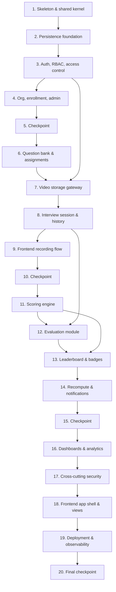

# Implementation Plan: Interview Assessment Platform

## Overview

This plan converts the design into incremental, test-backed coding steps for a NestJS + TypeScript modular monolith (clean architecture) with a React + TypeScript + Tailwind frontend, PostgreSQL (Prisma as the typed query layer — swappable for Drizzle), JWT/RBAC auth, and S3/R2 presigned-URL video storage.

Each task builds on prior tasks and ends by wiring new code into the running system — no orphaned code. Pure domain logic (scoring, ranking, badges, validation, access predicates) is built before the layers that depend on it. Sub-tasks marked with `*` are optional tests and can be skipped for a faster MVP; core implementation sub-tasks are not optional. Property tests use `fast-check` (≥100 iterations) and reference design properties; each is tagged `// Feature: interview-assessment-platform, Property {n}: {text}`.

## Tasks

- [x] 1. Scaffold modular-monolith skeleton and shared kernel
  - Initialize NestJS backend and React+Vite+Tailwind frontend workspaces (monorepo)
  - Create the clean-architecture folder convention (domain/application/infrastructure/interface) and an empty module per bounded context
  - Implement shared kernel: `Result<T,E>` type, base error classes, in-process event bus interface, and ID/value-object helpers
  - Configure Vitest + fast-check and a shared test setup
  - _Requirements: 27.1_

- [ ] 2. Persistence foundation
  - [ ] 2.1 Define the normalized schema and migrations
    - Model all entities from the design (users, refresh_tokens, colleges, departments, sections, student_profiles, teacher_student_assignments, categories, questions, interview_assignments + join tables, interview_sets + join, interview_sessions, video_uploads, evaluations, evaluation_scores, student_metrics, student_badges, scoring_config, leaderboards, notifications, activity_logs)
    - Add PKs, FKs, enum CHECKs, unique constraints (`users.email`, `student_profiles(college_id, roll_number)`, `interview_sessions(student_id, question_id, attempt_number)`, `evaluation_scores(evaluation_id, parameter_name)`), `created_at`/`updated_at` on all tables, and `deleted_at` on soft-deletable tables
    - Add the indexes from the design (ranking, status partial index, assignment lookup, evaluation by date)
    - _Requirements: 27.1, 27.2, 27.3, 27.4, 29.4_
  - [ ] 2.2 Implement base repository, soft-delete, timestamp, and audit primitives
    - Generic repository with active-listing filter that excludes soft-deleted rows
    - Timestamp hooks and an append-only `activity_logs` writer (Audit_Log)
    - _Requirements: 27.3, 27.4, 27.5_
  - [ ]* 2.3 Write property test for soft delete
    - **Property 7: Soft delete retains data and excludes from active listings**
    - **Validates: Requirements 5.4, 8.5, 27.4**
  - [ ]* 2.4 Write smoke checks for schema/constraints/indexes
    - Verify required tables, PK/FK/unique constraints, and indexes exist
    - _Requirements: 27.1, 27.2, 29.4_

- [ ] 3. Auth, RBAC, and access control
  - [ ] 3.1 Implement password policy and password hasher
    - Configurable password policy returning the unmet rule; salted hashing + verify
    - _Requirements: 1.3, 1.6_
  - [ ]* 3.2 Write property test for password policy validation
    - **Property 1: Password policy validation is total and rule-identifying**
    - **Validates: Requirements 1.3**
  - [ ]* 3.3 Write property test for password hashing
    - **Property 2: Password hashing is salted and verifiable**
    - **Validates: Requirements 1.6**
  - [ ] 3.4 Implement registration, login, token issuance, refresh, and logout
    - Register (Student role, duplicate-email conflict), login (generic failure), JWT access token (≤60 min) + rotating refresh tokens, refresh, logout revocation
    - _Requirements: 1.1, 1.2, 1.4, 1.5, 2.1, 2.2, 2.3, 2.4_
  - [ ]* 3.5 Write unit tests for auth flows
    - Register happy/duplicate, login success/generic-failure, refresh/expiry/logout, token lifetime bound
    - _Requirements: 1.1, 1.2, 1.4, 1.5, 2.1, 2.2, 2.3, 2.4_
  - [ ] 3.6 Implement RBAC guards and access-control predicates
    - Global JWT guard; role guard (403); assignment-scoped access predicate; student-owns-record filter
    - _Requirements: 3.1, 3.2, 3.3, 3.4_
  - [ ]* 3.7 Write property test for assignment-scoped access
    - **Property 3: Assignment-scoped access control**
    - **Validates: Requirements 3.3, 13.3**
  - [ ]* 3.8 Write property test for student record isolation
    - **Property 4: Student record isolation**
    - **Validates: Requirements 3.4**

- [ ] 4. Org, enrollment, and admin management
  - [ ] 4.1 Implement college/department/section management with soft delete
    - Create/link entities; soft delete retaining dependents
    - _Requirements: 5.1, 5.2, 5.3, 5.4_
  - [ ] 4.2 Implement student profile and enrollment
    - Persist profile + org association; college-scoped roll-number uniqueness; enrollment completeness gate; audited updates
    - _Requirements: 4.1, 4.2, 4.3, 4.4_
  - [ ]* 4.3 Write property test for roll-number uniqueness
    - **Property 6: Roll number uniqueness is college-scoped**
    - **Validates: Requirements 4.2**
  - [ ]* 4.4 Write property test for enrollment completeness gate
    - **Property 5: Enrollment completeness gate**
    - **Validates: Requirements 4.3**
  - [ ] 4.5 Implement teacher/student account management and reassignment
    - Create teacher; assign/reassign student; deactivate (block auth, retain history); preserve prior evaluations on reassign
    - _Requirements: 6.1, 6.2, 6.3, 6.4_
  - [ ]* 4.6 Write property test for reassignment preserving evaluations
    - **Property 8: Reassignment preserves historical evaluations**
    - **Validates: Requirements 6.4**
  - [ ] 4.7 Implement scoring config and leaderboard toggles
    - Persist weights only when each 0..100 and sum=100; apply to subsequent computations + audit; enable/disable leaderboard types
    - _Requirements: 7.1, 7.2, 7.3, 7.4_
  - [ ]* 4.8 Write property test for scoring weights validity
    - **Property 9: Scoring weights validity**
    - **Validates: Requirements 7.1, 7.2**

- [ ] 5. Checkpoint - Ensure all tests pass
  - Ensure all tests pass, ask the user if questions arise.

- [ ] 6. Question bank and assignments
  - [ ] 6.1 Implement question bank and categories
    - Create question (unique ID), difficulty enum validation, categories, edit with snapshot guarantee, soft delete excluding from new assignments
    - _Requirements: 8.1, 8.2, 8.3, 8.4, 8.5_
  - [ ]* 6.2 Write unit/edge tests for question validation
    - **Edge case: difficulty outside {Easy, Medium, Hard} rejected; valid values accepted**
    - _Requirements: 8.2_
  - [ ] 6.3 Implement assignments and interview sets
    - Fixed assignment; random assignment selecting N matching questions; named interview sets; 403 when assigning to non-assigned student
    - _Requirements: 9.1, 9.2, 9.3, 9.4_
  - [ ]* 6.4 Write property test for random assignment selection
    - **Property 11: Random assignment matches its specification**
    - **Validates: Requirements 9.2**

- [ ] 7. Video storage gateway (S3/R2 presigned URLs)
  - [ ] 7.1 Implement Object_Store gateway
    - Scoped, time-limited presigned PUT (upload) and GET (playback) URLs; object-exists check; store only key/metadata in DB
    - _Requirements: 12.1, 12.2, 12.3_
  - [ ] 7.2 Implement playback authorization
    - Issue playback URL only to owning Student, assigned Teacher, or Admin; otherwise 403
    - _Requirements: 12.4_
  - [ ]* 7.3 Write property test for playback authorization
    - **Property 14: Playback authorization**
    - **Validates: Requirements 12.4**
  - [ ]* 7.4 Write integration tests for presigned URLs
    - Verify upload/playback URLs target the expected key with TTL against an S3/R2-compatible test endpoint
    - _Requirements: 12.1, 12.2, 12.3_

- [ ] 8. Interview session, recording, and history
  - [ ] 8.1 Implement attempt numbering and session finalization
    - Next attempt number = max+1 per (student, question); transactional create with unique-constraint retry; capture question/category snapshot; finalize creates session with required fields and status "Pending Teacher Review"
    - _Requirements: 11.4, 11.5, 8.4_
  - [ ]* 8.2 Write property test for attempt numbering
    - **Property 13: Attempt numbering is max-plus-one and unique**
    - **Validates: Requirements 11.5**
  - [ ]* 8.3 Write property test for question snapshot immutability
    - **Property 10: Question text snapshot immutability**
    - **Validates: Requirements 8.4**
  - [ ] 8.4 Implement interview history retrieval
    - Immutable retention; return attempts ordered by timestamp with required per-attempt fields
    - _Requirements: 16.1, 16.2, 16.3_
  - [ ]* 8.5 Write property test for attempt history immutability
    - **Property 19: Attempt history immutability**
    - **Validates: Requirements 16.1**
  - [ ]* 8.6 Write property test for interview history ordering
    - **Property 20: Interview history ordering**
    - **Validates: Requirements 16.3**

- [ ] 9. Frontend recording flow
  - [ ] 9.1 Implement recording UI and upload integration
    - Instructions + camera/mic permission handling (block + show required permission on denial); question + preparation/recording timers + progress; record/preview/re-record; request presigned URL, direct upload, then finalize
    - _Requirements: 10.1, 10.2, 10.3, 11.1, 11.2, 11.3, 11.4_
  - [ ]* 9.2 Write property test for re-record retaining latest take
    - **Property 12: Re-record retains only the latest take**
    - **Validates: Requirements 11.3**

- [ ] 10. Checkpoint - Ensure all tests pass
  - Ensure all tests pass, ask the user if questions arise.

- [ ] 11. Scoring engine (pure domain service)
  - [ ] 11.1 Implement core score computations
    - Average Interview Score (mean of 18), percentage transform, and percentage range guarantee
    - _Requirements: 15.1, 15.2, 15.4_
  - [ ]* 11.2 Write property test for Average Interview Score
    - **Property 16: Average Interview Score is the mean of parameters**
    - **Validates: Requirements 15.1**
  - [ ]* 11.3 Write property test for percentage transform
    - **Property 17: Percentage transform**
    - **Validates: Requirements 15.2**
  - [ ]* 11.4 Write property test for percentage range invariant
    - **Property 18: Percentage range invariant**
    - **Validates: Requirements 15.4**
  - [ ] 11.5 Implement Consistency and Improvement scores
    - Consistency = clamp(100 − 2·popStdDev, 0, 100); Improvement chronological half-split delta and clamp(50 + delta, 0, 100); boundary behavior for equal values/means
    - _Requirements: 18.1, 18.2, 18.3, 19.1, 19.2, 19.3, 19.4_
  - [ ]* 11.6 Write property test for Consistency Score
    - **Property 23: Consistency Score definition and range**
    - **Validates: Requirements 18.1, 18.2, 18.3**
  - [ ]* 11.7 Write property test for Improvement partition and delta
    - **Property 24: Improvement partition and delta**
    - **Validates: Requirements 19.1**
  - [ ]* 11.8 Write property test for Improvement Score
    - **Property 25: Improvement Score definition and range**
    - **Validates: Requirements 19.2, 19.3, 19.4**
  - [ ] 11.9 Implement Overall Interview Rating
    - Weighted sum from Scoring_Config; <2-attempt boundary (consistency/improvement = 0); range guarantee
    - _Requirements: 17.1, 17.2, 17.4_
  - [ ]* 11.10 Write property test for Overall Interview Rating computation
    - **Property 21: Overall Interview Rating is the weighted sum**
    - **Validates: Requirements 17.1**
  - [ ]* 11.11 Write property test for Overall Interview Rating range
    - **Property 22: Overall Interview Rating range invariant**
    - **Validates: Requirements 17.4**

- [ ] 12. Evaluation module
  - [ ] 12.1 Implement evaluation submission and scoring capture
    - Validate 18 integer scores in 1..10 (identify offending parameter); capture feedback fields; compute and persist total/average/percentage; set status "Evaluated"; publish to make visible to student
    - _Requirements: 14.1, 14.2, 14.3, 14.4, 14.5, 15.3_
  - [ ]* 12.2 Write property test for evaluation input validation
    - **Property 15: Evaluation input validation**
    - **Validates: Requirements 14.1, 14.2**
  - [ ] 12.3 Implement teacher submission queue
    - Pending-submission cards with required fields; submission detail with player/profile/question/history; scoped to assigned students
    - _Requirements: 13.1, 13.2, 13.3_

- [ ] 13. Leaderboard and badges
  - [ ] 13.1 Implement leaderboard ranking and windowing
    - Rank desc by Overall, tie-break by Average then total interviews, dense ranks; Weekly/Monthly windowing; row field composition; support all 6 types
    - _Requirements: 20.2, 20.3, 20.4, 20.5_
  - [ ]* 13.2 Write property test for leaderboard ranking and tie-breaking
    - **Property 26: Leaderboard ranking and tie-breaking**
    - **Validates: Requirements 20.3**
  - [ ]* 13.3 Write property test for Weekly/Monthly windowing
    - **Property 27: Weekly and Monthly leaderboard windowing**
    - **Validates: Requirements 20.5**
  - [ ] 13.4 Implement badge engine
    - Return the exact qualifying badge set (Top Performer, Most Improved, Consistent Performer, Excellent Communicator, Interview Master); diff to award/revoke
    - _Requirements: 21.1, 21.2, 21.3, 21.4, 21.5, 21.6_
  - [ ]* 13.5 Write property test for badge award and revocation
    - **Property 28: Badge award and revocation produce the exact qualifying set**
    - **Validates: Requirements 21.1, 21.2, 21.3, 21.4, 21.5, 21.6**

- [ ] 14. Event-driven recompute and notifications
  - [ ] 14.1 Wire the publish → recompute pipeline through the event bus
    - On `EvaluationPublished`: recompute student metrics (Overall using all evaluated attempts), recompute affected leaderboards, re-evaluate badges (award/revoke), persist `student_metrics`/`student_badges`/`leaderboards`
    - _Requirements: 17.3, 20.1_
  - [ ] 14.2 Implement in-app notifications for all events
    - Submission confirmation, evaluation-completed + feedback-available, leaderboard-updated, new-assignment, new-submission (to teacher), platform-statistics (to admins)
    - _Requirements: 26.1, 26.2, 26.3, 26.4, 26.5, 26.6_
  - [ ]* 14.3 Write unit tests for notification creation per event
    - Assert exactly one notification of expected type/recipient per event (mock sink)
    - _Requirements: 26.1, 26.2, 26.3, 26.4, 26.5, 26.6_
  - [ ]* 14.4 Write integration test for the publish→recompute→leaderboard→badge→notify flow
    - One end-to-end example through the event bus
    - _Requirements: 17.3, 20.1_

- [ ] 15. Checkpoint - Ensure all tests pass
  - Ensure all tests pass, ask the user if questions arise.

- [ ] 16. Dashboards and analytics
  - [ ] 16.1 Implement student/teacher/admin dashboard endpoints
    - Student: ranks, ratings, scores, history, timeline, strengths/weak areas, category-wise; Teacher: pending/completed counts, class analytics, report export; Admin: platform totals and analytics
    - _Requirements: 22.1, 22.2, 22.3, 23.1, 23.2, 23.3, 24.1, 24.2_
  - [ ] 16.2 Implement analytics endpoints
    - Period (daily/weekly/monthly/yearly) aggregation, category analytics + trend, skill analytics, completion + feedback-trend analytics
    - _Requirements: 25.1, 25.2, 25.3, 25.4_
  - [ ]* 16.3 Write unit tests for dashboard/analytics shaping
    - Field composition and aggregation correctness on representative datasets
    - _Requirements: 22.1, 23.1, 24.1, 25.1_

- [ ] 17. Cross-cutting security
  - [ ] 17.1 Implement security middleware and input validation
    - HTTPS enforcement, schema validation on all endpoints, parameterized queries, output encoding (XSS), anti-CSRF on state-changing requests, per-endpoint rate limiting (429 + Retry-After)
    - _Requirements: 28.1, 28.2, 28.3, 28.4, 28.5, 28.6_
  - [ ]* 17.2 Write unit tests for security behaviors
    - Invalid input rejected, CSRF safeguard required, rate-limit returns 429 then resets
    - _Requirements: 28.2, 28.5, 28.6_

- [ ] 18. Frontend application shell and role views
  - [ ] 18.1 Implement auth flows, routing/guards, and role-based layouts
    - Login/register, token storage/refresh, protected routes by role, navigation
    - _Requirements: 1.1, 1.4, 3.1, 3.2_
  - [ ] 18.2 Implement student, teacher, and admin screens
    - Dashboards, interview history, evaluation form, submission queue, leaderboards, notifications, admin management — wired to backend endpoints
    - _Requirements: 13.1, 14.1, 16.3, 20.4, 22.2, 23.1, 24.1, 26.1_

- [ ] 19. Deployment and observability
  - [ ] 19.1 Containerize and configure CI/CD and observability
    - Dockerfiles for backend/frontend; CI builds+tests+artifacts before deploy and halts on test failure; structured logs and metrics
    - _Requirements: 30.1, 30.2, 30.3, 30.4_

- [ ] 20. Final checkpoint - Ensure all tests pass
  - Ensure all tests pass, ask the user if questions arise.

## Notes

- Tasks marked with `*` are optional test sub-tasks and can be skipped for a faster MVP; core implementation sub-tasks are required.
- Property tests use `fast-check` at ≥100 iterations, are tagged `// Feature: interview-assessment-platform, Property {n}: {text}`, and each maps to a design Correctness Property.
- Pure scoring/ranking/badge logic (task 11, 13) is implemented and property-tested before the event pipeline (task 14) wires it into evaluation publishing.
- Scale/performance targets (29.1–29.3) are validated via load testing in a dedicated environment, not via per-input automated tests.
- Each task references specific requirement sub-clauses for traceability; checkpoints provide incremental validation points.

## Task Dependency Graph



```json
{
  "waves": [
    { "wave": 1, "tasks": ["1"] },
    { "wave": 2, "tasks": ["2"] },
    { "wave": 3, "tasks": ["3"] },
    { "wave": 4, "tasks": ["4"] },
    { "wave": 5, "tasks": ["5"] },
    { "wave": 6, "tasks": ["6", "7"] },
    { "wave": 7, "tasks": ["8"] },
    { "wave": 8, "tasks": ["9", "11"] },
    { "wave": 9, "tasks": ["10"] },
    { "wave": 10, "tasks": ["12"] },
    { "wave": 11, "tasks": ["13"] },
    { "wave": 12, "tasks": ["14"] },
    { "wave": 13, "tasks": ["15"] },
    { "wave": 14, "tasks": ["16", "17"] },
    { "wave": 15, "tasks": ["18"] },
    { "wave": 16, "tasks": ["19"] },
    { "wave": 17, "tasks": ["20"] }
  ]
}
```
