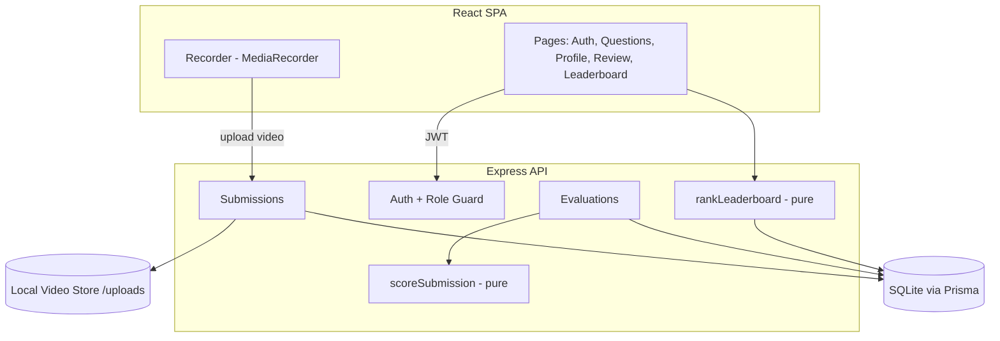
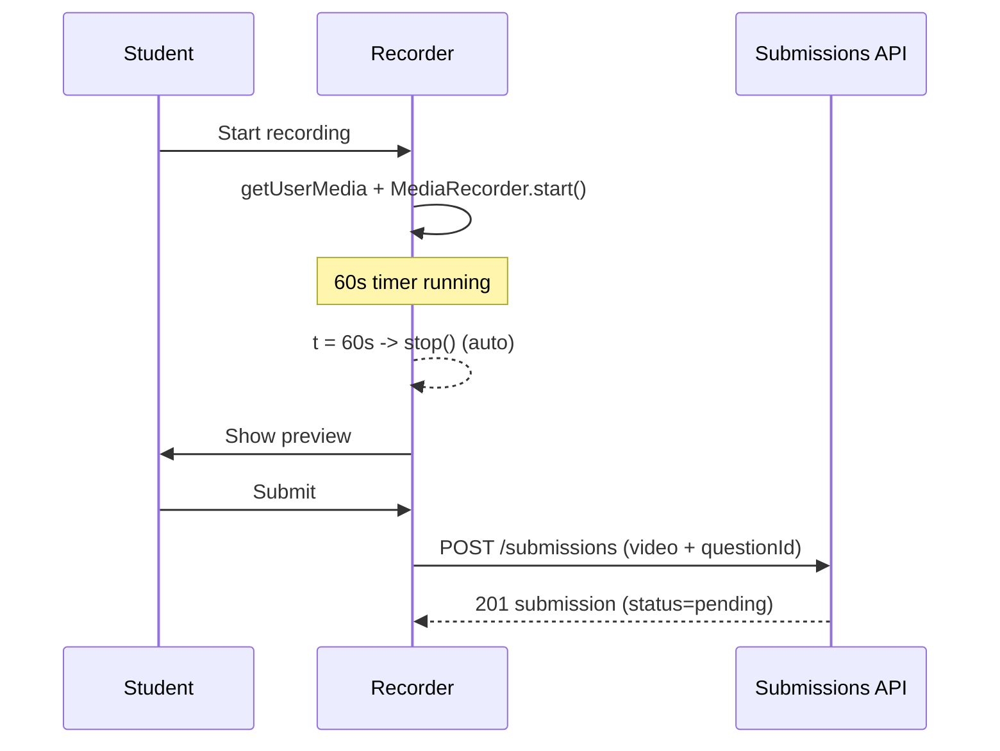
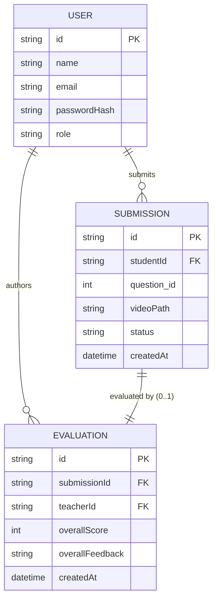

# Design Document

## Overview

The Mock Interview MVP is a small two-tier web application:

- A **React + TypeScript + Tailwind** single-page app (SPA) for both Students and Teachers.
- A **Node + TypeScript** REST backend that handles auth, submissions, evaluations, scoring, and the leaderboard.
- A relational database for metadata and an object/file store for video files.

The design is intentionally lean. It implements exactly the seven approved
requirements and nothing more: register/login with roles, a fixed question
list, record + submit a video, teacher review + scoring, a single overall score
per submission, results on the student profile, and one college-wide
leaderboard. There are no badges, analytics, dashboards, notifications, admin
question management, or multiple leaderboard types.

Two pieces of backend logic are pure functions and form the correctness core of
the app:

1. **Overall score** for one submission = `mean(8 parameter scores) * 10`, range 0–100.
2. **Leaderboard ranking** = average overall score per student across evaluated submissions, ordered descending, excluding students with no evaluated submissions.

These are the primary targets for property-based testing.

## Architecture

### Technology choices

| Concern | Choice | Rationale |
| --- | --- | --- |
| Frontend | React + TypeScript + Tailwind (Vite) | Standard, fast SPA stack; Tailwind keeps styling lean. |
| Backend framework | **Express** (not NestJS) | Simpler for a 7-requirement MVP. NestJS modules/DI add ceremony we do not need at this scale. A handful of route files and middleware is enough. |
| Database | **SQLite** via Prisma | Zero-config file DB, ideal for an MVP. Prisma gives typed access and a trivial path to Postgres later by swapping the datasource URL. |
| Video storage | **Local file storage** (`/uploads`) served by the backend | Keeps the MVP dependency-free. The upload boundary is abstracted behind a `VideoStore` interface, so swapping to S3 presigned URLs later is a localized change. |
| Auth | JWT (HS256) with a `role` claim | Lightweight, stateless, no session store needed. |

> Security note: video files under `/uploads` are served through an
> authenticated route, not a public static directory, so only logged-in users
> can fetch them.

### System diagram



### Request flow (happy path)

1. User registers/logs in → receives JWT with `sub` (user id) and `role`.
2. Student fetches questions (seeded constants), records an answer, uploads the video, and a `pending` submission is created.
3. Teacher fetches `pending` submissions, plays one back, and submits 8 parameter scores + feedback.
4. Backend validates scores, computes the overall score, stores the evaluation, and flips the submission to `evaluated`.
5. Student sees the score + feedback on their profile; the leaderboard reflects the new average.

## Components and Interfaces

### Frontend components

- **AuthPages** — register and login forms; stores the JWT (in memory + `localStorage`) and decoded role.
- **QuestionList** — renders the 10 seeded questions; Student picks one to answer.
- **Recorder** — wraps `MediaRecorder`; handles start/stop, 60s auto-stop, preview, and upload. (See Video Recording Flow below.)
- **StudentProfile** — lists the Student's submissions with status; shows overall score + feedback for evaluated ones, "awaiting review" for pending ones.
- **TeacherReview** — lists pending submissions, plays back video, and presents the 8-parameter scoring form + feedback field.
- **Leaderboard** — renders the ranked list returned by the API.
- **RoleRoute** — client-side guard that hides Teacher/Student-only pages (defense in depth; the server is the source of truth).

### Backend modules

- **authRouter** — `/auth/register`, `/auth/login`; hashes passwords (bcrypt), issues JWTs.
- **requireAuth / requireRole** — Express middleware. `requireAuth` verifies the JWT; `requireRole('teacher')` checks the `role` claim and returns 403 on mismatch.
- **questionsRouter** — returns the seeded question constants.
- **submissionsRouter** — create submission (Student), list own submissions (Student), list pending (Teacher), fetch one + video playback.
- **evaluationsRouter** — create evaluation (Teacher); validates input, calls `scoreSubmission`, persists, updates status.
- **leaderboardRouter** — returns `rankLeaderboard` output.
- **scoring.ts** — pure `scoreSubmission(parameterScores)` and `rankLeaderboard(students)` functions (no I/O).
- **VideoStore** — interface `{ save(file): Promise<string /* path */>; getStream(path): ReadStream }`, implemented by `LocalVideoStore`.

### Video recording flow

The Recorder uses the browser `MediaRecorder` API:

1. Request camera + mic via `navigator.mediaDevices.getUserMedia({ video: true, audio: true })`.
2. On **Start**, create a `MediaRecorder`, collect data chunks, and start a 60s timer.
3. When elapsed time reaches `MAX_DURATION = 60s`, call `recorder.stop()` automatically (also stoppable manually).
4. On stop, assemble chunks into a `Blob`, generate an object URL, and show it in a `<video>` element for **preview**.
5. On **Submit**, POST the blob as `multipart/form-data` with the `questionId` to `/submissions`; the backend saves the file via `VideoStore` and creates a `pending` submission.
6. Recording is discardable so the Student can re-record before submitting.



## Data Models

Questions are **seeded constants in code** (not a DB table), per Requirement 2.3
(no create/edit/delete). This keeps them immutable by design.

```ts
// questions.ts — seeded, fixed list of 10
export interface Question { id: number; prompt: string; }
export const QUESTIONS: readonly Question[] = [ /* 10 entries */ ];

export const SOFT_SKILL_PARAMETERS = [
  'confidence', 'communication', 'fluency', 'clarity',
  'vocabularyGrammar', 'bodyLanguage', 'eyeContact', 'professionalism',
] as const; // length 8
```

### Database (Prisma schema, conceptual)

```
User
  id            String   @id @default(uuid())
  name          String
  email         String   @unique
  passwordHash  String
  role          String   // 'student' | 'teacher'

Submission
  id            String   @id @default(uuid())
  studentId     String   // -> User.id
  questionId    Int      // -> QUESTIONS constant
  videoPath     String
  status        String   // 'pending' | 'evaluated'
  createdAt     DateTime @default(now())

Evaluation
  id              String   @id @default(uuid())
  submissionId    String   @unique // -> Submission.id (one evaluation per submission)
  teacherId       String   // -> User.id
  confidence        Int
  communication     Int
  fluency           Int
  clarity           Int
  vocabularyGrammar Int
  bodyLanguage      Int
  eyeContact        Int
  professionalism   Int
  overallScore    Int      // 0..100, computed
  overallFeedback String
  createdAt       DateTime @default(now())
```

### ER diagram



### Core pure functions

```ts
// scoring.ts
export function scoreSubmission(scores: number[]): number {
  // scores: exactly 8 integers in [1,10]
  const mean = scores.reduce((a, b) => a + b, 0) / scores.length;
  return Math.round(mean * 10); // 0..100 (10..100 given valid 1..10 inputs)
}

export interface StudentEvaluated {
  studentId: string;
  name: string;
  overallScores: number[]; // overall scores of that student's evaluated submissions
}
export interface LeaderboardRow {
  studentId: string;
  name: string;
  averageOverallScore: number;
}
export function rankLeaderboard(students: StudentEvaluated[]): LeaderboardRow[] {
  return students
    .filter(s => s.overallScores.length > 0)            // exclude no-eval students
    .map(s => ({
      studentId: s.studentId,
      name: s.name,
      averageOverallScore: s.overallScores.reduce((a, b) => a + b, 0) / s.overallScores.length,
    }))
    .sort((a, b) => b.averageOverallScore - a.averageOverallScore); // desc
}
```

## API Endpoints

| Method | Path | Auth | Purpose |
| --- | --- | --- | --- |
| POST | `/auth/register` | public | Create account with role (Req 1.1, 1.2) |
| POST | `/auth/login` | public | Authenticate, return JWT (Req 1.3, 1.4) |
| GET | `/questions` | any user | Return the 10 seeded questions (Req 2.2) |
| POST | `/submissions` | student | Upload video + create pending submission (Req 3.4, 3.5) |
| GET | `/submissions/mine` | student | Student's own submissions + statuses (Req 6.1, 6.3) |
| GET | `/submissions/:id/video` | auth | Stream video for playback (Req 4.2) |
| GET | `/submissions/pending` | teacher | List pending submissions (Req 4.1) |
| POST | `/submissions/:id/evaluation` | teacher | Submit evaluation (Req 4.3–4.5, 5.1) |
| GET | `/leaderboard` | any user | Ranked students by average score (Req 7.2) |

## Correctness Properties

*A property is a characteristic or behavior that should hold true across all valid executions of a system — essentially, a formal statement about what the system should do. Properties serve as the bridge between human-readable specifications and machine-verifiable correctness guarantees.*

The MVP's logic core is two pure functions (`scoreSubmission`, `rankLeaderboard`) plus evaluation input validation. These are the right targets for property-based testing. Auth, persistence, video I/O, and UI rendering are covered by example/integration tests instead (see Testing Strategy).

### Property 1: Overall score equals scaled mean and stays in range

*For any* array of exactly 8 integer parameter scores each in `[1, 10]`, `scoreSubmission` SHALL return the mean of those scores multiplied by 10, and the result SHALL be within the inclusive range `0` to `100`.

**Validates: Requirements 5.1, 5.2**

### Property 2: Evaluation validation accepts exactly the valid inputs

*For any* candidate evaluation input, the validator SHALL accept it if and only if it contains exactly 8 parameter scores, each an integer in `[1, 10]`, and a non-empty feedback text; all other inputs (wrong count, missing score, non-integer, out-of-range, missing feedback) SHALL be rejected with a validation error.

**Validates: Requirements 4.3, 4.4**

### Property 3: Leaderboard average equals each student's mean overall score

*For any* set of students with evaluated submissions, every row produced by `rankLeaderboard` SHALL have an `averageOverallScore` equal to the mean of that student's evaluated overall scores.

**Validates: Requirements 7.1**

### Property 4: Leaderboard is ordered by descending average

*For any* set of students, the rows returned by `rankLeaderboard` SHALL be ordered from highest to lowest `averageOverallScore`.

**Validates: Requirements 7.2**

### Property 5: Students with no evaluated submissions are excluded

*For any* set of students, `rankLeaderboard` SHALL exclude every student whose list of evaluated overall scores is empty, and SHALL include every student with at least one.

**Validates: Requirements 7.3**

## Error Handling

| Situation | Handling | Status |
| --- | --- | --- |
| Duplicate email on register (Req 1.2) | Reject with descriptive message | 409 |
| Invalid login credentials (Req 1.4) | Generic auth error (no user enumeration) | 401 |
| Missing/invalid JWT on protected route (Req 1.5) | Reject | 401 |
| Student calls a Teacher-only route (Req 1.6) | Role guard rejects | 403 |
| Invalid evaluation payload (Req 4.4) | Validation error listing the offending fields | 400 |
| Evaluating a non-existent or already-evaluated submission | Reject | 404 / 409 |
| Upload missing file or unknown `questionId` | Reject | 400 |
| Unexpected server/storage error | Logged; generic error returned (no internals leaked) | 500 |

Validation errors return a small structured body (`{ error, details }`) so the
frontend can surface field-level messages. Camera/mic permission denial in the
Recorder is handled client-side with a clear prompt to enable access.

## Testing Strategy

A lean, dual approach proportional to an MVP.

### Property-based tests (fast-check)

Use **fast-check** with Vitest on the backend. Minimum **100 iterations** per
property. Each test is tagged referencing its design property.

- Tag format: `Feature: mock-interview-mvp, Property {number}: {property_text}`
- Property 1 → `scoreSubmission`: generate 8 integers in [1,10], assert `result === Math.round(mean*10)` and `0 <= result <= 100`.
- Property 2 → evaluation validator: generate valid and malformed payloads (wrong length, out-of-range, non-integer, empty feedback), assert accept-iff-valid.
- Properties 3–5 → `rankLeaderboard`: generate random students (some with empty score lists), assert correct averages, descending order, and exclusion of empty-score students.

### Example / unit tests

A small number of focused examples for the non-property behavior:

- Auth: register student + teacher, duplicate-email rejection, valid/invalid login, JWT role claim (Req 1.1–1.4).
- Role guard: missing token → 401, student on teacher route → 403 (Req 1.5, 1.6).
- Questions: `GET /questions` returns 10 seeded items (Req 2.1, 2.2).
- Submission lifecycle: create → `pending`; valid evaluation → `evaluated` with stored score (Req 3.5, 4.5).
- Pending filter: only `pending` submissions returned to teachers (Req 4.1).

### Integration tests

- Upload flow: `POST /submissions` saves the video via `VideoStore` and creates a row (Req 3.4).
- Video playback: `GET /submissions/:id/video` streams the stored file (Req 4.2).

### Frontend component tests

A few React Testing Library tests with mocked APIs and fake timers:

- Recorder auto-stops at 60s and shows a preview (Req 3.2, 3.3).
- Profile renders score + feedback for evaluated submissions and "awaiting review" for pending ones (Req 6.1, 6.3).

We deliberately keep example tests minimal — the property tests carry the bulk
of input-space coverage for the scoring, leaderboard, and validation logic.
