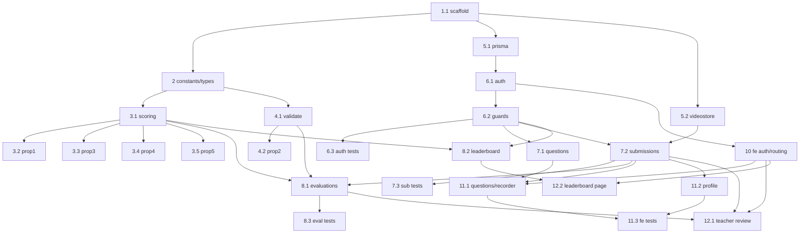

# Implementation Plan: Mock Interview MVP

## Overview

Build a monorepo with a Vite React + TypeScript + Tailwind frontend and an Express + TypeScript backend (SQLite via Prisma, local video storage behind a `VideoStore` interface, JWT HS256 auth with a role guard). Work bottom-up: scaffold the workspace and shared seeded constants, implement and property-test the pure scoring/leaderboard functions and evaluation validation first, then layer the data access, auth, and routers on top, and finally wire up the React UI. Each task builds on the previous one and integrates into the running app.

## Tasks

- [x] 1. Scaffold monorepo, backend, and frontend
  - Create root workspace with `backend/` (Express + TS) and `frontend/` (Vite React + TS + Tailwind) packages
  - Add TypeScript, Vitest, and fast-check to the backend; configure Tailwind in the frontend
  - Add Prisma with a SQLite datasource and a health-check route to confirm the backend boots
  - _Requirements: 1.1, 2.1_

- [x] 2. Define seeded constants and core types
  - Create `questions.ts` exporting `QUESTIONS` (10 fixed entries) and `SOFT_SKILL_PARAMETERS` (8 entries)
  - Define shared types: `Question`, `StudentEvaluated`, `LeaderboardRow`, evaluation payload type
  - _Requirements: 2.1, 2.3_

- [ ] 3. Implement and property-test pure scoring and leaderboard functions
  - [x] 3.1 Implement `scoreSubmission` and `rankLeaderboard` in `scoring.ts`
    - `scoreSubmission(scores)` returns `round(mean(8 scores) * 10)`, range 0–100
    - `rankLeaderboard(students)` averages each student's overall scores, excludes empty, sorts descending
    - _Requirements: 5.1, 5.2, 7.1, 7.2, 7.3_

  - [x]* 3.2 Write property test for overall score
    - **Property 1: Overall score equals scaled mean and stays in range**
    - Tag: `Feature: mock-interview-mvp, Property 1: Overall score equals scaled mean and stays in range`
    - Generate 8 integers in [1,10], assert `result === round(mean*10)` and `0 <= result <= 100`; ≥100 iterations
    - **Validates: Requirements 5.1, 5.2**

  - [x]* 3.3 Write property test for leaderboard average
    - **Property 3: Leaderboard average equals each student's mean overall score**
    - Tag: `Feature: mock-interview-mvp, Property 3: Leaderboard average equals each student's mean overall score`
    - ≥100 iterations
    - **Validates: Requirements 7.1**

  - [x]* 3.4 Write property test for leaderboard ordering
    - **Property 4: Leaderboard is ordered by descending average**
    - Tag: `Feature: mock-interview-mvp, Property 4: Leaderboard is ordered by descending average`
    - ≥100 iterations
    - **Validates: Requirements 7.2**

  - [x]* 3.5 Write property test for exclusion of no-eval students
    - **Property 5: Students with no evaluated submissions are excluded**
    - Tag: `Feature: mock-interview-mvp, Property 5: Students with no evaluated submissions are excluded`
    - ≥100 iterations
    - **Validates: Requirements 7.3**

- [ ] 4. Implement and property-test evaluation input validation
  - [x] 4.1 Implement `validateEvaluation` 
    - Accept iff exactly 8 integer parameter scores in [1,10] plus non-empty feedback; otherwise return a validation error
    - _Requirements: 4.3, 4.4_

  - [x]* 4.2 Write property test for evaluation validation
    - **Property 2: Evaluation validation accepts exactly the valid inputs**
    - Tag: `Feature: mock-interview-mvp, Property 2: Evaluation validation accepts exactly the valid inputs`
    - Generate valid and malformed payloads (wrong count, out-of-range, non-integer, empty feedback); ≥100 iterations
    - **Validates: Requirements 4.3, 4.4**

- [ ] 5. Set up Prisma schema and video storage
  - [x] 5.1 Define Prisma models and run the initial migration
    - `User`, `Submission`, `Evaluation` models per the design; generate the client
    - _Requirements: 1.1, 3.4, 3.5, 4.5_

  - [x] 5.2 Implement the `VideoStore` interface and `LocalVideoStore`
    - `save(file): Promise<string>` and `getStream(path): ReadStream` writing under `/uploads`
    - _Requirements: 3.4, 4.2_

- [ ] 6. Implement auth and role middleware
  - [x] 6.1 Implement `authRouter` (register/login) with bcrypt and JWT
    - Hash passwords with bcrypt; reject duplicate email; issue HS256 JWT with `sub` and `role` claims on valid login
    - _Requirements: 1.1, 1.2, 1.3, 1.4_

  - [x] 6.2 Implement `requireAuth` and `requireRole` middleware
    - `requireAuth` verifies the JWT (401 if missing/invalid); `requireRole('teacher')` returns 403 on mismatch
    - _Requirements: 1.5, 1.6_

  - [ ]* 6.3 Write unit tests for auth and role guard
    - Register student + teacher, duplicate-email rejection, valid/invalid login, missing token → 401, student on teacher route → 403
    - _Requirements: 1.1, 1.2, 1.3, 1.4, 1.5, 1.6_

- [ ] 7. Implement questions and submissions routers
  - [x] 7.1 Implement `questionsRouter`
    - `GET /questions` returns the 10 seeded questions to any authenticated user
    - _Requirements: 2.2_

  - [x] 7.2 Implement `submissionsRouter`
    - `POST /submissions` (student): multipart video upload via `VideoStore`, create `pending` submission
    - `GET /submissions/mine` (student), `GET /submissions/pending` (teacher), `GET /submissions/:id/video` (auth) streaming playback
    - _Requirements: 3.4, 3.5, 3.6, 4.1, 4.2, 6.1, 6.3_

  - [ ]* 7.3 Write tests for submissions and upload flow
    - Create → `pending`; pending filter returns only pending; upload saves via `VideoStore`; `:id/video` streams the file
    - _Requirements: 3.4, 3.5, 4.1, 4.2_

- [ ] 8. Implement evaluations and leaderboard routers
  - [x] 8.1 Implement `evaluationsRouter`
    - `POST /submissions/:id/evaluation` (teacher): `validateEvaluation` → `scoreSubmission` → persist Evaluation → set status `evaluated`
    - _Requirements: 4.3, 4.4, 4.5, 5.1_

  - [x] 8.2 Implement `leaderboardRouter`
    - `GET /leaderboard` aggregates evaluated overall scores per student and returns `rankLeaderboard` output
    - _Requirements: 7.1, 7.2, 7.3_

  - [ ]* 8.3 Write tests for evaluation lifecycle
    - Valid evaluation → `evaluated` with stored score; invalid payload → 400
    - _Requirements: 4.4, 4.5, 5.1_

- [ ] 9. Checkpoint - Ensure all backend tests pass
  - Ensure all tests pass, ask the user if questions arise.

- [x] 10. Build frontend auth, API client, and role routing
  - API client attaching the JWT; AuthPages (register/login) storing token + decoded role; `RoleRoute` client-side guard
  - _Requirements: 1.1, 1.3, 1.5, 1.6_

- [ ] 11. Build student flow: questions, Recorder, profile
  - [x] 11.1 Implement `QuestionList` and `Recorder`
    - Render 10 questions; Recorder uses `MediaRecorder`, 60s auto-stop, preview, and multipart upload to `/submissions`
    - _Requirements: 2.2, 3.1, 3.2, 3.3, 3.4_

  - [x] 11.2 Implement `StudentProfile`
    - List submissions; show overall score + feedback for evaluated, "awaiting review" for pending
    - _Requirements: 6.1, 6.3_

  - [ ]* 11.3 Write component tests for Recorder and Profile
    - Recorder auto-stops at 60s and shows preview (fake timers); Profile renders evaluated vs pending states
    - _Requirements: 3.2, 3.3, 6.1, 6.3_

- [ ] 12. Build teacher review and leaderboard pages
  - [x] 12.1 Implement `TeacherReview`
    - List pending submissions, play back video, present 8-parameter scoring form + feedback, submit evaluation
    - _Requirements: 4.1, 4.2, 4.3, 6.2_

  - [x] 12.2 Implement `Leaderboard` page
    - Render the ranked list from `GET /leaderboard`
    - _Requirements: 7.2_

- [ ] 13. Final checkpoint - Ensure all tests pass
  - Ensure all tests pass, ask the user if questions arise.

## Notes

- Tasks marked with `*` are optional test sub-tasks and can be skipped for a faster MVP.
- Property tests use fast-check with ≥100 iterations and are tagged per the design's tag format, mapped to the 5 correctness properties.
- The pure functions (`scoreSubmission`, `rankLeaderboard`) and `validateEvaluation` are built and property-tested before the routers that consume them.
- Each task references specific requirements for traceability; checkpoints ensure incremental validation.

## Task Dependency Graph



```json
{
  "waves": [
    { "id": 0, "tasks": ["1"] },
    { "id": 1, "tasks": ["2"] },
    { "id": 2, "tasks": ["3.1", "4.1", "5.1", "5.2"] },
    { "id": 3, "tasks": ["3.2", "3.3", "3.4", "3.5", "4.2", "6.1"] },
    { "id": 4, "tasks": ["6.2", "8.2"] },
    { "id": 5, "tasks": ["6.3", "7.1", "7.2", "10"] },
    { "id": 6, "tasks": ["7.3", "8.1", "11.1", "11.2", "12.2"] },
    { "id": 7, "tasks": ["8.3", "11.3", "12.1"] }
  ]
}
```
